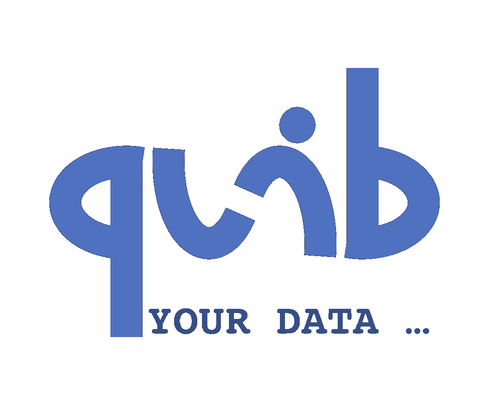

# Quibbler
**Interactive, reproducible and efficient data analytics**

## What is it?
*Quibbler* is a toolset for building highly interactive, yet reproducible, 
transparent and efficient data analysis pipelines. *Quibbler* allows using standard 
*Python* syntax to process data through any series of analysis steps, while 
automatically maintaining connectivity between downstream results and upstream raw data 
sources. *Quibbler* facilitates and embraces human interventions as an inherent part 
of the analysis pipeline: input parameters, as well as exceptions and overrides, 
can be specified and adjusted either programmatically, or by 
interacting with "live" graphics, and all such interventions are automatically 
recorded in well-documented human-machine readable files. Changes to such parameters 
propagate downstream, pinpointing which specific data items, or
even specific elements thereof, are affected, thereby vastly saving unnecessary 
recalculations. *Quibbler*, therefore, facilitates hands-on interactions with data 
in ways that are not only flexible, fun and interactive, but also traceable, 
well-documented, and highly efficient.

## Main Features
Here are a few of the things that *Quibbler* does:

* Easily build powerful GUI-like interaction with data, without a need for callbacks 
and event listeners. 

* Interactive specification of inputs and overrides of parameter values.

* Automatically create human-readable records of user interventions and parameter specifications.

* Independently calculate, cache and validate/invalidate individual slices of heavy-to-calculate arrays. 

* Present a dependency graph between raw data and downstream results.  

* Provide inherent undo/redo functionalities.

* **_All-of-the-above using completely standard functions and programming syntax - 
there is very little to learn to get started!_** 

## Documentations
See https://readthedocs.com/ for a getting-started tour and documentations.

## Installation 

To install run:

`pip install pyquibbler`

If are using *Jupyter lab*, you can also add the *pyquibbler Jupyter Lab extensions*:

`pip install pyquibbler_labextension`

For developers, see [here](INSTALL.md).

## Credit

Quibbler was created by Roy Kishony, initially implemented as a Matlab toolbox. 

Quibbler for Python, *pyquibbler*, was developed at the 
[Kishony lab, Technion - Israel Institute of Technology](https://kishony.technion.ac.il/), 
by Maor Kern, Maor Kleinberger and Roy Kishony.

## Related products

* [Streamlit](https://streamlit.io/)
* [Shiny](https://shiny.rstudio.com/)
* [ipywidgets](https://github.com/jupyter-widgets/ipywidgets)
* [bokeh](http://bokeh.org)
* [Vega-Altair](https://altair-viz.github.io/)
* [Datashader](https://datashader.org/)
