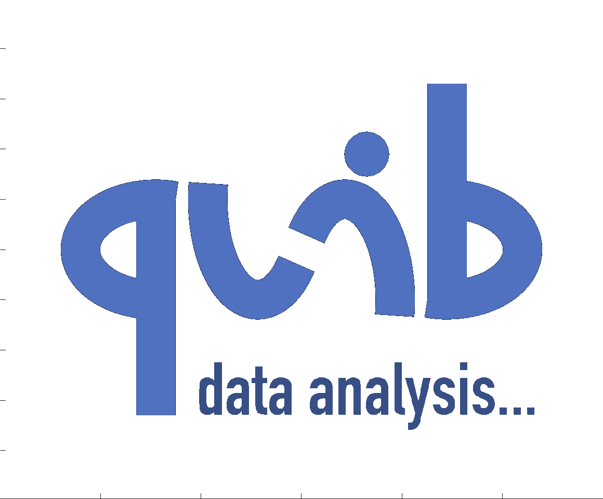
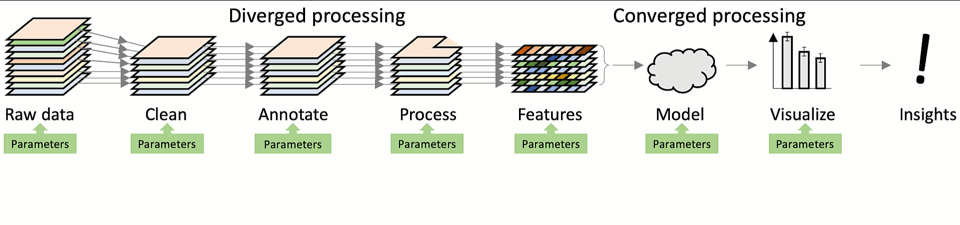

# Quibbler
**Interactive, traceable and efficient data analytics**


## What is it?
*Quibbler* is a toolset for building highly interactive, yet traceable, 
transparent and efficient data analysis pipelines. *Quibbler* allows using standard 
*Python* syntax to process data through any series of analysis steps, while 
automatically maintaining connectivity between downstream results and upstream raw data 
sources. *Quibbler* facilitates and embraces human interventions as an inherent part 
of the analysis pipeline: input parameters, as well as exceptions and overrides, 
can be specified and adjusted either programmatically, through input files, or by 
interacting with "live" graphics, and all such interventions are automatically 
recorded in well-documented human-machine readable files. Changes to such parameters 
propagate downstream, pinpointing which specific steps and specific data items or
even specific slices or elements thereof are affected, thereby vastly saving unnecessary 
recalculations. *Quibbler*, therefore, facilitates hands-on interactions with data 
in ways that are not only flexible, fun and interactive, but also traceable, 
well-documented, and highly effecient.


## Main Features
Here are a few of the things that *Quibbler* does:

* Easily build powerful GUI-like interaction with data, without a need for callbacks 
and event listeners. 

* Interactive specification of inputs and exceptions to default functionalities.

* Automatically maintain a record of user interventions and parameter specifications.

* Independently calculate, cache and validate/invalidate focal data elements or slices of heavy-to-calculate arrays. 

* Track a dependency graph between raw data and downstream results.  

* Inherent undo/redo functionalities.

* **All-of-the-above using completely standard functions and programming syntax - there is very little to learn to get started!** 

## Rationale
TTraceability, transparency, interactivity and efficiency are becoming increasingly
important, yet challenging, in today’s data-rich worlds of science, engineering and biomedicine. 
Throughout these fields, important insights are derived from highly complex data analysis
pipelines, where, through chained transformation steps, raw data is gradually transformed 
into simpler, more abstract and insightful forms. Understanding how a given downstream 
focal result depends on upstream raw data is crucial, yet often challenging. 
Not only are there multiple complex steps and algorithmic dependencies, but also, 
each of these steps often requires multiple human specified parameter, interventions and informed
choices (setting thresholds, excluding data points, cleaning
artifacts, etc.). It is therefore often difficult to know how a focal downstream result
or key insight depends on the raw data sources and on any of the multiple manual
interventions and decisions made throughout the pipeline. Conversely, it is typically 
almost impossible to trace which downstream result is affected when the user changes an
upstream parameters and which specific parts of the analysis must be
recalculated upon any such changes. Parameters are often buried in the code and
re-specification of parameters is slow, undocumented and non-interactive.



_**Conceptual view of data analysis pipelines:** Raw data (left) is gradually cleaned and 
transformed as it is processed through multiple analysis steps, ultimately leading to
key results and insights (right). These analysis steps often require choices and 
specifications of key critical parameters (green boxes). While the data flow downstream 
(left to right), the data analyst must have tools to transverse the pipeline upstream (red arrow), 
questioning how a given downstream result or insight depends on the raw
data and the many parameter choices throughout the analysis pipeline. 
Changing and refining an upstream parameter (red '\') may affect one (or more) of 
the data items, which requires recalculating only specific steps of the pipeline 
(red left-to-right arrows). 
In "diverged" analysis steps, data items are processed independently 
and only the affected items must be recalculated (red frames), and in "converged" steps, 
the entire calculation needs to be repeated. Strong analysis pipelines must facilitate 
making such changes while interactively viewing their effect on downstream results (changing bars).
Through such an interactive process of parameter specifications, we ultimately refine the 
insights we gain from our analysis._ 
<br/>
<br/>
### *Quibbler*: interactive, traceable and efficient data analytics

Addressing the above challenges, *Quibbler* offers a data analysis toolset built on three
key principles:

1. **Forward and backward traceability.** In *Quibbler*, every piece of 
data maintains upstream connectivity all the way to the raw data. 
*Quibbler* thereby allows both forward and backward dependency-tracing 
through the analysis pipeline. 


2. **Interactive, transparent, and well-documented human interventions.** Realizing 
that data analysis pipelines are rarely fully automated, *Quibbler* facilitates
and embraces human interventions as an inherent part of the analysis pipeline. 
Users can readily change any external input parameters as well as override any 
default functional behavior. Whether made through the command line, the code, 
input files, or by interacting with "live" graphics, all such interventions are 
automatically documented in transparent human-machine read-write files. 
*Quibbler* thereby maintains complete documentation of all the steps, decisions 
and parameters that led to any key observation, making the results of the analysis 
pipeline transparent, understandable and reproducible. 


3. **Computation efficiency.** In *Quibbler*, intermediate calculations are cached 
in memory and when an upstream parameter changes, only the specific cached calculations 
that depend on this parameter are invalidated. *Quibbler* thereby avoids re-running 
of complex codes and make sure only the very necessary steps of the analysis and only the 
specifically affected data items are re-calculated upon any upstream parameter changes. 


**See the https://readthedocs.com/ for a Getting-started tour and Documentations.**

<br/>
<br/>

### Installing for developers

To install pyquibbler and the pyquibbler-labext, follow these steps:

#### Create environment:

```conda create -n pyquibbler --override-channels --strict-channel-priority -c conda-forge -c nodefaults jupyterlab=3 cookiecutter nodejs jupyter-packaging git```

```conda activate pyquibbler```

#### Install pyquibbler-labextension:
In the quibbler root directory:

```cd pyquibbler-labextension```

```pip install -e .```

```jupyter labextension develop . --overwrite```

```jlpm run build```

```jupyter lab build --minimize=False```

If you are developing the client code, then to automatically build following changes, run:

```jlpm run watch```


#### Install pyquibbler:

```cd ../pyquibbler```

```pip install -e .'[dev, sphinx]'```


#### Install chromedriver
To run the tests, you'll need the chromedriver (which allows selenium to run a browser it's in control of)
and then add it to your path:

1. Go to https://chromedriver.chromium.org/downloads, and download the chromedriver corresponding to your chrome version and operating system.
You can check your chrome version by clicking on chrome and going to "About Google Chrome".
You should see 102.0.x. After clicking on the correct version, you'll be able to choose your operating system.

2. Unzip the chromedriver (by clicking on the archive)

3. After downloading your chromedriver, go to your terminal. Run `echo $PATH`. This will show you a set of locations seperated by a colon where executable files are expected to be found.
You need to place your chromedriver in one of them. If `/usr/local/bin` is in your PATH, the experts at Quibbler recommend placing it there. 
To place it in this location, run `mv ~/Downloads/chromedriver /usr/local/bin/`

4. After placing the chromedriver in your PATH, we need to make it executable. To do this, run
`chmod 777 /usr/local/bin/chromedriver`

5. Run the tests! Go to `tests/lab_extension` and run `pytest`. If tests fail, you can try:
   1. when running the tests, make sure the chrome selenium opens is visible to you (there are issues with jupyter when it's not, as it doesn't load)
   2. restart pycharm
   3. if getting `“chromedriver” cannot be opened because the developer cannot be verified`, try running:
   ```xattr -d com.apple.quarantine /usr/local/bin/chromedriver```
   