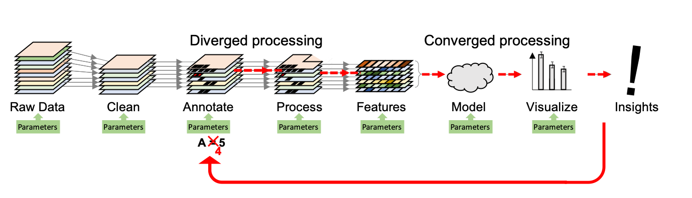

# Data Quibbler
**Building interactive, traceable, transparent, and efficient data analysis pipelines.** 

## What is it?
**Data Quibbler** is a toolset for building highly interactive, yet traceable, 
transparent and efficient data analysis pipelines. Quibbler allows using standard 
Python syntax to process data through any complex series of analysis steps, while 
automatically maintaining connectivity between downstream results 
and upstream raw sources. Quibbler facilitates and embraces human interventions 
as an inherent part of the analysis pipeline: input parameters as well as exceptions and overrides 
can be specified and adjusted either programmatically, through input files, or by
interacting with "live" graphics, and all such interventions are automatically 
recorded in well-documented human-machine readable files. Changes to such parameters 
propagate downstream, pinpointing which specific steps and specific
data array or even slices thereof are affected, thereby vastly saving unnecessary 
recalculations. Quibbler therefore facilitates fun hands-on playing with data 
in ways that are flexible and interactive, yet also efficient, traceable, well-documented, 
and reproducible.

## Main Features
Here are a few of the things that Quibbler does:

* Easily build powerful GUI-like interaction with data, without a need for callbacks 
and listeners. 

* Easy manual specification of overrides and exceptions to default functionalities.

* Calculate, cache and validate/invalidate focal sub-slices of heavy-to-calculate arrays. 

* Track a dependency graph between raw data and downstream results.  

* Track and maintain a human-readable record of user interventions and parameter
specifications (TBD).

* Inherent undo/redo functionality (TBD).

## Rationale
Traceability, transparency, interactivity and efficiency are becoming increasingly
important, yet challenging, in today’s data-rich science, engineering and biomedicine. 
Throughout these fields, important insights are derived from highly complex data analysis
pipelines, where, through chained transformation steps, raw data is gradually transformed 
into simpler, more abstract and insightful forms. Understanding how a given downstream 
focal result depends on upstream raw data is crucial, yet often very difficult. 
Not only there are multiple complex steps and algorithmic dependencies, but also, 
each of these steps often requires multiple human decisions, interventions and informed
choices (choosing parameters, setting thresholds, excluding data points, cleaning
artifacts, etc.). It is therefore often difficult to know how a focal downstream result
or key insight depends on the raw data sources and on any of the multiple manual
interventions and decisions made throughout the pipeline. Conversely, it is typically 
almost impossible to trace which downstream result is affected when the user changes an
upstream parameter or data source and which specific parts of the analysis must be
recalculated upon any such changes. Parameters are often buried in the code and
re-specification of parameters is slow, undocumented and non-interactive. 



*Conceptual view of a data analysis pipeline: Raw data (left) is gradually cleaned and 
transformed as it is processed through multiple analysis steps, ultimately leading to
key results and insights (right). These analysis steps often require choices and 
specifications of key critical parameters (green boxes). While the data flow downstream 
(left to right), the data analyst must have tools to transverse the pipeline upstream 
(grey arrows), questioning how a given downstream result or insight depends on the raw
data and the many choices and parameters through the analysis process (red arrow). 
Changing and refining an upstream parameter (red 'X') may affect one (or more) of 
the data items, which requires recalculating specific parts of the pipeline 
(red dashed arrows). In "diverged" analysis steps, data items are processed independently 
and only the affected items must be recalculated, and in "converged" steps, the entire 
calculation needs to be repeated. Strong analysis pipelines must facilitate tracing 
from downstream results to upstream parameters, must allow easy interactive yet 
well-documented way to change and refine parameters, and must be able to efficiently 
pinpoint and recalculate only affected data items following such parameter changes.*

Addressing these challenges, Quibbler offers a data analysis toolset built on three
key principles:
1. Forward and backward traceability. In Quibbler every piece of data maintains
upstream connectivity all the way to the raw data. Quibbler thereby allows both 
forward and backward dependency-tracing through the data analysis pipeline. 
2. Interactive, transparent, and well-documented human interventions. Realizing that 
data analysis pipelines are rarely fully automated, Quibbler facilitates and embraces 
human interventions as an inherent part of the analysis pipeline. Users can readily
change any external input parameters as well as override any default intermediate
algorithmic result. Whether made through the command line, the code, input files,
or by interacting with "live" graphics, all such interventions are automatically 
documented in transparent human-machine read-write files. Quibbler thereby maintains 
complete documentation of all the steps, decisions and parameters that led to any
key observation, making the results of the analysis pipeline transparent, understandable 
and reproducible. 
3. Computation efficiency. In Quibbler, intermediate calculations can be cached 
in memory or in cache files. The user can specify the basic data elements that
are processed, stored and tracked as independent individual units. When an upstream
parameter changes, only the specific cached calculations that depend on this parameter
are invalidated. Quibbler thereby avoids re-running of complex codes and make sure only
the very necessary parts of the analysis are re-calculated upon any upstream parameter 
changes. 


## DOC

### Interface

- `iquib`
- `Quib.get_value()`
- `DefaultFunctionQuib.is_cache_valid`
- `Quib.get_caching_method()`
- `Quib.set_caching_method()`

### Debugging

- `FunctionQuib._func`
- `FunctionQuib._args`
- `FunctionQuib._kwargs`
- `FunctionQuib._get_dependencies()`
- `FunctionQuib.get_cache_behavior()`

### Deepcopy

There are three cases in which we deepcopy:

#### Quib Creation

When a function quib is created, we deepcopy the arguments passed to the function. An example in which this is needed is
below:

```python
a = []
fquib = func(a, quib)
a.append(1)
fquib.get_value()
# Without deepcopy, the argument was mutated before the call
```

#### Function call

When a function quib calls the original function with quib values, we have to replace quibs with their values, which
requires us to recurse over the arguments to some extent. In addition, if a function mutates its arguments, stores them
in a global storage, returns them, or a view to them
(see Array copy/view behavior below) a user might get a handle to the internal arg storage of the function quib:

```python
@quib_func
def f(a):
    return a


quib = iquib([])
fquib = f(quib)
new_a = fquib.get_value()
new_a.append(1)
# Without deepcopy, the internal arg storage of fquib was mutated
```

Also, the user can mutate the result of `get_value` and by that unknowingly mutate the internal cache of the quib:

```python
q = iquib([0])
a = q.get_value()
a.append(1)
# Without deepcopy, we have changed the iquib without invalidating anything.
```

#### Cache storage

When a result of a function is stored in the cache, it should be deepcopied as well. A function might return an object
that has other references to it (a global object, a view, etc.)
and therefore mutation of that object will result in mutation of the internal cache. For example:

```python
A = []


def f():
    return A


result = f().get_value()
A.append(1)
# Without deepcopy, the result is mutated 
```

#### Cache usage

When a cached value is used, if the program receives a reference to the internal cache object, it could mutate it, even
by just applying overrides to it. So values fetched from the cache should be deepcopied.

#### Optimizations

We could:

- Have a whitelist of functions that don't need argument/result deepcopy (most numpy functions).
- Avoid deepcopying objects that have refcount=1
  (although the scan will still have to be recursive in case the object contains another with refcount>1)
- Let the user explicitly turn off deepcopying, globally or for specific functions
- Not support specific types of functions, or provide special decorators for functions that don't return new data
- Analyze functions to automatically discover if they need deepcopying or not
- Not cache user functions, or let users explicitly choose the function type if they want to cache

#### Array copy/view behavior

In some cases, an operation on a numpy array can result with a view to that numpy array, instead of a new array
referencing new memory. For example:

- `np.view(arr)`
- `arr[4:10]`
- `arr.reshape((3, 5))`
- `arr.swapaxes((1, 2))`

Some functions can return both a view and a copy, according to the arguments. For example `__getitem__` will return a
copy only if the selected data is contiguous in memory. On view arrays, the attribute `base` points to the original
array instead of `None`.

## Q/A

- Why do changes not occur after doing `plt.show(block=False); # my_stuff; time.sleep(1000)`
    - The event loop needs to run- we tried doing `flush_events` but the only way (we saw on mac)
      for events to happen is to actually start the event loop (this happens automatically when pausing). <br/>
      As a side note, our solution (of ```axes.redraw_in_frame(); axes.figure.canvas.blit()```)
      has near identical performance to running the event loop ) <br/>
      It is important to note that we're not sure of all of this for other backends.
