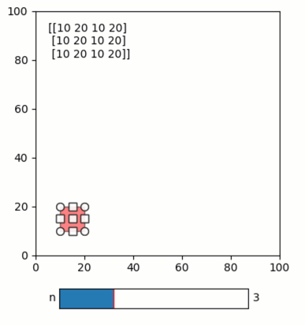

Diverged evaluation
-------------------

Rationale
^^^^^^^^^

Data analysis pipelines can have *diverged* processing steps, where a
specific function is applied repeatedly to each of many individual data
items (e.g., enhancing each image in a stack of images). In such
diverged analysis, the processing of each data item could be done
independently, and we may only want to process some and not all of the
items at a given time. Furthermore, changes to upstream parameters may
only affect the calculations of some of the data items while any cached
calculations of other items remain valid (e.g., changing an enhancement
parameter specific for one image requires repeating the processing of
this image alone). We therefore need ways to independently calculate,
cache and track the validity of each data item in such diverged analysis
steps. In *Quibbler*, such independent processing and tracking is
automatically enabled by adopting the *NumPy* syntax of ``vectorize``
and ``apply_along_axis``. Applying such *NumPy* vectorized functions to
quib arguments creates a *vectorized function quib* whose output array
is calculated, cached and invalidated not as a whole but rather
element-by-element, or slice by slice.

Reviewing the standard behavior of np.vectorize
^^^^^^^^^^^^^^^^^^^^^^^^^^^^^^^^^^^^^^^^^^^^^^^

*NumPy*\ ’s ``np.vectorize`` provides a standard syntax to *vectorize* a
given function such that when applied to array arguments it creates a
new array by acting repeatedly on each element of the array arguments
(or across slices thereof, see the ``signature`` kwarg).

For example:

.. code:: ipython3

    # Imports
    import pyquibbler as qb
    from pyquibbler import iquib, q
    qb.override_all()
    import numpy as np
    import matplotlib.pyplot as plt
    from matplotlib.widgets import RectangleSelector, Slider
    from matplotlib.patches import Arrow
    %matplotlib tk

.. code:: ipython3

    def mysqr(x):
        print('calculating sqr({})'.format(x))
        return x ** 2
    
    
    v_mysqr = np.vectorize(mysqr, otypes=[int])

In this example, ``v_mysqr`` is the vectorized form of ``mysqr``; when
``v_mysqr`` is applied to an array, it executes the underlying function
``mysqr`` on each element of the input array:

.. code:: ipython3

    v_mysqr(np.array([0, 1, 2, 3, 4]))

.. parsed-literal::

    calculating sqr(0)
    calculating sqr(1)
    calculating sqr(2)
    calculating sqr(3)
    calculating sqr(4)

.. parsed-literal::

    array([ 0,  1,  4,  9, 16])

Applying a vectorized function to quib arguments creates a vectorized function quib
^^^^^^^^^^^^^^^^^^^^^^^^^^^^^^^^^^^^^^^^^^^^^^^^^^^^^^^^^^^^^^^^^^^^^^^^^^^^^^^^^^^

In analogy to the standard behavior above, applying a vectorized
function to quib arguments creates a vectorized function quib that
calculates its output by calling the underlying function on each element
of the output of its quib arguments. As with other function quibs, this
definion is declarative, no calculations are initially performed:

.. code:: ipython3

    x = iquib(np.array([0, 1, 2, 3, 4]))
    x2 = v_mysqr(x).setp(cache_mode='on')

Calculations are only performed once we request the output of the
function quib:

.. code:: ipython3

    x2.get_value()

.. parsed-literal::

    calculating sqr(0)
    calculating sqr(1)
    calculating sqr(2)
    calculating sqr(3)
    calculating sqr(4)

.. parsed-literal::

    array([ 0,  1,  4,  9, 16])

Vectorized quibs targetly calculate and cache specifically requested array elements
^^^^^^^^^^^^^^^^^^^^^^^^^^^^^^^^^^^^^^^^^^^^^^^^^^^^^^^^^^^^^^^^^^^^^^^^^^^^^^^^^^^

As the output of vectorized function quibs is calculated
element-by-element, there is no need to calculate the entire array if
only specific elements are requested. Indeed, the *Quibbler*
implementation of ``np.vectorize``, unlike the standard *NumPy*
implementation, knows to only calculate the array elements specifically
requested to provide a requested output.

For example, let’s repeat the simple code above, but only ask for the
value of ``x2`` at a specific element. *Quibbler* will only evaluate the
function at the requested position:

.. code:: ipython3

    x = iquib(np.array([0, 1, 2, 3, 4]))
    x2 = v_mysqr(x).setp(cache_mode='on')
    x2[3].get_value()

.. parsed-literal::

    calculating sqr(3)

.. parsed-literal::

    9

These values are indepdnently cached, so additional requests for array
output only calculate the parts of the array not yet calculated:

.. code:: ipython3

    x2[2:].get_value()

.. parsed-literal::

    calculating sqr(2)
    calculating sqr(4)

.. parsed-literal::

    array([ 4,  9, 16])

.. code:: ipython3

    x2.get_value()

.. parsed-literal::

    calculating sqr(0)
    calculating sqr(1)

.. parsed-literal::

    array([ 0,  1,  4,  9, 16])

Vectorized quibs track validity of individual array elements
^^^^^^^^^^^^^^^^^^^^^^^^^^^^^^^^^^^^^^^^^^^^^^^^^^^^^^^^^^^^

Not only array elements of vectorized function quibs are individually
calculated and cached, their validity is also independently tracked upon
upstream changes.

When upstream value changes, such changes only invalidate the
specifically affected array elements. Only the calculation of these
elements is then repeated when the output is requested:

TODO: repeat after making vectorized non-graphic

.. code:: ipython3

    x[3] = 10

.. parsed-literal::

    calculating sqr(10)

.. code:: ipython3

    x2.get_value()

.. parsed-literal::

    array([  0,   1,   4, 100,  16])

Using vectorize for graphic functions
^^^^^^^^^^^^^^^^^^^^^^^^^^^^^^^^^^^^^

Vectorized function quibs readily facilitate creating multiple instances
of similar graphic elements. This is done simply by vectorizing an
underlying function that create graphics and setting ``lazy=False`` in
the vectorize command.

Here is a simple example:

.. code:: ipython3

    def draw_arrow(ax, xy, dxy, w):
        plt.plot([xy[0], xy[0]+dxy[0]], [xy[1], xy[1]+dxy[1]], 'r-')
        #ax.add_patch(Arrow(xy[0], xy[1], dxy[0], dxy[1], w)) <- TODO - use this when patches work
    
    
    v_draw_arrow = np.vectorize(draw_arrow, lazy=False, signature='(),(2),(2),()->()')
    
    plt.figure()
    ax = plt.gca()
    plt.axis([0, 100, 0, 100])
    
    xy = iquib(np.array([[10, 10], [20, 20], [30, 30], [40, 40]]))
    xy_tail = xy[0:-1]
    xy_head = xy[1:]
    dxy = xy_head - xy_tail
    w = iquib(10.)
    v_draw_arrow(ax, xy_tail, dxy, w);
    plt.plot(xy[:,0], xy[:,1], 'ob', markersize=16, picker=True);

Passing quibs as arguments to allows inverse assignment from vectorized quibs
^^^^^^^^^^^^^^^^^^^^^^^^^^^^^^^^^^^^^^^^^^^^^^^^^^^^^^^^^^^^^^^^^^^^^^^^^^^^^

In the examples above, when the vectorized function quib gets quib
arguments it sends to the underlying function the output value of these
quibs at given array positions. The underlying function deals with
regular, non-quib, arguments. Alternatively, it is also possible to send
the underlying function quibs which reference the vectorize quib
arguments at the corresponding indices. This behavior is controlled by
the ``pass_quibs`` kwarg of np.vectorize. By default, ``pass_quibs`` is
set to ``False``. Setting ``pass_quibs=True`` will pass quib as
arguments thus enabling some important functionality including in
particular the ability to inverse assign from graphics created within
the function.

See this example:

.. code:: ipython3

    xy_default = iquib(np.array([10, 20, 10, 20]))
    xy_default.allow_overriding = False
    n = iquib(np.array([5]))
    xy = np.tile(xy_default, (n[0], 1))
    xy.allow_overriding = True
    
    def rectselect(ax, ext):
        RectangleSelector(ax=ax, extents=ext)
        return
    
    v_rectselect = np.vectorize(rectselect, signature='(),(4)->()', lazy=False, pass_quibs=True)
    
    ax = plt.gca()
    plt.axis('square')
    plt.axis([0, 100, 0, 100])
    v_rectselect(ax, xy)
    
    plt.text(5, 95, q(str, xy), va='top');
    
    # TODO: add after fixing bug:
    #Slider(ax=plt.axes([0.4, 0.2, 0.3, 0.05]), label='n', valmin=1, valmax=8, valinit=n[0])

Additional demos
^^^^^^^^^^^^^^^^

For additional examples, see:

-  :doc:`examples/quibdemo_compare_images`
