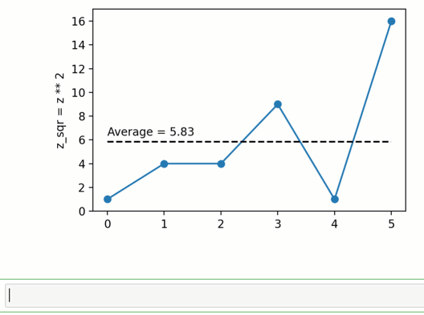
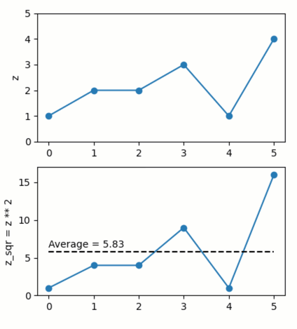

Introduction to Quibbler
========================

Below is a quick tutorial of *Quibbler* for *Python* (``pyquibbler``).
The tutorial briefly shows some of the basic functionalities and
concepts of *Quibbler*, while providing links to more comprehensive
descriptions on each topic.

For a demo-style getting-started, please consult the minimal-app
:doc:`Quickstart`, or the :doc:`Examples`.

Setting up
----------

Install
~~~~~~~

To install *Quibbler* use:

``pip install pyquibbler``

Import
~~~~~~

``pyquibbler`` is customarily imported as ``qb``. In addition, it is
convenient to directly import some often used functions such as
``iquib`` and ``quiby`` (which will be explained below). Following
import, we need to execute ``qb.override_all()`` which configure *NumPy*
and *Matplotlib* functions to work with *Quibbler*. Imports of *NumPy*
and *Matplotlib*, if needed, should follow the execution of
``qb.override_all()``. A typical import therefore looks like:

.. code:: python

    # importing and initializing pyquibbler:
    import pyquibbler as qb
    from pyquibbler import iquib, quiby
    qb.override_all()
    
    # any other imports:
    import matplotlib.pyplot as plt
    import numpy as np

Graphics backend
~~~~~~~~~~~~~~~~

``pyquibbler`` works well with ``tk`` and ``widget``.

If you are using *Jupiter Notebook*, use for example:

.. code:: python

    %matplotlib tk

The quib object
---------------

A ``Quib`` is an object that represents an output *value* as well as the
*function* and *arguments* used to calculate this value. There are two
major types of quibs: *input-quibs* (i-quibs) which take any *Python*
object as their argument and present it as their value (their function
is trivially the identity function), and *function-quibs* (f-quibs) that
produce their output value by applying a given function to a given list
of arguments, which could be i-quibs, other f-quibs and any other
*Python* objects.

Input quib (i-quib)
~~~~~~~~~~~~~~~~~~~

Any *Python* object can be transformed into an i-quib using the
``iquib`` command. For example:

.. code:: python

    my_lucky_number = iquib(7)
    my_lucky_number

.. parsed-literal::

    my_lucky_number = iquib(7)

Note that the string representation of a quib shows its *name* (in this
case ‘my_lucky_number’; see :py:attr:``~pyquibbler.Quib.name`` property)
and its *function* and *arguments* (in this case, ‘iquib(7)’; See
:py:attr:``~pyquibbler.Quib.func``, :py:attr:``~pyquibbler.Quib.args``,
:py:attr:``~pyquibbler.Quib.kwargs`` properties).

Getting the quib’s value using get_value()
^^^^^^^^^^^^^^^^^^^^^^^^^^^^^^^^^^^^^^^^^^

To get the output *value* of the quib, we use the :py:attr:`~pyquibbler.Quib.get_value`
method:

.. code:: python

    my_lucky_number.get_value()

.. parsed-literal::

    7

Input quibs can represent objects of any class
^^^^^^^^^^^^^^^^^^^^^^^^^^^^^^^^^^^^^^^^^^^^^^

Quibs can represent any *Python* object including Numeric, String, List,
Tuple, Set, and Dictionary. They can also represent *NumPy* ndarrays,
*Matplotlib* Artists as well as essentially any other type of objects.

For example:

.. code:: python

    city_data = iquib({'City': 'Haifa', 'Population': 279247})
    city_data

.. parsed-literal::

    city_data = iquib({'City': 'Haifa', 'Population': 279247})

.. code:: python

    hello_world = iquib(['Hello', 'World'])
    hello_world.get_value()

.. parsed-literal::

    ['Hello', 'World']

Assigning new values to input quibs
^^^^^^^^^^^^^^^^^^^^^^^^^^^^^^^^^^^

Input quibs can be modified by assignments using standard *Python*
assignment syntax:

.. code:: python

    hello_world[0] = 'Hi'
    hello_world.get_value()

.. parsed-literal::

    ['Hi', 'World']

To completely replace the value of a quib, even with objects of a
different type, use the ``assign()`` method:

.. code:: python

    city_data.assign('anything')
    city_data.get_value()

.. parsed-literal::

    'anything'

Function quib (f-quib)
~~~~~~~~~~~~~~~~~~~~~~

Applying functions or operators to quib arguments creates a *function-quib* that performs these operations
^^^^^^^^^^^^^^^^^^^^^^^^^^^^^^^^^^^^^^^^^^^^^^^^^^^^^^^^^^^^^^^^^^^^^^^^^^^^^^^^^^^^^^^^^^^^^^^^^^^^^^^^^^

*Quibbler* modifies standard functions and operators such that they can
work directly with quib arguments, or with combinations of quibs and
other objects, to create a *function quib*, whose function is to perform
the indicated operation. Such Quibbler-supported functions, also called
*quiby functions*, include many standard *Python*, *NumPy* and
*Matplotlib* functions (see [full list[Quiby functions]]). Operators,
such as ``+``, ``-``, ``<``, ``>``, ``**``, ``@``, are also quiby, and
so are all types of indexing including slicing, field access, and
advanced indexing. We can therefore easily define a chained network of
functional quibs using standard *Python* syntax.

As a simple example, let’s start with an input quib ``z`` representing a
numeric *NumPy* array:

.. code:: python

    z = iquib(np.array([2, 1, 2, 3]))

We can use this quib in standard functions and operations, just like we
would use a normal numeric *NumPy* array. For example:

.. code:: python

    z_sqr = z ** 2
    z_sqr

.. parsed-literal::

    z_sqr = z ** 2

The statement above created ``z_sqr`` which is a functional quib whose
*function* is to square the *value* of ``z``.

We can similarly continue with additional downstream operations. Say,
calculating the average of the elements of ``z_sqr``:

.. code:: python

    mean_z_sqr = np.average(z_sqr)
    mean_z_sqr

.. parsed-literal::

    mean_z_sqr = average(z_sqr)

Quibs are defined declaratively (lazy evaluation)
^^^^^^^^^^^^^^^^^^^^^^^^^^^^^^^^^^^^^^^^^^^^^^^^^

In general, quib operations are declarative; they define a quib with a
specified function and arguments, but do not immediately execute this
function. For example, the statement above,
``mean_z_zqr = np.average(z_sqr)`` creates a new quib whose function is
to perform ``np.average`` on the value of ``z_sqr``, but this averaging
operation is not yet computed (deferred evaluation). Instead, as shown
below, the quib’s function is only evaluated when we ask for the value
of the quib.

Quib functions are only evaluated when their output value is needed
^^^^^^^^^^^^^^^^^^^^^^^^^^^^^^^^^^^^^^^^^^^^^^^^^^^^^^^^^^^^^^^^^^^

To calculate the value of a function-quib, we can use the
:py:meth:`~pyquibbler.Quib.get_value()` method:

.. code:: python

    mean_z_sqr.get_value() # (2^2 + 1^2 + 2^2 + 3^2) / 4 = 4.5

.. parsed-literal::

    4.5

The statement above triggers the evaluation of ``mean_z_sqr``:
performing the function ``np.average`` on the *value* of ``z_sqr``. This
operation, in turn, therefore also triggers the evaluation of ``z_sqr``,
squaring the value of ``z``.

f-quibs can cache their calculated value
^^^^^^^^^^^^^^^^^^^^^^^^^^^^^^^^^^^^^^^^

Following calculation of its value, a quib can cache the result to avoid
unnecessary future re-calculations. For more about caching, see the
:py:attr:`~pyquibbler.Quib.cache_mode` and :py:attr:`~pyquibbler.Quib.cache_status` properties.

Upstream changes automatically propagate to affect downstream results
~~~~~~~~~~~~~~~~~~~~~~~~~~~~~~~~~~~~~~~~~~~~~~~~~~~~~~~~~~~~~~~~~~~~~

When we make changes to a quib, these changes are automatically
propagated to affect the values of downstream dependent quibs
(recursively). For example, suppose we change one of the elements of our
input quib ``z``:

.. code:: python

    z[2] = 0

When such a change is made, downstream dependent quibs are notified that
their cached output is no longer valid (though, no re-calculation is
immediately being performed). Then, when we ask for the value of a
downstream quib, it will get recalculated to reflect the upstream
change:

.. code:: python

    mean_z_sqr.get_value() # (2^2 + 1^2 + 0^2 + 3^2) / 4 = 3.5

.. parsed-literal::

    3.5

Quib indexing too is interpreted declaratively
~~~~~~~~~~~~~~~~~~~~~~~~~~~~~~~~~~~~~~~~~~~~~~

Similarly to applying functions on quib arguments, indexing a quib also
creates an f-quib, whose function is to perform the indexing operation.

For example, let’s define a function quib that calculates the middle
value of each two consecutive elements of an array:

.. code:: python

    r = iquib(np.array([0., 3., 2., 5., 8.]))
    r_middle = (r[0:-1] + r[1:]) * 0.5
    r_middle

.. parsed-literal::

    r_middle = (r[0:-1] + r[1:]) * 0.5

.. code:: python

    r_middle.get_value()

.. parsed-literal::

    array([1.5, 2.5, 3.5, 6.5])

Note that ``r_middle`` is defined functionally; if its argument change
it will get re-evaluated:

.. code:: python

    r[-1] = 13.
    r_middle.get_value()

.. parsed-literal::

    array([1.5, 2.5, 3.5, 9. ])

Even functions that are not “*quiby*” can be implemented as function-quibs
~~~~~~~~~~~~~~~~~~~~~~~~~~~~~~~~~~~~~~~~~~~~~~~~~~~~~~~~~~~~~~~~~~~~~~~~~~

While many *Python*, *NumPy* and *Matplotlib* functions are supported to
work directly on quibs (see: :doc:`List-of-quiby-functions`), some
functions are left naitive, not quiby. In addition, any typical user
function is generally not quiby. Yet, *any* function can be readily made
quiby using the :py:func:`~pyquibbler.quiby` function.

For example, if we want to define a quib that implements a
string-specific ``format()`` function (which is a native string method,
not a quiby function), we can use:

.. code:: python

    xy = iquib([2, 3])
    xy_text = quiby('X={}, Y={}'.format)(xy[0], xy[1])
    xy_text.get_value()

.. parsed-literal::

    'X=2, Y=3'

.. code:: python

    xy[1] = 5
    xy_text.get_value()

.. parsed-literal::

    'X=2, Y=5'

As another example, consider ``str``. When applied to quib, ``str``
returns the string representation of the quib, rather than a new quib
that performs ``str`` on the value of the quib argument:

.. code:: python

    w = iquib(7)
    str_native = str(w)
    str_native

.. parsed-literal::

    'w = iquib(7)'

If, instead, we want the quiby behavior of ``str``, we can use the
``quiby`` syntax:

.. code:: python

    str_quiby = quiby(str)(w)
    str_quiby.get_value()

.. parsed-literal::

    '7'

Other common *Python* functions that are not quiby, yet can be
implemented using the ``quiby``-syntax include: ``len``, ``int``,
``str``. User functions too can be converted to a quiby functions using
the ``quiby`` function (and see also the :py:func:`~pyquibbler.quiby_function` decorator
and the :py:func:`~pyquibbler.q` syntax).

Calculation effeciency
~~~~~~~~~~~~~~~~~~~~~~

As noted above, calculations in *Quibbler* are cached and are only
repeated following changes to upstream inputs. Notably though, when
upstream changes occur, *Quibbler* does not blindly invalidates all
downstream results. Instead, it follows and identifies the specific
quibs, and even the specific slices or elements thereof, that must be
recalculated, thereby efficiently reducing required calculations.

Consider the following example:

.. code:: python

    @quiby
    def mean(x):
        print('Calculating the mean of: ',x)
        return np.average(x)

.. code:: python

    v = iquib(np.array([3, 0, 3, 1, 4, 2]))
    v_sqr = v ** 2
    n = quiby(len)(v) // 2
    mean_v_sqr_left = mean(v_sqr[0:n]) # average of the first 3 elements of v_sqr
    mean_v_sqr_right = mean(v_sqr[n:]) # average of the last 3 elements of v_sqr

Now that these quibs are declared, asking for their values will trigger
a call to the ‘mean’ function applied to the 3 left and 3 right numbers
of v:

.. code:: python

    mean_v_sqr_left.get_value()

.. parsed-literal::

    Calculating the mean of:  [9 0 9]

.. parsed-literal::

    6.0

.. code:: python

    mean_v_sqr_right.get_value()

.. parsed-literal::

    Calculating the mean of:  [ 1 16  4]

.. parsed-literal::

    7.0

Say, we now change a given element of the source data v:

.. code:: python

    v[3] = 2

*Quibbler* knows to only invalidate the cache of the specifically
affected downstream calculations. The change above affects the values
used by ``mean_v_sqr_right``, so requesting its value requires
re-calculation:

.. code:: python

    mean_v_sqr_right.get_value()

.. parsed-literal::

    Calculating the mean of:  [ 4 16  4]

.. parsed-literal::

    8.0

However, this same change in ``v[3]`` does not affect the value of
``mean_v_sqr_left``, and *Quibbler* knows there is no need to
reclaculate it:

.. code:: python

    mean_v_sqr_left.get_value()

.. parsed-literal::

    6.0

Matplotlib functions too can work directly on quibs, creating live graphics
~~~~~~~~~~~~~~~~~~~~~~~~~~~~~~~~~~~~~~~~~~~~~~~~~~~~~~~~~~~~~~~~~~~~~~~~~~~

Graphics *Matplotlib* functions too can work directly with quib
arguments, creating *graphics quibs*, which represent “live” graphics:
graphics that automatically refreshes upon upstream changes.

For example:

.. code:: python

    z = iquib(np.array([1., 2, 2, 3, 1, 4]))
    z_sqr = z ** 2
    mean_z_sqr = np.average(z_sqr)

.. code:: python

    plt.plot(z_sqr, '-o')
    plt.plot([0, 5], mean_z_sqr + [0, 0], 'k--')
    plt.text(0, mean_z_sqr + 0.5, quiby('Average = {:.2f}'.format)(mean_z_sqr))
    plt.ylabel(str(z_sqr));
    plt.ylim([0, 17]);

Note that unlike regular quibs which evaluate *lazily*, graphics quibs
are evaluated *eagerly*, immediately upon creation, and are also
recalculated immediately upon upstream changes, thereby enabling the
above behavior.

Using quibs with graphics functions readily creates interactive GUIs.
~~~~~~~~~~~~~~~~~~~~~~~~~~~~~~~~~~~~~~~~~~~~~~~~~~~~~~~~~~~~~~~~~~~~~

We have seen that graphics quibs automatically refresh when upstream
changes occur. Importantly, and even more powerfully, this
data-to-graphics linkage can also be used reversely: changes to the
graphics can propagate backwards to affect quib data. Indicating
``picker=True`` for ``plt.plot`` allows the user to drag the graphics
and such changes in the graphics are inverted to upstream changes in the
data (see also separate chapters on :doc:`Graphics` and
:doc:`Inverse-assignments`).

For example, let’s re-plot the data above, plotting both the input ``z``
and the function quibs ``z_sqr`` and ``mean_z_sqr`` and indicating
``picker=True``. As can be seen, the points can now be interactively
dragged. Dragging ``z`` affect downstream results. More so, even
``z_sqr`` can be dragged with these operations inverted to affect
upstream ``z`` which in turn affects downstream ``mean_z_sqr``.

.. code:: python

    plt.figure()
    plt.subplot(2, 1, 1)
    plt.plot(z, '-o', picker=True)
    plt.ylabel('z');
    plt.ylim([0, 5]);

.. code:: python

    plt.subplot(2, 1, 2)
    plt.plot(z_sqr, '-o', picker=True)
    plt.plot([0, 5], mean_z_sqr + [0, 0],'k--')
    plt.text(0, mean_z_sqr + 0.5, quiby('Average = {:.2f}'.format)(mean_z_sqr))
    plt.ylabel(str(z_sqr));
    plt.ylim([0, 17]);

