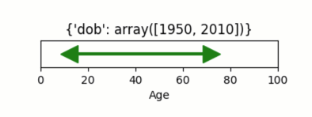
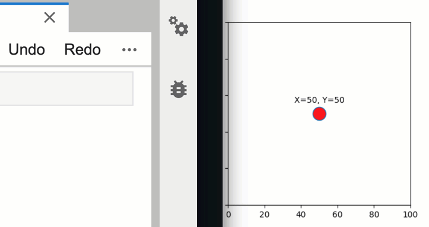
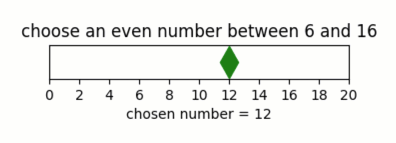

Assignments
-----------

Rationale
~~~~~~~~~

Data analysis pipelines are often heavily parametrized, necessitating
means to identify and change parameters easily, transparently, and
interactively. Typically, though, interactive parameter specification is
challenging. Firstly, underlying input parameters are often transformed
into various different downstream forms through a range of functional
operations (changing units, shifting between linear and log scales,
extracting specific parameters out of larger data structures, combining
parameters, etc.). Secondly, such transformed representations of
parameters may further be presented graphically in various forms. In
*Quibbler*, these multiple downstream representations of upstream
parameters are all inherently linked: changing any downstream
representation of a given parameter automatically changes its source
value, thereby updating all other representations.

This behavior is achieved through the process of *inverse assignment*,
in which an assignment to a downstream function quib is propagated
backwards and ultimately actualized as an *override* in an upstream
quib, typically the source input quib. This upstream change then
propagates downstream to affect all other representations of this same
parameter. This behavior allows readily building sophisticated, yet
inherently interactive, data analysis pipelines.

Below, we cover how the value of input quibs can change either simply by
direct assignments or through the process of inverting assignments made
to downstream function quibs. Kindly consult also with the chapter on
:doc:`Overriding-default-functionality` for assignments actualized as
exceptions to function quibs.

Assigning values to quibs
~~~~~~~~~~~~~~~~~~~~~~~~~

Quib assignments are made using standard *Python* assignment syntax.

For example:

.. code:: python

    # Imports
    import pyquibbler as qb
    from pyquibbler import iquib, q
    qb.override_all()
    import numpy as np
    import matplotlib.pyplot as plt
    from matplotlib.widgets import Slider, CheckButtons
    
    %matplotlib tk

.. code:: python

    words = iquib(['We', 'love', 'big', 'data'])
    words.get_value()

.. code:: none

    ['We', 'love', 'big', 'data']

.. code:: python

    words[2] = 'huge'
    words.get_value()

.. code:: none

    ['We', 'love', 'huge', 'data']

Deep-level assignments are also supported:

.. code:: python

    x = iquib([1, [2, 3], 4])
    x[1][1] = 0
    x.get_value()

.. code:: none

    [1, [2, 0], 4]

Whole-object assignments
^^^^^^^^^^^^^^^^^^^^^^^^

To completely replace the whole value of a quib, we use the
:py:meth:`~pyquibbler.Quib.assign()` method. For example, suppose we want to assign the
*NumPy* array ``np.array([10, 20, 30])`` into the quib ``x`` above. The
syntax ``x = np.array([10, 20, 30])`` cannot work as it simply sets
``x`` to *be* the *NumPy* array rather than setting the existing quib’s
value to be the specified array. To perform such whole-object
assignments, we can use the :py:meth:`~pyquibbler.Quib.assign()` method:

.. code:: python

    x.assign(np.array([10, 20, 30]))
    x.get_value()

.. code:: none

    array([10, 20, 30])

Inverse assignments
~~~~~~~~~~~~~~~~~~~

By default, assignments to functional quibs are propagated backwards to
alter upstream quibs. This *inverse assignment* process proceeds
upstream until it reaches a quib, typically an i-quib, in which the
assignment is ultimately *actualized* as an *override* to the quib value
(for assignments actualized at intermediate f-quibs, see
:doc:`Overriding-default-functionality`).

For example, suppose ``z`` is an i-quib and ``z10`` is an f-quib that
depends on ``z``:

.. code:: python

    z = iquib(np.array([11, 12, 13]))
    z10 = z + 10
    z10.get_value()

.. code:: none

    array([21, 22, 23])

Then, making an assignment into ``z10`` is propagated backwards,
reaching the i-quib ``z`` where the assignment is actualized:

.. code:: python

    z10[2] = 100
    z.get_value()

.. code:: none

    array([11, 12, 90])

.. code:: python

    z10.get_value()

.. code:: none

    array([ 21,  22, 100])

Such inverse assignment can transverse multiple levels, inverting many
types of functional operations including arithmetic functions, casting,
concatenation, array-reordering, object referencing and more.

For example, consider a series of functional operations starting with a
given i-quib:

.. code:: python

    a = iquib(np.array([1, 0, 2, 0, 4, 0, 8]))

and continuing with a sequence of different functional transformations:

.. code:: python

    b = a[0::2]  # -> [1, 2, 4, 16]
    c = np.log2(b)  # -> [0, 1, 2, 3]
    d = np.flip(c)  # -> [3, 2, 1, 0]
    e = d + 10  # -> [13, 12, 11, 10]
    e.get_value()

.. code:: none

    array([13., 12., 11., 10.])

then, assigning to the downstream f-quib:

.. code:: python

    e[0] = 14

is translated into upstream changes in the corresponding indeces of the
relevant source i-quibs. In our case, it sets ``a[6] = 16``:

.. code:: python

    a.get_value()

.. code:: none

    array([ 1,  0,  2,  0,  4,  0, 16])

such that ``e[0] = 14`` as we specified.

.. image:: images/inverse_assignment_illustrate.gif

Combining inverse assignments with graphics-driven assignments readily creates interactive GUIs
~~~~~~~~~~~~~~~~~~~~~~~~~~~~~~~~~~~~~~~~~~~~~~~~~~~~~~~~~~~~~~~~~~~~~~~~~~~~~~~~~~~~~~~~~~~~~~~

By combining inverse assignment with :doc:`Graphics`, we can easily create
intuitive and interactive graphics user interface for parameter
specification. This combination is particularly powerful in cases where
an upstream parameter is transformed into one or more different, yet
inherently dependent, representations. In such cases, changing any of
these representations will affect the source parameter, by inverse
assignment, and thereby affect all other dependent representations.

Consider a simple example, where we choose parameters for analysis of
Electronic Health Records and we want to interactively set the age range
of the analysis, while translating age range to into range of
date-of-birth (dob):

.. code:: python

    params = iquib({
        'dob': np.array([1950, 2010]), 
    })
    
    dob = params['dob']
    current_year = iquib(2022)
    age = -dob + current_year
    
    fig = plt.figure(figsize=(5, 2))
    ax = fig.add_axes([0.2, 0.5, 0.6, 0.17])
    ax.axis([0, 100, -1, 1])
    ax.plot(age, [0, 0], 'g-', lw=3)
    ax.plot(age[0], 0, 'g>', markersize=16, picker=True)
    ax.plot(age[1], 0, 'g<', markersize=16, picker=True)
    ax.set_xlabel('Age')
    ax.set_yticks([])
    ax.set_title(q(str, params));

For additional examples, see:

-  :doc:`examples/quibdemo_LotkaVolterra`
-  :doc:`examples/quibdemo_same_data_in_many_forms`

Inverse assignments of many-to-one functions
~~~~~~~~~~~~~~~~~~~~~~~~~~~~~~~~~~~~~~~~~~~~

Inverse assignment is defined in *Quibbler* not only for one-to-one
functions, but also for many-to-one functions. Such inversions are based
on the original upstream value onto which the assignment is inverted.
This functionality creates the naturally expected behaviors.

Here are a few examples:

**Casting.** *Quibbler* will adequately inverse casting functions like
``float``, ``int`` and ``str`` (note that these functions are *quiby*,
and we use therefore use them with the :py:func:`~pyquibbler.q` syntax).

For example:

.. code:: python

    i = iquib(5)
    f = q(float, i)
    s = q(str, f)
    s.get_value()

.. code:: none

    '5.0'

.. code:: python

    s.assign('7.2')
    i.get_value()

.. code:: none

    7

**Rounding.** In *Quibbler*, the inverse of rounding functions, like
``round``, ``ceil``, ``floor`` is simply defined as the identify
function. So, while the inverse of round(10) can be any number between
9.5 and 10.5, *Quibbler* uses the value 10 for the inversion:

.. code:: python

    f = iquib(np.array([-3.2, 3.2, -3.7, 3.7]))
    f_round = np.round(f)
    f_round[0:5] = [10, 10, 10, 10]
    f.get_value()

.. code:: none

    array([10., 10., 10., 10.])

**Periodic functions.** Periodic functions have multiple inversion
solutions. *Quibbler* automatically chooses the solution closet to the
current value of the assigned quib. For example:

.. code:: python

    phi = iquib(np.array([0., 180., 360., -360., 3600.]))
    sin_phi = np.sin(phi / 360 * 2 * np.pi) # <- [0., 0., 0., 0., 0.]
    sin_phi[0:5] = [0.5, 0.5, 0.5, 0.5, 0.5]
    phi.get_value()

.. code:: none

    array([  30.,  150.,  390., -330., 3630.])

**Other many-to-one functions.** As with periodic functions, in other
functions where multiple solutions exist, inverse assignments assumes
the solution closest to the current value:

.. code:: python

    r = iquib(np.array([-3., 3.]))
    r2 = np.square(r)
    r2[0:2] = [16, 16]
    r.get_value()

.. code:: none

    array([-4.,  4.])

Inverse assignment of binary operators with two quib arguments
~~~~~~~~~~~~~~~~~~~~~~~~~~~~~~~~~~~~~~~~~~~~~~~~~~~~~~~~~~~~~~

As a convention, in binary operators (like addition, multiplication,
etc.), inverse assignment is defined to target the first quib argument.

This definition allows specifying the upstream target for assignment
inversion.

Consider, for example, the different in behavior of the following two
code snippets:

.. code:: python

    x = iquib([3, 4])
    s = x[0] + x[1]
    s.assign(10)
    x.get_value()

.. code:: none

    [6, 4]

.. code:: python

    x = iquib([3, 4])
    s = x[1] + x[0]
    s.assign(10)
    x.get_value()

.. code:: none

    [3, 7]

These two codes differ only in the order in which ``x[0]`` and ``x[1]``
are added. In the first case, when we use ``s = x[0] + x[1]``, the first
quib is ``x[0]`` and the assignment into ``s`` is inverted to affect
``x[0]``. Conversely, in the second case, when we use
``s = x[1] + x[0]``, the first quib is ``x[1]`` and the assignment into
``s`` is inverted to affect ``x[1]``. Note that in both cases ``x`` is
changed such that its sum is ``10``.

This behavior allows controlling the desired behavior of inverse
assignment when a given change can be satisfied in more than one way. As
an illustrating example, see:

-  :doc:`examples/quibdemo_drag_whole_object_vs_individual_points`

Inverse assignment of binary operators with two dependent quib arguments
~~~~~~~~~~~~~~~~~~~~~~~~~~~~~~~~~~~~~~~~~~~~~~~~~~~~~~~~~~~~~~~~~~~~~~~~

As indicated above, when binary operators acting on two quibs are
inverted, inversion is set to always target the first quib. When these
two quibs are independent, the resulted upstream assignment will satisfy
the downstream assignment we have made (as seen in the example above).
However, when the two quibs are dependent, we can get upstream
assignments that do not necessarily satisfy the downstream assignments
we made. Formally speaking, inverse assignment is not meant to ‘solve’
an equation, rather as a function that propagate downstream assignments
to desired upstream changes. This is perhaps best exemplified in the
following simple code which allows adding a given value to specified
quib:

.. code:: python

    x = iquib(5)
    dx = x - x

.. code:: python

    dx.assign(2)
    x.get_value()

.. code:: none

    7

.. code:: python

    dx.assign(-3)
    x.get_value()

.. code:: none

    4

This behavior can be used, for example, to graphically control the
position of one object by “dragging” another fixed object. See:

-  :doc:`examples/quibdemo_dragging_fixed_object`

Upstream type casting can be used to restrict the value of downstream results
~~~~~~~~~~~~~~~~~~~~~~~~~~~~~~~~~~~~~~~~~~~~~~~~~~~~~~~~~~~~~~~~~~~~~~~~~~~~~

The value of downstream functional quibs could be restricted due to
specific type of upstream quibs.

In the following example, ``a`` is an integer and thereby ``b = 10 * a``
must be divisible by 10. Assigning a value of 33 to ``b`` assigns 3.3 to
``a``, but since ``a`` is an array of integers, it changes to 3 thereby
changing ``b`` to 30 (rather than the assigned value of 33):

.. code:: python

    a = iquib(np.array([7]))
    b = 10 * a
    b[0] = 33
    b[0].get_value()

.. code:: none

    30

This natural behavior can be used in applications where we need to
restrict the possible values of specific function quibs. See for
example:

-  :doc:`examples/quibdemo_drag_fixed_values`

Undo/Redo assignments
~~~~~~~~~~~~~~~~~~~~~

*Quibbler* tracks all assignments (either graphics-driven, or through
the command line), allowing Undo/Redo functionality. Undo/Redo can be
done using the Undo/Redo buttons of the :py:func:`~pyquibbler.quibapp`, or the using the
embedded Undo/Redo buttons within *Jupyter Lab*.

Here is a simple demo:

.. code:: python

    xy = iquib(np.array([50, 50]))
    plt.figure(figsize=(4, 4))
    plt.axis('square')
    plt.axis([0, 100, 0, 100])
    plt.plot(xy[0], xy[1], 'o', picker=True, markersize=16, markerfacecolor='r')
    plt.text(xy[0], xy[1]+5, q('X={}, Y={}'.format, xy[0], xy[1]), 
             ha='center', va='bottom')

Undo/redo can also be invoked programatically using :py:func:`~pyquibbler.undo`,
:py:func:`~pyquibbler.redo`:

.. code:: python

    a = iquib([0, 1, 2])
    a[1] = 10
    a.get_value()

.. code:: none

    [0, 10, 2]

.. code:: python

    qb.undo()
    a.get_value()

.. code:: none

    [0, 1, 2]

.. code:: python

    qb.redo()
    a.get_value()

.. code:: none

    [0, 10, 2]

The assignment_template is used to restrict assigned values
~~~~~~~~~~~~~~~~~~~~~~~~~~~~~~~~~~~~~~~~~~~~~~~~~~~~~~~~~~~

Depending on the application, we may need to assure and verify that the
user only assign specific data types and values to a given quib. This is
achieved using the :py:attr:`~pyquibbler.Quib.assignment_template` property. When ``None``,
there are no restrictions on assignments. To restrict the value of
overriding assignments to the quib, use the
:py:meth:`~pyquibbler.Quib.set_assignment_template()` method:

-  Set a bound template between ``start`` and ``stop``:
   ``set_assignment_template(start, stop)``

-  Set a bound template between ``start`` and ``stop``, with specified
   ``step``: ``quib.set_assignment_template(start, stop, step)``

For example, here is a simple app for interactively choosing an even
number within a defined range:

.. code:: python

    # figure setup
    fig = plt.figure(figsize=(5, 2))
    ax = fig.add_axes([0.2, 0.5, 0.6, 0.17])
    ax.set_yticks([])
    ax.set_xticks(np.arange(0, 22, 2))
    ax.axis([0, 20, -1, 1])
    ax.set_title('choose an even number between 6 and 16')
    
    # use assignment_template to restrict quib overriding values:
    num = iquib(12, assignment_template=(6, 16, 2))
    
    # plot:
    ax.plot(num, 0, 'gd', markersize=16, picker=True)
    ax.set_xlabel(q('chosen number = {}'.format, num));

See also the following demos, where ``assignment_template`` is used:

-  :doc:`examples/quibdemo_default_overriding`
-  :doc:`examples/quibdemo_compare_images`
-  :doc:`examples/quibdemo_drag_fixed_values`
-  :doc:`examples/quibdemo_fft`

Saving quib assignments to files
~~~~~~~~~~~~~~~~~~~~~~~~~~~~~~~~

The assignments of each quib can be saved into quib-associated files,
see :doc:`Project-save-load`.
