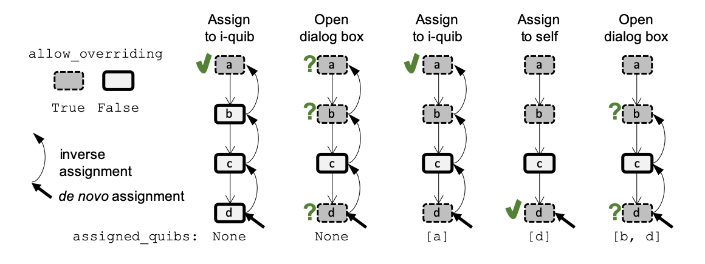

Overriding default functionality
--------------------------------

Rationale
^^^^^^^^^

Overriding, or making exceptions, is an inherent inevitability in many
data analysis applications. For example, when analyzing many similar
data items, we can often devise a processing scheme that works well on
most of the data items, yet requires some adjustments for outlier items
(say, we may have many images that are each normalized according to some
default normalization scheme, but we need to make an exception for few
of these images that were taken in different lighting conditions).
*Quibbler* allows overriding such default functional behavior in a
simple, interactive, yet also transparent and well-documented fashion.
Such exceptions are made by *overriding assignments*.

Consider the following simple, where we define a default value to be
used for some presumed downstream processing of some *n* data items:

.. code:: ipython3

    # Imports
    import pyquibbler as qb
    from pyquibbler import iquib
    qb.override_all()
    import numpy as np
    import matplotlib.pyplot as plt
    %matplotlib tk

.. code:: ipython3

    # Number of data items:
    n = iquib(5)
    
    # Define default factor:
    default_factor = iquib(np.array([7.]))
    
    # Define a per-item factor by replicating the default factor:
    per_item_factor = np.tile(default_factor, n)

.. code:: ipython3

    per_item_factor.get_value()

.. parsed-literal::

    array([7., 7., 7., 7., 7.])

The ``per_item_factor`` is a function quib, providing a “default” value
to be used for ``n`` data items. In this simple example, this per-item
default is simply a result of applying the ``tile`` function to the
underlying i-quib ``default_factor``. In general, though, such per-item
decisions could be a result of other, more complex, functionalities.
Yet, as sophisticated as our automatic choice could get, we may still
sometime need to make exceptions, *overriding* the default functional
behavior. To allow such overriding of the defualt funational values of a
given quib, we first need to turn on its ``allow_overriding`` property:

.. code:: ipython3

    per_item_factor.allow_overriding = True

Now, say we want to override the ``per_item_factor``, for instance
substituting 9 in position 1, we can simply use standard assignment
syntax:

.. code:: ipython3

    per_item_factor[1] = 9

.. parsed-literal::

    Overriding choices:
    (1) per_item_factor
    (2) default_factor
    

.. parsed-literal::

    Choose the number of the quib to override 
    (press enter without a choice to cancel):  1

.. parsed-literal::

    Overriding:  per_item_factor

There are two options for *actualizing* this assignment. First, as we
have seen in the chapter on :doc:`Inverse-assignments`, the assignment can
inverse-propagate to an upstream i-quib, in our case to be actualized as
a chnage to the ``default_factor``. Second, since we have now set
``per_item_factor.allow_overriding = True`` there is also an option to
actualize the assignment as an override to the ``per_item_factor``. We
can programatically specifiy which of these two options to choose by
setting the ``assigned_quibs`` property (expalined below). But, here, we
did not specify a choice and *Quibbler* thereby prompt us, asking to
choose at which of these two levels to actualize the assignment.

Choosing to actualize at the ``per_item_factor`` (choosing “1” in the
menu above) will cause an overriding assignment to this function quib:

.. code:: ipython3

    per_item_factor.get_value()

.. parsed-literal::

    array([7., 9., 7., 7., 7.])

As we see, the quib has been overridden to have a value of 9 at position
1. All other values remain functional: they are the result of the
function ``tile`` applied to ``default_factor``. Changing
``default_factor`` will change the downstream ``per_item_factor`` in all
but the overridden positions:

.. code:: ipython3

    default_factor[0] = 8
    per_item_factor.get_value()

.. parsed-literal::

    array([8., 9., 8., 8., 8.])

The choice we made in the dialog box is recorded in the quib. So further
assignments do not require bringing up the dialog box again:

.. code:: ipython3

    per_item_factor[3] = 7
    per_item_factor.get_value()

.. parsed-literal::

    array([8., 9., 8., 7., 8.])

Assignments are actualized as a list of overrides to a quib’s ‘default’ value
^^^^^^^^^^^^^^^^^^^^^^^^^^^^^^^^^^^^^^^^^^^^^^^^^^^^^^^^^^^^^^^^^^^^^^^^^^^^^

When we make overriding assignments to a quib, these assignments are
actualized as a list of overrides that apply to the quib’s ‘default’
value (the functional value).

This override list is accessible through the ``get_override_list()``
method:

.. code:: ipython3

    per_item_factor.get_override_list()

.. parsed-literal::

    quib[1] = 9
    quib[3] = 7

In addition, we can check which element positions are overridden, using
the ``get_override_mask()`` method:

.. code:: ipython3

    per_item_factor.get_override_mask().get_value()

.. parsed-literal::

    array([False,  True, False,  True, False])

Graphics-driven overriding assignments
^^^^^^^^^^^^^^^^^^^^^^^^^^^^^^^^^^^^^^

Overriding can also be used together with graphics-driven assignments,
easily yielding interactive GUIs for default-overriding parameter
specification.

.. code:: ipython3

    # Figure setup
    plt.axis([-0.5, n - 0.5, 0, 10])
    plt.xticks(np.arange(n))
    
    # Plot the default_factor as an horizontal dragganle line
    plt.plot([-0.5, n - 0.5], default_factor[[0, 0]], 'k', 
             linewidth=5, picker=True);
    
    # Plot the per_item_factor as an bars and as draggable markers
    x = np.arange(n)
    plt.bar(x, per_item_factor, color=(0.7, 0.7, 0.7))
    plt.plot(x, per_item_factor, 's', picker=True);

[[images/overriding_default_by_dragging.gif]]

For more complex, two-level overriding, see
[[examples/quibdemo_default_overriding_two_levels]].

Clearing assignments by assigning the Default value
^^^^^^^^^^^^^^^^^^^^^^^^^^^^^^^^^^^^^^^^^^^^^^^^^^^

Overriding assignments to a quib can be cleared, thereby restoring the
default functionality. Clearing overriding assignments can be done
graphically, simply by right-clicking a graphic quib (see in the video
above). Alternatively, overriding can be removed programatically using
an assigning syntax where the assigned value is the *Quibbler*
``default`` value:

.. code:: ipython3

    per_item_factor[1:4] = [101, 102, 103]
    per_item_factor.get_value()

.. parsed-literal::

    array([  8., 101., 102., 103.,   8.])

.. code:: ipython3

    per_item_factor[1:3] = qb.default
    per_item_factor.get_value()

.. parsed-literal::

    array([  8.,   8.,   8., 103.,   8.])

All assignments to a quib can be cleared using:

.. code:: ipython3

    per_item_factor.assign(qb.default)
    per_item_factor.get_value()

.. parsed-literal::

    array([8., 8., 8., 8., 8.])

Out-of-range overriding are ignored
^^^^^^^^^^^^^^^^^^^^^^^^^^^^^^^^^^^

When we try to assign out of range, we get an exception. For example,

.. code:: ipython3

    per_item_factor[10] = 3
    # yields: IndexError: index 10 is out of bounds for axis 0 with size 5

However, it is also possible that an originally within-range assignment
will become out-of-range. For example:

.. code:: ipython3

    per_item_factor[4] = 3
    per_item_factor.get_value()

.. parsed-literal::

    array([8., 8., 8., 8., 3.])

This assignment will become out-of-range if we now change ``n``. In such
a case, *Quibbler* gives a warning and otherwise ignores the
out-of-range assignment:

.. code:: ipython3

    n.assign(4)
    per_item_factor.get_value()

.. parsed-literal::

    array([8., 8., 8., 8.])

Overriding is controlled by the ‘allow_overriding’ and ‘assigned_quibs’ properties
^^^^^^^^^^^^^^^^^^^^^^^^^^^^^^^^^^^^^^^^^^^^^^^^^^^^^^^^^^^^^^^^^^^^^^^^^^^^^^^^^^

When a *de novo* assignment is being made to a specific quib (the
“assigned quib”) the assignment can be actualized as overriding of this
focal quib, or can :doc:`inverse-propagate<Inverse-assignments>` upstream
and actualized as overrides of some higher up quibs (“inverse-assigned
quibs”). The choice of which quibs should be chosen for actualizing the
overriding assignment is controlled by the following two quib
properties:

-  **allow_overriding.** A boolean property specifying for each quib
   whether it accepts overriding. By default, i-quibs accept overriding
   and f-quibs do not. In order to allow overriding of a specific
   f-quib, we need to explicitly set its ``allow_overriding`` to
   ``True``.

-  **assigned_quibs.** Indicates a set of possible upstream quibs into
   which an assignment to the current quib should be inverse-propagated
   and actualized:

   -  ``None`` (default): If there is only one upstream quib with
      allow_overriding=True, inverse-assign to it. If multiple options
      exist, bring up a dialog box to ask the user which quib to
      inverse-assign to.

   -  ``{}``: Do not allow *de novo* assignments to this quib.

   -  ``{quibs}``: Set of upstream quibs into which to actualize *de
      novo* assignments made to the current quib. If multiple options
      exist, bring up a dialog box.

In the default settings, where ``assigned_quibs=None`` and
``allow_overriding=True`` only for i-quibs, any *de novo* assignment to
an f-quib is inverse-propagated all the way to the respective upstream
i-quibs, where it is ultimately actualized.

Though, when overriding of specific intermediate f-quibs is enabled
(``allow_overriding=True``), multiple options for actualizing a *de
novo* assignment to a downstream quib may be available. The choice among
these options is determined by the ``assigned_quibs`` property of the
quib to which the *de novo* assignment was made.

The following diagram depicts such inverse assignment behaviors:

