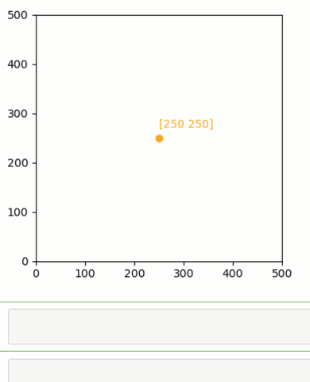
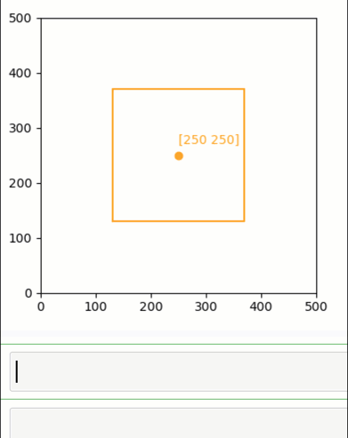
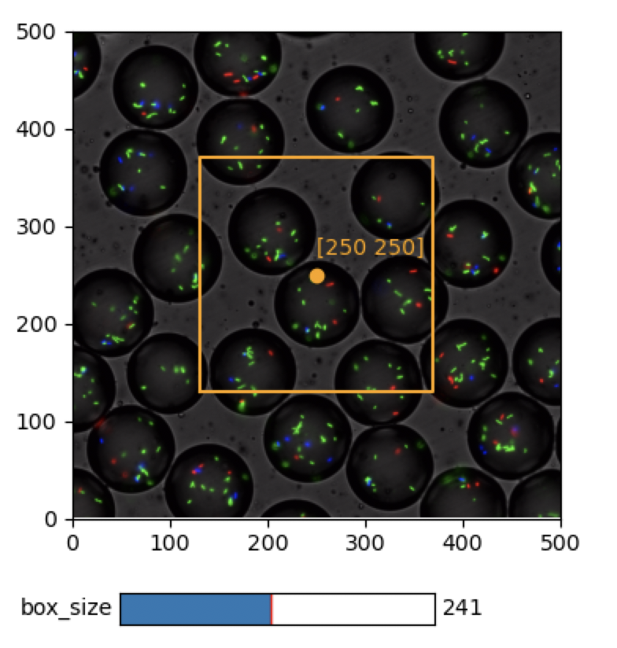
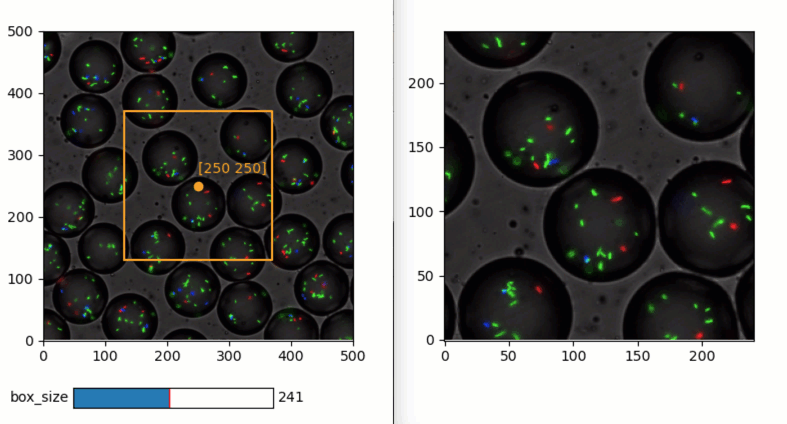

Quickstart
----------

*Quibbler* allows easily creating highly interactive and efficient data
analysis applications. Importantly, in *Quibbler*, effeciency and
interactivity are enabled naturally, using completely standard *Python*,
*NumPy* and *Matplotlib* programming syntax. There is therefore very
little to learn to get started.

This page provides a minimal-demo quickstart to quickly get you up and
running.

For additional demos, consider also the :doc:`Examples`.

For a more methodological tour, see the :doc:`Introduction` and the
complete :doc:`User Guide<index>`.

Before starting, please first :doc:`install Quibbler<Installation>`.

Import
~~~~~~

*Quibbler* for *python*, ``pyquibbler``, is conventionally imported as
``qb``. In addition, it is convenient to specifically import some
often-used functions such as ``iquib`` (which will be explained below).
Following import, we execute ``qb.override_all()`` which configures
*NumPy* and *Matplotlib* functions to work with *Quibbler*. A typical
import therefore looks as follows:

.. code:: python

    # Quibbler import:
    import pyquibbler as qb
    from pyquibbler import iquib
    qb.override_all()
    
    # Other imports:
    import numpy as np
    import matplotlib.pyplot as plt
    %matplotlib tk

Example of a minimal app
~~~~~~~~~~~~~~~~~~~~~~~~

As a quick simple example to demonstrate *Quibbler*, consider the
following code for creating a figure with a draggable marker and
corresponding text at defined x-y coordinates:

.. code:: python

    xy = iquib(np.array([250, 250]))
    x = xy[0]
    y = xy[1]
    plt.axis('square')
    plt.axis([0, 500, 0, 500])
    plt.plot(x, y, marker='o', color='Orange', picker=True)
    plt.text(x, y + 20, np.array2string(xy), color='Orange');

As we can see, except for the use of the function :py:func:`~pyquibbler.iquib` (which
will be explained below), the rest is a completely standard *Python*
code for plotting a marker at position x=250, y=250 and adding a text
label with a string representation of these coordinates. Indeed, running
this code plots the marker and the text as classically expected. Yet,
unlike in classical programming, in *Quibbler* the data items and
graphics are all bi-directionally linked. First, assigning new values to
an upstream variable, say assigning ``xy[1] = 300`` immediately
refreshes all downstream graphics. Second, the plotted marker is in fact
draggable and, as we drag it, we see that it leads to changes in the
upstream variable ``xy`` and in any dependent graphics.

In *Quibbler*, thereby, we can easily get interactive functionality
while using completely standard programming syntax and without the need
for the tedious programming of event-specific callback functions for
creating interactive behaviors.

How does it work?
~~~~~~~~~~~~~~~~~

Below, we briefly explain the above example, while providing a more
general view of *Quibbler* functionality.

The quib object
^^^^^^^^^^^^^^^

*Quibbler* functionality is based on the :py:class:`~pyquibbler.Quib` object. The quib is an
object that represents an output *value* as well as the *function* and
*arguments* used to calculate this value. There are two major types of
quibs: input-quibs (i-quibs) which take a regular *Python* object as
their argument and present it as their value, and function-quibs
(f-quibs) that calculate their output value by applying a given function
to a given list of arguments, which could include other quibs and any
other *Python* objects.

Input-quibs
^^^^^^^^^^^

Input-quibs are created using the function :py:func:`~pyquibbler.iquib`, which
transforms any regular *Python* object into a quib. In our case
``xy = iquib(np.array([250, 250]))`` creates an i-quib ``xy`` whose
value is the *NumPy* array ``[250, 250]``.

Function-quibs
^^^^^^^^^^^^^^

Function-quibs are created naturally whenever we use quibs as part of
standard expressions or functions. Indeed, *Quibbler* modifies standard
functions and operators such that they can work directly with quibs.
Such *Quibbler*-supported functions, also called *quiby functions*,
include not only many standard *Python*, *NumPy* and *Matplotlib*
functions (see :doc:`List-of-quiby-functions`, but also operators (such as
``+``, ``-``, ``<``, ``>``, ``**``, ``@``, etc.), and any array indexing
syntax (e.g., if ``xy`` is a quib, ``x = xy[0]`` is a function quib). We
can therefore easily define a chained network of function quibs using
standard programming syntax.

In our case, the commands ``x = xy[0]`` and ``y = xy[1]`` create the
f-quibs ``x`` and ``y`` whose function is to reference ``xy`` at
positions 0 and 1, respectively. Next, the command
``plt.plot(x, y, ...)`` defines an f-quib whose function is to perform
``plt.plot`` on the values of ``x`` and ``y``. Similarly, ``y + 4`` is a
function quib that adds 4 to the value of ``y``, ``np.array2string(xy)``
is a function-quib that performs the ``array2string`` on the value of
``xy`` and, finally, ``plt.text(...)`` is a function quib that calls the
*Matplotlib* function ``plt.text`` with the values of its quib
arguments.

Upstream changes automatically propagate to affect the value of downstream quibs
^^^^^^^^^^^^^^^^^^^^^^^^^^^^^^^^^^^^^^^^^^^^^^^^^^^^^^^^^^^^^^^^^^^^^^^^^^^^^^^^

All of these quibs are created *declaratively*: they are functional
objects whose value changes upon upstream changes. As seen in the video
above, we can probe the value of any quib using the ``get_value``
method. When we make an assignment to the upstream i-quib ``xy``, say
assigning ``xy[1] = 300``, we change the value of ``xy`` which in turn
changes the value of ``y``, which in turn changes the plot and the text.

Interaction with the graphics is inverse-propagated, leading to changes in upstream quibs
^^^^^^^^^^^^^^^^^^^^^^^^^^^^^^^^^^^^^^^^^^^^^^^^^^^^^^^^^^^^^^^^^^^^^^^^^^^^^^^^^^^^^^^^^

The relation above can also go backward. Note that in the plot command
above, we have indicated ``picker=True``. This syntax tells *Quibbler*
to allow dragging the plotted graphics while translating such user
interactions with the graphics into assignments to the corresponding
quib arguments of the plt.plot function. Such assignments into the
arguments of the plot function are then inverse-propagated further
upstream, ultimately actualized as changes to upstream quibs (typically
reaching upstream i-quibs; see :doc:`Inverse-assignments`). In our case
dragging the marker is initially translated into assignments to the
``x`` and ``y`` quibs. Since ``x`` and ``y`` are function quibs, the
assignment is further inverse-propagated upstream to the i-quib ``xy``
where it is actualized. The resulting change in ``xy`` then percolates
downstream to affect the plotted marker as well as text position and the
text string label.

Building interactive data analysis apps
~~~~~~~~~~~~~~~~~~~~~~~~~~~~~~~~~~~~~~~

The above principles can be used to build powerful bi-directional
relationships between data, parameter specifications and graphics.

As a very simple example, we will extend our coordinate-choosing example
above for building a small app for choosing and extracting a square area
in an image.

Let’s first define and plot our square area, as a box extending length
``d`` from our defined x-y coordinates:

.. code:: python

    d = iquib(120)
    plt.plot(d * np.array([ -1,  1,  1, -1, -1]) + x, 
             d * np.array([ -1, -1,  1,  1, -1]) + y, 
             color='Orange', picker=True);

As we can see, setting ``picker=True`` in the plot function, this plot
too becomes interactive. Indeed, changing the value of ``d``, say by
assigning ``d[0] = 150``, changes the plotted square. And, conversely,
dragging any of the corners of the square is inverted into an assignment
to the iquib ``d`` which then refreshes all other corners of the plotted
square. To further understand how *Quibbler* chooses to invert these
dragging actions into changes in ``d`` rather than in ``x`` and ``y``,
see ` <Inverse-assignments>`__, or the
` <examples/quibdemo_drag_whole_object_vs_individual_points>`__
example).

Connecting quibs with widgets
~~~~~~~~~~~~~~~~~~~~~~~~~~~~~

Quibs can also readily connect with *Matplotlib* widgets. Here again,
unlike in standard programming, using quibs in widgets automatically
creates an interactive behavior without requiring us to specifically
implement a callback function for each widget.

As an example, let’s add a slider controlling the size of our square
box.

As the box is extending from -d[0] to d[0], its size is defined by:

.. code:: python

    box_size = 2 * d + 1

To connect widgets with quibs, we simply use standard *Matplotlib*
widget creation functions, while specifying a quib as the initial value
of the widget. In our case, we will create a slider with initial value
set to the function quib ``box_size``:

.. code:: python

    from matplotlib.widgets import Slider
    main_ax = plt.gca()
    slider_ax = plt.axes([0.2, 0.05, 0.5, 0.04])
    Slider(ax=slider_ax, label='box_size', valmin=1, valmax=500, 
           valinit=box_size);

.. image:: images/Quickstart_widget_box_size.gif

As we can see, the created widget is bi-directionally linked with the
data. First, when we drag the square corners above, ``d`` changes and
the slider position moves. Conversely, when we drag the slider, these
interactions are inverted into assignments to ``box_size`` and, since
``box_size`` is a function quib, the change further propagates to affect
``d``, thereby refreshing the plotted square. Note that as ``d`` is
defined as an array of integers, ``box_size``, which is defined as
``2*d[0] + 1`` must be, by definition, an odd number. Indeed, as we drag
the slider, *Quibbler* restricts the dragging to odd numbers (to
understand more on dragging between restricted values, see
` <examples/quibdemo_drag_fixed_values>`__.

Loading data from files
~~~~~~~~~~~~~~~~~~~~~~~

Function quibs can also implement functions that read data from files.
One simple way in which this can be achieved is setting the file name as
a quib, then using standard file-accessing functions.

In our example, we will load and plot an image that we want to cut based
on our defined square. Let’s look at an example of a microscopy image of
fluorescently-labeled bacteria growing inside small micro-droplets:

.. code:: python

    filename = iquib('bacteria_in_droplets.tif')
    img = plt.imread(filename)
    main_ax.imshow(img);

Downstream data items are inherently linked with upstream parameter choice
~~~~~~~~~~~~~~~~~~~~~~~~~~~~~~~~~~~~~~~~~~~~~~~~~~~~~~~~~~~~~~~~~~~~~~~~~~

In *Quibbler*, we can keep defining data processing operations easily
yielding a connected chain of processes.

For example, we can use slice indexing based on the quibs ``x``, ``y``
and ``d`` which we have defined above, to extract and plot the image
within our defined box:

.. code:: python

    img_cut = img[y-d:y+d+1, x-d:x+d+1, :]
    plt.figure()
    plt.imshow(img_cut, origin='lower');

Conclusions
~~~~~~~~~~~

As we have seen, *Quibbler* provides a fast, easy and intuitive way to
analyze data in an inherently interactive way. Notably, such interactive
analysis appears naturally in *Quibbler* without us needing to worry
about the traditional, and often tedious, programming of specific
callback functions for each interactive behavior. Instead, we can set
our mind on the analysis from a data-oriented forward-looking
standpoint, and let *Quibbler* deal with any asynchronous graphics or
widget events.

Beyond **Interactivity**, other important capabilities of *Quibbler*,
not demonstrated above, include:

**1. Efficiency.** Upon changes to parameters, *Quibbler* tracks and
identifies which specific downstream data items, or even specific
elements thereof, are affected and must be recalculated. See
:doc:`Diverged-evaluation`.

**2. Traceability** *Quibbler* allows easily probing which specific
inputs affect a downstream result, and vise versa, which downstream
results are affected by a given focal parameter.

**3. Overriding**. Function quibs can be overridden, streamlining
exception specifications to default behaviors. See
:doc:`Overriding-default-functionality`.

**4. Transparency.** Inputs, as well as exceptions and overrides, are
saved in simple human-readable files. See :doc:`Project-save-load`.
