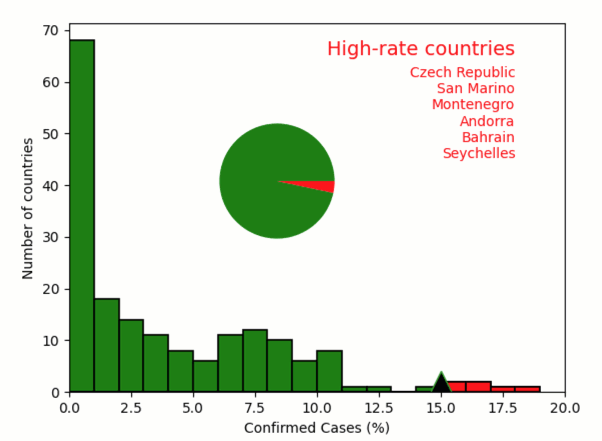

COVID-19 analysis
-----------------

**Analysis of COVID-19 infection rate by country.**

-  **Features**

   -  Reading data from external files
   -  Graphics-driven assignments

-  **Try me**

   -  Drag right or left the high-rate threshold (triangle marker)

.. code:: ipython3

    from pyquibbler import iquib, q, override_all
    override_all()
    from matplotlib import pyplot as plt
    import numpy as np
    %matplotlib tk

.. code:: ipython3

    # Load data file of COVID statistics per countries
    file_name = iquib('../data_files/COVID_Fatality.csv')
    
    dtype=[("Country", str, 32), ("ConfirmedCases", int), ("Deaths", int),  ("Population", float)]
    fatality_table = np.genfromtxt(file_name, dtype=dtype, delimiter=',', names=True)

.. code:: ipython3

    # Figure setup
    plt.xlabel("Confirmed Cases (%)")
    plt.ylabel("Number of countries")
    plt.xlim([0, 20]);

.. code:: ipython3

    # Calculate and plot histogram of infection rate
    rate = fatality_table['ConfirmedCases'] / fatality_table['Population'] * 100
    plt.hist(rate, np.arange(0, 20, 1), facecolor='g', edgecolor='black', linewidth=1.2);

.. code:: ipython3

    # Define a threshold for high-rate countries
    threshold = iquib(15)
    
    # Identify countries above/below threshold
    below_threshold = rate < threshold
    above_threshold = rate >= threshold
    
    # Plot histogram of above-threshold countries
    plt.hist(rate[above_threshold], np.arange(0, 20, 1), facecolor='r', alpha=1, edgecolor='black', linewidth=1.2)
    
    # Plot the threshold (using picker=True indicates that it is draggable)
    plt.plot(threshold, 0, markerfacecolor='k', marker='^', markersize=30, 
             picker=True, pickradius=30);

.. code:: ipython3

    # List countries above the threshold:
    plt.text(18, 68, 'High-rate countries', fontsize=14, verticalalignment='top',
             horizontalalignment='right', color='r')
    plt.text(18, 63, q("\n".join, fatality_table[above_threshold]['Country']), verticalalignment='top',
             horizontalalignment='right', color='r');

.. code:: ipython3

    # Pie chart
    below_threshold_sum = q(sum, below_threshold)
    above_threshold_sum = q(sum, above_threshold)
    ax = plt.axes([0.3, 0.4, 0.3, 0.3])
    plt.pie([below_threshold_sum, above_threshold_sum], colors=['g', 'r'])
    
    plt.show()
