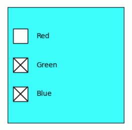

Quib-linked CheckButtons widget
-------------------------------

**A demo of interactive quib-linked matplotlib CheckButtons widget.**

-  **Features:**

   -  Quiby widgets.
   -  Quiby axis attributes.

-  **Try me:**

   -  Try playing with the check-buttons.

.. code:: ipython3

    from pyquibbler import iquib, override_all, q
    override_all()
    import matplotlib.pyplot as plt
    from matplotlib import widgets
    %matplotlib tk

.. code:: ipython3

    # Prepare figure, axes
    plt.figure(figsize=(3,3))
    axs = plt.gca()

.. code:: ipython3

    # Define input quib for colors:
    colors = iquib([False, True, True])

.. code:: ipython3

    # Define a quib-widget
    # (Interaction with the widget changes the quib)
    widgets.CheckButtons(ax=axs, labels=['Red','Green','Blue'], actives=colors);

.. code:: ipython3

    # Set the color of the axis to the quib colors
    axs.set_facecolor(colors);

