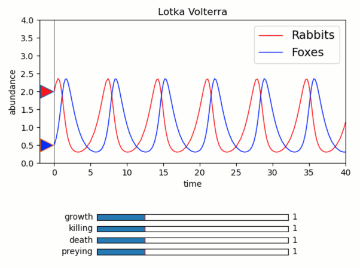

Build simple GUI for Lotka Volterra by equations
------------------------------------------------

**A demo of Lotka-Volterra equation solver. Initial conditions and
parameters are set interactively.**

-  **Features**

   -  Quib-linked widgets
   -  Running user defined functions using *q*
   -  Graphics quibs
   -  Graphics-driven assignments
   -  Inverse assignments

-  **Try me**

   -  Try dragging up and down the triangle markers to set the initial
      conditions.
   -  Try adjusting the sliders to set equation parameters.

.. code:: python

    from pyquibbler import iquib, override_all, q
    override_all()
    import matplotlib.pyplot as plt
    from matplotlib.widgets import Slider
    import numpy as np
    from scipy.integrate import solve_ivp
    %matplotlib tk

.. code:: python

    def solveLV(x0, pars, tfinal):
        a, b, c, d = pars
        
        def LV(t,v):
            # Lotka-Volterra equations:
            dv = np.zeros(np.shape(v));
            dv[0] =  a * v[0] - b * v[0] * v[1]
            dv[1] = -c * v[1] + d * v[0] * v[1]
            return dv
        
        return solve_ivp(LV, [0,tfinal], x0, rtol=1e-6)

.. code:: python

    # Initial condition:
    X0 = iquib([2,0.5]);
    
    # Parameters:
    abcd = iquib([1., 1., 1., 1.]);
    
    # Final time:
    tf = iquib(40);
    
    # Define the ODE solver quib:
    sol = q(solveLV, X0, abcd, tf)
    
    y = sol['y']
    t = sol['t']
    
    # Prepare figure:
    fig = plt.figure()
    axs = fig.add_axes([0.15,0.4,0.8,0.5])
    axs.set_xlim([-2,tf])
    mx = np.max([4.,np.max(y)])
    axs.set_ylim([0,mx])
    axs.set_xlabel('time')
    axs.set_ylabel('abundance')
    axs.set_title('Lotka Volterra')
    
    # Plot results:
    h1 = axs.plot(t,y[0,:], 'r', linewidth=1)
    h2 = axs.plot(t,y[1,:], 'b', linewidth=1)
    
    # Plot initial conditions:
    axs.plot(-1, X0[0], marker='>', markerfacecolor='r', markersize=16, picker=True)
    axs.plot(-1, X0[1], marker='>', markerfacecolor='b', markersize=16, picker=True)
    axs.plot([0, 0], [0, mx], 'k-', linewidth=0.5)
    
    # Add legend:
    ttls = iquib(['Rabbits', 'Foxes']);
    axs.legend(ttls, fontsize=14, loc='upper right')
    
    # Set sliders for parameters:
    params_labels = iquib(['growth', 'killing', 'death', 'preying']);
    for i in range(4):
        slider_axs = fig.add_axes([0.3,0.2-i*0.04,0.5,0.02])
        Slider(ax=slider_axs, label=params_labels[i], 
               valmin=0, valmax=4, valstep=0.1, valinit=abcd[i])

