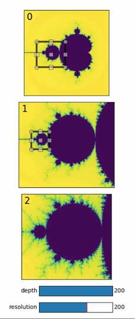

Interactive zooming on Mandelbrot
---------------------------------

**Simple quib-based app for viewing and zooming on the Mandelbrot set.**

-  **Features**

   -  Calling a user-defined function
   -  Quib-linked widgets
   -  Inverse assignments

-  **Try me**

   -  Try moving the region-of-interests in panels 1 and 2 to choose
      zoom-in areas.

.. code:: ipython3

    from pyquibbler import iquib, override_all, q
    import matplotlib.pyplot as plt
    from matplotlib import widgets
    import numpy as np
    override_all()
    %matplotlib tk

.. code:: ipython3

    def mandelbrot(extent, num_pixels=200, num_iterations=30):
        '''
        calculate mandelbrot set in the extent range
        extent = [xmin, xmax, ymin, ymax]
        '''
        
        x_range = extent[0:2]
        y_range = extent[2:4]
    
        dx = np.diff(x_range)
        dy = np.diff(y_range)
        d = np.maximum(dx,dy) / num_pixels
        xy = np.mgrid[y_range[0]:y_range[1]:d, x_range[0]:x_range[1]:d]
        y,x = xy
        c = x + 1j * y
        z = np.zeros(np.shape(x))
        m = np.zeros(np.shape(x))
    
        import warnings
        warnings.filterwarnings("ignore")
        for i_iter in range(num_iterations):
            z = z*z + c
            m[(np.abs(z) > 2) & (m == 0)] = num_iterations - i_iter
        warnings.filterwarnings("default")
        m = np.flipud(m)
    
        return m

.. code:: ipython3

    # Define input quibs:
    resolution = iquib(200) # image resolution
    depth = iquib(200) # number of iterations for calculating convergence of the mandelbrot set
    XYs = [] # selection areas for each of the panels
    XYs.append(iquib(np.array([-2.   ,  1.  , -1.5, 1.5  ])))
    XYs.append(iquib(np.array([-1.55 , -0.55, -0.5, 0.39 ])))
    XYs.append(iquib(np.array([-1.42 , -1.23, -0.1, 0.08 ])))
    
    # Figure setup:
    fig = plt.figure(figsize=(4.5,8))
    
    for k in range(3):
        # Define a functional quib that calculates Mandelbrot:
        img = q(mandelbrot,XYs[k], resolution, depth)
    
        # Plot the image:
        axs = fig.add_axes([0.1,0.13+(2-k)*0.28,0.8,0.26])
        axs.imshow(img, extent=XYs[k])
        axs.set_xticks([])
        axs.set_yticks([])
        axs.text(0.03,0.97,str(k), transform = axs.transAxes, fontsize=16, verticalalignment='top',horizontalalignment='left')
    
        # ROI selector:
        if k<2:
            widgets.RectangleSelector(axs, extents=XYs[k+1], rectprops=dict(edgecolor='black', alpha=0.7, fill=False, linewidth=3))
    
    # plot the depth slider
    axs = fig.add_axes([0.35,0.08,0.4,0.03])
    widgets.Slider(
        ax=axs, label='depth', valmin=0, valmax=200, valstep=1, valinit=depth);
    
    # plot the resolution slider
    axs = fig.add_axes([0.35,0.03,0.4,0.03])
    widgets.Slider(
        ax=axs, label='resolution', valmin=10, valmax=300, valstep=10, valinit=resolution);

