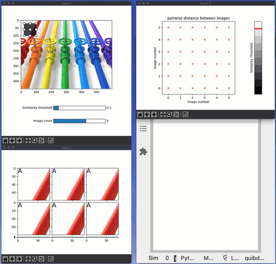

Compare images
--------------

**Pairwise image comparison demonstrating diverged analysis.**

In this example, we analyze similarity among a set of images.
Specifically, the pipeline involves the following three steps:

1. cutting *n* sub-images from a source image based on user-specified
   Region Of Interests (ROIs).

2. performing all pair-wise color-comparisons among these cut images.

3. clustering the images based on their pairwise color similarity.

When a single ROI changes (by being dragged), *Quibbler* knows to only
make the calculation needed: re-cutting the specific corresponding image
and re-calculating the pairwise comparisons of this specific image with
all other images (2 *n* - 1 recalculations).

A print command within the image-cutting and the image-comparison
functions allows tracking functional call (dragging an ROI should follow
by a report of a single “Cutting image” and then 2 *n* - 1 “Comparing
images” messages).

-  **Features**

   -  Diverged calculations of quib slices
   -  Calling user function with np.vectorize
   -  Graphics-driven assignments
   -  Inverse assignments
   -  Assignment template

-  **Try me**

   -  Drag each region of interest to define the cut images. Watch the
      number of re-calculations being made.
   -  Change the similarity threshold either with the slider or on the
      color-scale.
   -  Add or remove images with the “Image count” slider.

.. code:: python

    # Imports:
    
    import pyquibbler as qb
    from pyquibbler import iquib, q, quiby
    qb.override_all()
    
    import numpy as np
    from scipy.sparse.csgraph import connected_components
    from functools import partial
    from matplotlib import pyplot as plt, widgets
    from mpl_toolkits.axes_grid1 import ImageGrid
    
    %matplotlib tk

.. code:: python

    # Define vectorized analysis steps:
    
    @partial(np.vectorize, signature='(4),()->()', pass_quibs=True, is_graphics=True)
    def create_roi(roi, axs):
        rectprops = dict(facecolor='k', edgecolor='k', alpha=0.2, fill=True)
        widgets.RectangleSelector(axs, extents=roi, rectprops=rectprops)
    
    
    @partial(np.vectorize, signature='(w,h,c),(4),()->()',otypes=[object])
    def cut_image(image, roi, image_id):
        print(f'Cutting image {image_id}')
        return image[roi[2]:roi[3], roi[0]:roi[1]]
    
    
    @partial(np.vectorize, otypes=[float])
    def image_distance(img1, img2, image_id1, image_id2):
        print(f'Comparing {image_id1} -> {image_id2}')
        rgd_distance = np.average(img1, axis=(0, 1)) - np.average(img2, axis=(0, 1))
        return np.linalg.norm(rgd_distance / 255)
    
    
    @partial(np.vectorize, signature='(),()->()', is_graphics=True)
    def show_cut_images(ax, img):
        ax.imshow(img)
    
    
    @partial(np.vectorize, signature='(),()->()', is_graphics=True)
    def plot_image_cluster_label(ax, index):
        ax.text(0, 0, chr(index+65), fontsize=20, ha='left', va='top')
    
        
    @partial(np.vectorize, is_graphics=True)
    def show_adjacency(axs, x, y, adjacent):
        symbol = 'x' if adjacent else '.'
        axs.plot(x, y, symbol, color='r')

.. code:: python

    # Read and draw source image
    file_name = iquib('../data_files/pipes.jpg')
    image = plt.imread(file_name)
    
    plt.figure(1, figsize=[6, 6])
    ax1 = plt.axes([0.15, 0.3, 0.7, 0.65])
    ax1.imshow(image);

.. code:: python

    # Define ROIs:
    num_images = iquib(6, assignment_template=(0, 10, 1))
    image_ids = np.arange(num_images)
    
    roi_default = iquib([[20, 100, 20, 100]], allow_overriding=False)
    
    rois = np.repeat(roi_default, num_images, axis=0)
    rois.setp(assignment_template=(0, 1000, 1), allow_overriding=True)
    
    similiarity_threshold = iquib(.1)

.. code:: python

    # Cut the images from image according to the rois
    cut_images = cut_image(image, rois, image_ids)

.. code:: python

    # Draw the rois
    create_roi(rois, ax1);

.. code:: python

    # Add slides for similarity threshold and image count:
    widgets.Slider(
        ax=plt.axes([0.4, 0.2, 0.4, 0.03]),
        label="Similiarity threshold",
        valmin=0, valmax=1, valstep=.05,
        valinit=similiarity_threshold)
    
    widgets.Slider(
        ax=plt.axes([0.4, 0.1, 0.4, 0.03]),
        label="Image count",
        valmin=1, valmax=9, valstep=1,
        valinit=num_images);

.. code:: python

    # Figure 2 - Plot the cut images
    fig = plt.figure(2)
    grid_axes = iquib(ImageGrid(fig, 111, nrows_ncols=(3, 3), axes_pad=0.1))
    show_cut_images(grid_axes[:num_images], cut_images) \
        .setp(graphics_update='drop');

.. code:: python

    # Calculate all pairwise image comparisons 
    image_distances = image_distance(np.expand_dims(cut_images, 1), cut_images, 
                                     np.expand_dims(image_ids, 1), image_ids)
    adjacents = image_distances < similiarity_threshold

.. code:: python

    # Figure 3 - Plot distance matrix
    fig = plt.figure(3)
    fig.clf()
    axs = fig.add_axes([0.1, 0.15, 0.7, 0.7])
    axs.imshow(1 - image_distances, cmap='gray', vmin=0, vmax=1) \
        .setp(graphics_update='drop')
    axs.axis([-0.5, num_images-0.5, -0.5, num_images-0.5])
    axs.set_title('pairwise distance between images')
    axs.set_xlabel('Image number')
    axs.set_ylabel('Image number')
    
    
    show_adjacency(axs, np.expand_dims(image_ids, 1), image_ids, adjacents) \
        .setp(graphics_update='drop');
    
    # colormap
    axclr = fig.add_axes([0.85, 0.15, 0.06, 0.7])
    clrmap = np.linspace(1, 0, 10).reshape(10, 1)
    axclr.imshow(clrmap, cmap='gray', vmin=0, vmax=1)
    axclr.plot([-0.5, 0.5], similiarity_threshold * 10 - 0.5 + np.array([0, 0]), 
               '-r', linewidth=4, picker=True)
    axclr.set_xticks([])
    axclr.set_yticks([])
    axclr.set_ylabel('Similarity Threshold');

.. code:: python

    # add cluster label
    cluster_indeces = q(connected_components, adjacents)[1]
    plot_image_cluster_label(grid_axes[:num_images], cluster_indeces) \
        .setp(graphics_update='drop');

