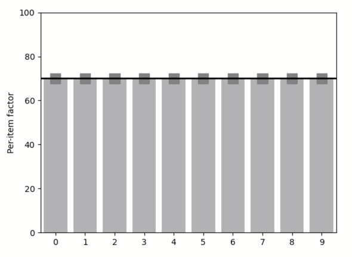

Overriding default values
-------------------------

**A demo of specifying default values and overriding for specific
exception cases.**

Say we have several “items” and we want to apply a function to each item
with some “default factor”. We need a way to choose this factor
globally, but we might sometimes need to make an exception and adjust it
for specific items (say the items are images and we need to normalize
all of them by a certain default factor, while allowing an exception for
some of the images). Essentially, we would like to copy the “default
factor” for each item and allow “overriding” of these copies. In
*Quibbler*, as shown below, such behavior is achieved quite seamlessly
using overriding of function quibs.

-  **Features**

   -  Overriding default values
   -  Graphics-driven assignments
   -  Inverse assignments
   -  override_mask
   -  Assignment template

-  **Try me**

   -  Drag the horizontal line to change the overall “default factor”
   -  Drag the “per-item factor” markers will make an excpetion, moving
      a specific point. To cancel the exception and return to the
      default value, right-click a point.

.. code:: ipython3

    from functools import partial
    from pyquibbler import iquib, override_all, q
    override_all()
    import matplotlib.pyplot as plt
    import numpy as np
    %matplotlib tk

.. code:: ipython3

    # Set number of plates
    n_plates = iquib(10)

.. code:: ipython3

    # Figure setup
    plt.figure()
    plt.axis([-0.5, n_plates - 0.5, 0, 100])
    plt.ylabel('Per-item factor')
    plt.xticks(np.arange(n_plates));

.. code:: ipython3

    # Common properties
    input_properties = {'assignment_template':(0, 100, 1), 'allow_overriding':True}

.. code:: ipython3

    # Define and plot the default factor
    default_factor = iquib(np.array([70]))
    default_factor.setp(**input_properties)
    plt.plot([-0.5, n_plates - 0.5], default_factor[[0, 0]], 'k', 
             zorder=3, linewidth=2, picker=True);

.. code:: ipython3

    # Define and plot the per-item factor
    from matplotlib.colors import ListedColormap
    per_item_factor = np.repeat(default_factor, n_plates, 0)
    per_item_factor.setp(**input_properties, assigned_quibs=[per_item_factor])
    
    x = np.arange(n_plates)
    plt.bar(x, per_item_factor, color=(0.7, 0.7, 0.7))
    
    plt.scatter(x, per_item_factor, marker='s', s=150, zorder=2, 
                cmap=ListedColormap(['grey', 'red']),
                c=per_item_factor.get_override_mask(), 
                picker=True, pickradius=20);
