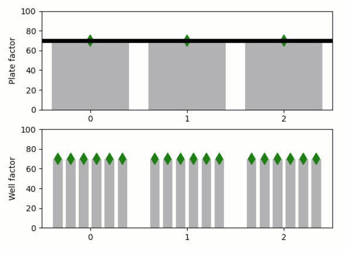

Overriding default values (two-levels)
--------------------------------------

**A demo of two-level default and overriding.**

Say we have several “plates”, and each of these plates has several
“wells”, and we want to apply a function to each well in each plate with
some default factor. We need a way to choose this factor globally, but
we might sometimes need to adjust it for specific plates and even for
specific wells within the plates. Essentially, we would like to copy the
“default factor” for each plate and copy the plate factor for each well,
while allowing “overriding” of these copies at each level. In
*Quibbler*, as shown here, such behavior is achieved quite seamlessly
using overriding of function quibs.

-  **Features**

   -  Overriding
   -  Override mask
   -  Graphics-driven assignments
   -  Inverse assignments
   -  Assignment template

-  **Try me**

   -  Drag the horizontal line to change the “default factor”
   -  Drag the “per-plate factor” markers will prompt asking if
      assignments should be interpreted as overrides to the
      “plate-facor”, or propagate upstream to change the default.
   -  Drag the “per-well factor” markers will prompt asking if
      assignments should be interpreted as overrides at the well level,
      or inverse-propagate one step up to the plate level, or two step
      up to the default level.

.. code:: python

    from functools import partial
    from pyquibbler import iquib, override_all, q
    override_all()
    import matplotlib.pyplot as plt
    import numpy as np
    %matplotlib tk

.. code:: python

    # Set number of plate and number wells per plate
    n_plates = iquib(3)
    n_wells = iquib(6)

.. code:: python

    # Figure setup
    plt.figure()
    
    ax1 = plt.subplot(2, 1, 1)
    ax1.axis([-0.5, n_plates - 0.5, 0, 100])
    ax1.set_ylabel('Plate factor')
    ax1.set_xticks(np.arange(n_plates))
    
    ax2 = plt.subplot(2, 1, 2)
    ax2.axis([-0.5, n_plates - 0.5, 0, 100])
    ax2.set_ylabel('Well factor')
    ax2.set_xticks(np.arange(n_plates));

.. code:: python

    # Common properties
    input_properties = {
        'assignment_template': (0, 100, 1), 
        'allow_overriding': True
    }
    
    def two_color_scatter(ax, x, y):
        from matplotlib.colors import ListedColormap
        return ax.scatter(
            x, y, marker='d', s=100, zorder=2, 
            cmap=ListedColormap(['green', 'red']),
            c=y.get_override_mask(), 
            picker=True, pickradius=10)

.. code:: python

    # Define and plot the default factor
    default_factor = iquib(70).setp(**input_properties)
    ax1.plot([-0.5, n_plates - 0.5], default_factor + np.array([0, 0]), 'k', 
             linewidth=5, picker=True);

.. code:: python

    # Define and plot the per-plate factor
    plate_factor = np.repeat(default_factor, n_plates, 0).setp(**input_properties)
    x = np.arange(n_plates)
    ax1.bar(x, plate_factor, color=(0.7, 0.7, 0.7))
    two_color_scatter(ax1, x, plate_factor);

.. code:: python

    # Define the per-plate-per-well factor
    well_factor = np.repeat(plate_factor, n_wells, 0).setp(**input_properties, name='Well_factor')
    dd = np.linspace(-0.4, 0.4, n_wells + 1)
    dd = (dd[0:-1] + dd[1:]) / 2.
    xx = np.ravel(x + np.reshape(dd, (n_wells, 1)), 'F')
    ax2.bar(xx, well_factor, color=(0.7, 0.7, 0.7), width=0.1)
    two_color_scatter(ax2, xx, well_factor);

