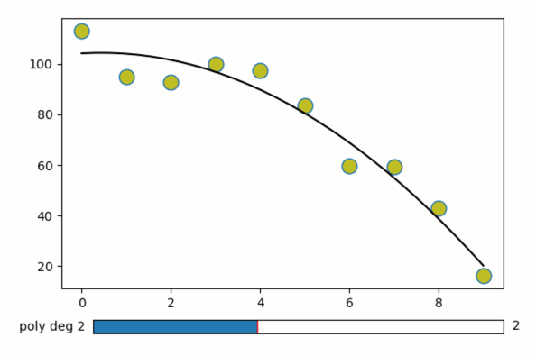

Multi-point dragging and widgets
--------------------------------

**Plot and fit multiple individually-draggable data points.**

-  **Features**

   -  Graphics-driven assignments of multiple points
   -  Inverse assignments
   -  Assignment template

-  **Try me:**

   -  Try dragging the data points.
   -  Try changing the degree of the polynomial fit with the slider.

.. code:: python

    from pyquibbler import iquib, override_all, q
    override_all()
    import matplotlib.pyplot as plt
    from matplotlib import widgets
    import numpy as np
    %matplotlib tk

.. code:: python

    # Define x, y data points
    num_points = iquib(10)
    x = np.arange(0., num_points);
    y = 100. - np.arange(0., num_points)**2
    
    # Add random noise
    y = y + 5 * np.random.randn(num_points)
    
    # Allow overrding the default functional values of x,y:
    x.allow_overriding = True
    y.allow_overriding = True
    
    # Define figure, axes:
    plt.figure(figsize=[7, 5])
    ax = plt.axes([0.2, 0.2, 0.7, 0.6])
    
    # Plot the x-y points. use picker=True to allow dragging
    ax.plot(x, y, marker='o', markersize=12, markerfacecolor='y',
            linestyle='None', picker=True, pickradius=15)
    
    
    # Define polynomial fit degree:
    n_poly = iquib(2)
    
    # Connect polynomial fit with slider:
    axSlider = plt.axes([0.25, 0.1, 0.65, 0.03])
    freq_slider = widgets.Slider(ax=axSlider, valmin=0, valmax=5, valstep=1,
        label=q("poly deg {:.0f}".format, n_poly),
        valinit=n_poly)
    
    # Perform and plot the polynomial fit:
    pf = np.polyfit(x, y, n_poly)
    x0 = np.linspace(np.min(x), np.max(x), 30)
    y0 = np.polyval(pf, x0)
    ax.plot(x0, y0, 'k-');

