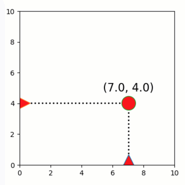

Dragging graphics vertically/horizontally
=========================================

**A demo of interactive graphics-driven assignments with
vertical/horizontal dragging.**

-  **Features**

   -  Graphics-driven assignments
   -  Horizontal/vertical dragging
   -  Inverse assignments

-  **Try me**

   -  Try dragging the circle - note that it can move freely.
   -  Try dragging the axis-sliders - note that they are constraint
      horizontally and vertically.

.. code:: python

    from pyquibbler import iquib, override_all, q
    override_all()
    import matplotlib.pyplot as plt
    import numpy as np
    %matplotlib tk

.. code:: python

    x = iquib(7.)
    y = iquib(4.)
    
    plt.figure(figsize=(4, 4))
    plt.xlim(0, 10)
    plt.ylim(0, 10)
    
    # Lines connecting dot to axeses
    plt.plot([x, x], [0, y], 'k:', linewidth=2)
    plt.plot([0, x], [y, y], 'k:', linewidth=2)
    
    # Text above dot
    plt.text(x, y + 0.6, 
             q("({}, {})".format, np.around(x, decimals=1), np.around(y, decimals=1)),
             horizontalalignment="center",
             verticalalignment="bottom", fontsize=16)
    
    # Vertical and horizontal sliders
    plt.plot(x, 0.2, '^', markerfacecolor='r', markersize=22, picker=True)
    plt.plot(0.2, y, '>', markerfacecolor='r', markersize=22, picker=True)
    
    # Draggable dot
    plt.plot(x, y, markerfacecolor='red', marker='o', 
             markersize=20, picker=True, pickradius=25);

