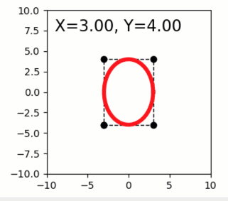

Dragging graphics affects upstream quibs
----------------------------------------

**A simple demo of interactive graphics-driven assignments.**

-  **Features:**

   -  Graphics quibs
   -  Graphics-driven assignments
   -  Inverse assignments

-  **Try me:**

   -  Try dragging the red marker; note the change in X,Y text, square,
      ellipse.

.. code:: python

    from pyquibbler import iquib, override_all, q
    import matplotlib.pyplot as plt
    import numpy as np
    override_all()
    %matplotlib tk

.. code:: python

    # Figure setup:
    fig1 = plt.figure(figsize=(4,3))
    plt.axis('square');
    plt.axis([-10, 10, -10, 10]);

.. code:: python

    # Define input quibs for X,Y coordinates:
    XY = iquib(np.array([3., 4.]))
    X = XY[[0]]
    Y = XY[[1]]

.. code:: python

    # Plot additional graphics based on X and Y.
    # these downstream graphics will change when the marker is moved:
    
    # Text:
    plt.text(-9,9,q('X={:.2f}, Y={:.2f}'.format,X[0],Y[0]),fontsize=16,verticalalignment='top');
    
    # Rectangle:
    plt.plot(X*np.array([-1,1,1,-1,-1]), Y*np.array([-1,-1,1,1,-1]), 'k--o', linewidth=1, picker=True);
    
    # Ellipse:
    tt = np.linspace(0,2*np.pi,50);
    xx = X*np.cos(tt);
    yy = Y*np.sin(tt);
    plt.plot(xx,yy,'r-',linewidth=4);

