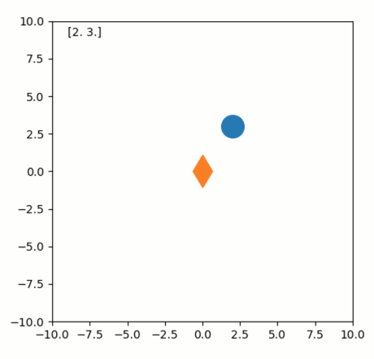

Dragging a fixed object to affect another
-----------------------------------------

**A demo of interactively “dragging” a non-movable object.**

-  **Features**

   -  Graphics quibs
   -  Graphics-driven assignments
   -  Inverse assignments of binary operators

-  **Try me**

   -  Try dragging the fixed diamond. It won’t move but will affect the
      position of the circle.

.. code:: ipython3

    from pyquibbler import iquib, override_all, q
    override_all()
    import matplotlib.pyplot as plt
    import numpy as np
    %matplotlib tk

.. code:: ipython3

    # define and plot a point at xy coordinates:
    xy = iquib(np.array([2., 3.]))
    plt.axis('square')
    plt.axis([-10, 10, -10, 10])
    plt.plot(xy[0], xy[1], 'o', markersize=20)
    plt.text(-9, 9, np.array2string(xy, precision=2))
    
    # define and plot a differential function quib, which is by defintion fixed at [0,0]:
    dxy = xy - xy
    plt.plot(dxy[0], dxy[1], 'd', markersize=20, picker=True);

