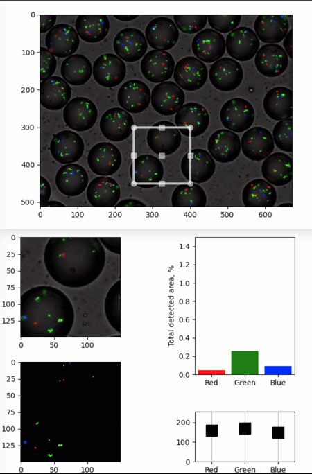

Simple quib-app for image analysis
----------------------------------

**A simple demo of a quib-based GUI with
matplotlib.widgets.RectangleSelector.**

-  **Features**

   -  Graphics quibs
   -  Graphics-driven assignments
   -  Inverse assignments

-  **Try me**

   -  Try dragging the Region of Interest (ROI) in the main image or
      dragging/resizing the rectangle around the cut image in the second
      figure.
   -  The ROI and downstream analysis showing the RGB components of the
      ROI will update.

.. code:: ipython3

    from pyquibbler import iquib, override_all, q
    override_all()

.. code:: ipython3

    import matplotlib.pyplot as plt
    from matplotlib.widgets import RectangleSelector
    import numpy as np
    import os
    %matplotlib tk

.. code:: ipython3

    # Load an image:
    filename = iquib(os.path.join('..','data_files','bacteria_in_droplets.tif')) # <-- input
    img_main = plt.imread(filename);

.. code:: ipython3

    # Show the image:
    plt.figure()
    ax = plt.gca()
    ax.imshow(img_main);

.. code:: ipython3

    # Define and plot a rectangle Region Of Interest (ROI)
    ROI = iquib(np.array([250, 400, 300, 450])); # <-- input: xmin, xmax, ymin, ymax
    rectprops = dict(edgecolor='w', alpha=0.7, fill=False, linewidth=3)
    RectangleSelector(ax, extents=ROI, rectprops=rectprops);

.. code:: ipython3

    # Cut the ROI from the main image:
    img_cut = img_main[ROI[2]:ROI[3], ROI[0]:ROI[1], :]
    
    # Plot the cut image:
    fig2 = plt.figure()
    ax_cut = fig2.add_axes([0.05, 0.55, 0.35, 0.4])
    ax_cut.imshow(img_cut);

.. code:: ipython3

    # Threshold each of the RGB channels:
    thresholds_rgb = iquib(np.array([160, 170, 150])) # <-- input: RGB thresholds
    img_cut01 = img_cut > np.reshape(thresholds_rgb,(1, 1, 3))
    
    # Plot the thresholded image:
    ax_cut01 = fig2.add_axes([0.05, 0.05, 0.35, 0.4])
    ax_cut01.imshow(img_cut01 * 1.);

.. code:: ipython3

    # Calculate area above threshold for each color:
    fraction_above_threshold = np.average(img_cut01, (0, 1)); 
    
    # Plot detected areas:
    ax_area = fig2.add_axes([0.6, 0.4, 0.3, 0.55])
    ax_area.bar([1,2,3], fraction_above_threshold * 100, color=['r', 'g', 'b'])
    ax_area.axis([0.5, 3.5, 0, 1.5])
    ax_area.set_ylabel('Total detected area, %');
    ax_area.set_xticks([1, 2, 3])
    ax_area.set_xticklabels(['Red', 'Green', 'Blue']);

.. code:: ipython3

    # Threshold controls
    ax_thr = fig2.add_axes([0.6, 0.05, 0.3, 0.2])
    ax_thr.axis([0.5, 3.5, 0, 255])
    ax_thr.xaxis.grid(True)
    ax_thr.set_xticks([1, 2, 3])
    ax_thr.set_xticklabels(['Red', 'Green', 'Blue'])
    ax_thr.plot([1, 2, 3], thresholds_rgb, 'sk', markersize=16, markerfacecolor='k', picker=True);

.. code:: ipython3

    # Add a rectangle "draggable" ROI around the extracted image:
    shifted_ROI = ROI - ROI[[0,0,2,2]]
    shrinked_shifted_ROI = shifted_ROI + [7, -7, +7, -7]
    RectangleSelector(ax_cut, extents=shrinked_shifted_ROI, rectprops=rectprops);

