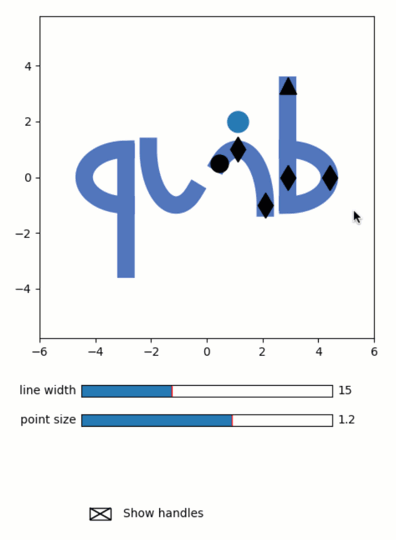

Making the quib icon
--------------------

**A demo of interactive design of the quib icon.**

-  **Features**

   -  Graphics-driven assignments
   -  Inverse assignments
   -  User-functions

-  **Try me**

   -  Drag the marker handles to change the ‘quib’ icon.
   -  Play with the sliders to choose line-width.
   -  Use the check-box to turn markers invisible.

.. code:: ipython3

    from pyquibbler import iquib, override_all, quiby_function, q
    override_all()
    import numpy as np
    import matplotlib.pyplot as plt
    import matplotlib.widgets as widgets
    %matplotlib tk

.. code:: ipython3

    # Define function that plot the icon (works on non-quib parameters)
    def getIcon0(par):
        def tet2xy(tet1,tet2,x0,y0,dx,dy):
            tet = np.linspace(tet1,tet2,50)*2*np.pi/360;
            return np.vstack([
                x0 + np.cos(tet)*dx,
                y0 + np.sin(tet)*dy
                ])
        
        def add2pth(xy):
            nonlocal XY
            XY = np.hstack([XY, [[np.NaN],[np.NaN]], xy]);
    
        XY = np.zeros((2,1))
        
        # make the curve of the 'q'
        add2pth(tet2xy(90-par['qbExtend'], 270-par['qbExtend'], -par['Width'], 0, par['qbCurve'], 1));
    
        # make the line of the 'q'
        add2pth(np.vstack([-np.array([[1,1]])*par['Width'], np.array([par['qbLineDown'],par['qbLineUp']])]));
    
        # make the 'u'
        add2pth(tet2xy(par['uiAngle1'], 360+par['uiAngle2'], -par['uiWidth']-par['uiShift'], 1, par['uiWidth'], 2));
    
        # reflect
        add2pth(-XY)
        
        return XY

.. code:: ipython3

    # Define the parameters of the icon
    isvis = iquib([True]) # whether the handles are visible
    icon_props = iquib({
        'LineWidth':   15,
        'PointWidth':  1.2,
        'Width':       2.9,
        'qbCurve':     1.5,
        'qbLineDown': -3.3,
        'qbLineUp':    0.9,
        'qbExtend':    0,
        'uiAngle1':    177,
        'uiAngle2':    -49,
        'uiWidth':     1,
        'uiShift':     0.1,
    })
    
    point_pos = iquib(np.array([0.,1.])) # the position of the point above the 'i'
    color = iquib(np.array([ 79,113,191])/255); # color of the quib icon

.. code:: ipython3

    # Set the figure
    fig = plt.figure(figsize=(5,7))
    axs = fig.add_axes([0.1,0.4,0.8,0.55])
    axs.axis('equal')
    axs.axis([-6, 6, -6, 6]);

.. code:: ipython3

    # Plot the icon
    xy = q(getIcon0, icon_props)
    axs.plot(xy[0], xy[1], linewidth=icon_props['LineWidth'], color=color);

.. code:: ipython3

    # add the dot abobe the 'i'
    axs.plot(point_pos[0]+icon_props['uiWidth']+icon_props['uiShift'], point_pos[1]+1, 'o', 
             markersize=icon_props['LineWidth']*icon_props['PointWidth'], picker=True);

.. code:: ipython3

    # Plot the handle-markers
    options = {'markersize':icon_props['LineWidth'], 'picker':True, 'visible':isvis[0]}
    
    axs.plot(icon_props['Width'], 0, 'dk', **options)
    axs.plot(icon_props['qbCurve'] + icon_props['Width'], 0, 'dk', **options)
    axs.plot(icon_props['Width'], -icon_props['qbLineDown'], '^k', **options)
    axs.plot(icon_props['uiWidth'] + icon_props['uiShift'], 1, 'dk', **options)
    axs.plot(icon_props['uiShift'] + 2 * icon_props['uiWidth'], -1, 'dk', **options)
    
    tet2 = icon_props['uiAngle2'] * (2*np.pi/360)
    axs.plot(-np.cos(tet2) * icon_props['uiWidth'] + icon_props['uiWidth'] + icon_props['uiShift'],
             -np.sin(tet2) * 2 - 1, 'ok', **options);

.. code:: ipython3

    # Make the Sliders widgets
    axs = fig.add_axes([0.2,0.3,0.6,0.02])
    widgets.Slider(ax=axs, valmin=1, valmax=40, label='line width', valinit=icon_props['LineWidth']);
    
    axs = fig.add_axes([0.2,0.25,0.6,0.02])
    widgets.Slider(ax=axs, valmin=0, valmax=2, label='point size', valinit=icon_props['PointWidth']);

.. code:: ipython3

    # Make the CheckButtons widget
    axs = fig.add_axes([0.2,0.02,0.4,0.16])
    axs.axis('off')
    widgets.CheckButtons(ax=axs, labels=['Show handles'], actives=isvis);
