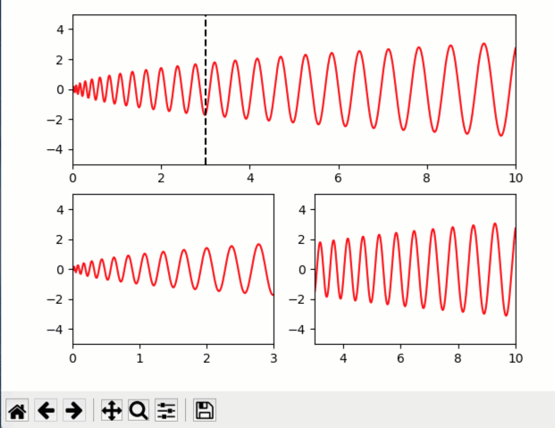

Quiby setting of axes limits
----------------------------

**Implement inverse assignment from axis limits.**

-  **Features**

   -  Quib setting of axes limits
   -  Graphics-driven inverse assignment from axis limit changes.

-  **Try me**

   -  Try panning or zooming into the axes.
   -  Try dragging the vertical line seperator.

.. code:: python

    from pyquibbler import iquib, q, override_all, undo, redo
    override_all()
    from matplotlib import pyplot as plt
    import numpy as np
    %matplotlib tk

.. code:: python

    fig = plt.figure()
    
    x_limits_fixed = np.array([0., 10.])
    y_limits_fixed = np.array([-5., 5.])
    x_seperator = iquib(3.)
    
    y_limits = iquib(y_limits_fixed)
    
    func = lambda x: np.sqrt(x) * np.sin(np.sqrt(x) / 0.02)
    
    xx = np.linspace(x_limits_fixed[0], x_limits_fixed[1], 800)
    yy = func(xx)
    
    # top panel:
    ax0 = fig.add_subplot(2, 1, 1)
    ax0.plot(xx, yy, 'r-')
    ax0.set_xlim(x_limits_fixed)
    ax0.set_ylim(y_limits_fixed)
    ax0.plot(x_seperator + np.array([0, 0]), y_limits_fixed, '--k', picker=True)
    
    # left panel:
    ax1 = fig.add_subplot(2, 2, 3)
    ax1.plot(xx, yy, 'r-')
    ax1.set_xlim(x_limits_fixed[0], x_seperator)
    ax1.set_ylim(y_limits)
    
    # right panel:
    ax2 = fig.add_subplot(2, 2, 4)
    ax2.plot(xx, yy, 'r-')
    ax2.set_xlim(x_seperator, x_limits_fixed[1])
    ax2.set_ylim(y_limits);

