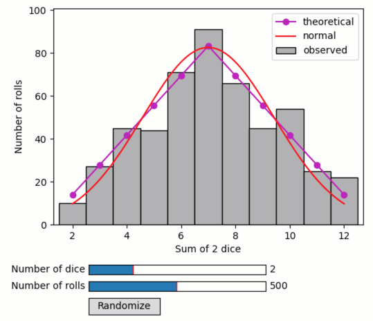

Quibs of random functions - dice rolling
----------------------------------------

**A demo of a quib-based analysis involving random numbers**

-  **Features**

   -  Random quibs
   -  Assignment template
   -  Graphics-driven assignments
   -  Quib-linked widgets

-  **Try me**

   -  Try playing with the number of dice or the number of rolling.
   -  Try pressing ‘Randomize’ to re-randomize random-function quibs.

.. code:: python

    from pyquibbler import iquib, override_all, q, quiby_function, reset_random_quibs
    override_all()
    
    import matplotlib.pyplot as plt
    from matplotlib.widgets import Slider, Button
    import numpy as np
    
    %matplotlib tk

.. code:: python

    # Inputs
    num_dice = iquib(2)
    num_rolls = iquib(500)
    num_sides = iquib(6)
    results = np.random.randint(1, num_sides + 1, (num_rolls, num_dice));

.. code:: python

    # Prepare figure
    fg = plt.figure()
    ax = fg.add_axes([0.15, 0.3, 0.7, 0.65])
    ax.set_xlabel('Sum of ' + q(str, num_dice) + ' dice')
    ax.set_ylabel('Number of rolls');

.. code:: python

    # Histogram of sum of the dice in each roll
    sum_dice = np.sum(results, axis=1)
    plt.hist(sum_dice, bins=np.arange(num_dice - 0.5, num_dice * num_sides + 1.5), 
             ec='k', facecolor=[0.7, 0.7, 0.7])
    ax.set_xlim([num_dice - 0.7, num_dice * num_sides + 0.7]);

.. code:: python

    # Plot exact distribution
    def p_sum_dice(n_dice, n_sides, total):
        # Returns the probability of getting a sum n when rolling num_dice dice with num_sides sides
        if n_dice == 1:
            # equal probability for each outcome 
            ps = np.zeros(total.shape)
            ps[(1 <= total) & (total <= n_sides)] = 1 / n_sides 
            return ps
        return sum(1/n_sides * p_sum_dice(n_dice - 1, n_sides, total-outcome) 
                   for outcome in range(1, n_sides+1)) 
    
    xx = np.arange(num_dice,num_dice*num_sides+1)
    p = q(p_sum_dice,num_dice,num_sides,xx)
    ax.plot(xx,p*num_rolls,'mo-');

.. code:: python

    # Plot normal approximation
    @quiby_function()
    def p_normal(m,s,x):
        return 1 / s / np.sqrt(2 * np.pi) * np.exp(-0.5 * ((x - m) / s)**2)
    
    std = np.std(np.arange(1, num_sides + 1))
    mean = np.average(np.arange(1, num_sides + 1))
    se = std * np.sqrt(num_dice)
    mn = mean * num_dice
    xx = np.linspace(num_dice, num_dice*num_sides, 100)
    p = p_normal(mn, se, xx)
    ax.plot(xx, p*num_rolls, 'r-');

.. code:: python

    # set ylim to max expected + 2 std
    mx_count_expected = p_normal(mn, se, mn) * num_rolls
    ax.set_ylim([0, mx_count_expected + 2 * np.sqrt(mx_count_expected)]);

.. code:: python

    # legend
    plt.legend(['theoretical', 'normal', 'observed']);

.. code:: python

    # Add slider controls
    Slider(ax=fg.add_axes([0.23, 0.15, 0.4, 0.03]), label='Number of dice', 
           valmin=1, valmax=5, valinit=num_dice, valstep=1)
    Slider(ax=fg.add_axes([0.23, 0.10, 0.4, 0.03]), label='Number of rolls', 
           valmin=10, valmax=1000, valinit=num_rolls, valstep=10);

.. code:: python

    # Add randomize button
    randomize = Button(fg.add_axes([0.23, 0.03, 0.16, 0.05]), 'Randomize')
    randomize.on_clicked(lambda x: reset_random_quibs());

