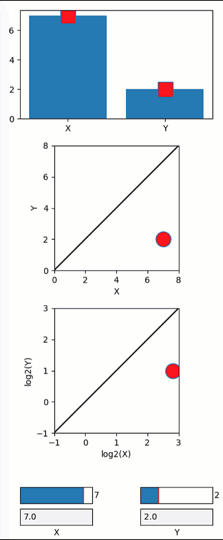

Same variable in different co-adjusting graphical representations
-----------------------------------------------------------------

In data analysis, we often want to represent the same variable in
different graphical forms, and/or following different arithmetic
transformations (for example, representing the same threshold value in
both linear and log scales). As these different presentations represent
different transformations of the same value, we would want that a change
in any one of them will automatically affect the others.

In Quibbler, a change to any one of the graphical presentations of a
variable is propagated backwards to the source variable, typically an
iquib, thereby automatically affecting all representations.

In the current example, the same data X,Y is represented in different
graphical forms. Changing any one of these representations changes all
the others accordingly.

-  **Features**

   -  Graphics quibs
   -  Quib-linked widgets
   -  Graphics-driven assignments
   -  Inverse assignments

-  **Try me:**

   -  Dragging the square markers in the top panel
   -  Dragging the circle markers in the linear or log scale panels
   -  Adjusting the sliders
   -  Entering a new value in the text boxes (not currently implemented)

.. code:: ipython3

    from pyquibbler import iquib, override_all, q
    override_all()
    import matplotlib.pyplot as plt
    from matplotlib import widgets
    import numpy as np
    %matplotlib tk

.. code:: ipython3

    # Figure setup:
    fig = plt.figure(figsize=(4,9))
    
    axs1 = fig.add_axes([0.1,0.78,0.8,0.2])
    axs2 = fig.add_axes([0.1,0.5,0.8,0.23])
    axs3 = fig.add_axes([0.1,0.2,0.8,0.23])
    
    axs1.set_xticks([1,2])
    axs1.set_xticklabels(['X','Y']);
    
    axs2.axis('square');
    lim2 = iquib([0,8])
    axs2.set_xlim(lim2)
    axs2.set_ylim(lim2)
    axs2.set_xlabel('X')
    axs2.set_ylabel('Y')
    
    axs3.axis('square');
    lim3 = iquib([-1,3])
    axs3.set_xlim(lim3)
    axs3.set_ylim(lim3)
    axs3.set_xlabel('log2(X)')
    axs3.set_ylabel('log2(Y)')
    
    axs_slider_x = fig.add_axes([0.1,0.07,0.3,0.03])
    axs_slider_y = fig.add_axes([0.6,0.07,0.3,0.03])
    
    axs_txt_x = fig.add_axes([0.1,0.03,0.3,0.03])
    axs_txt_y = fig.add_axes([0.6,0.03,0.3,0.03])
    axs_txt_x.set_xlabel('X')
    axs_txt_y.set_xlabel('Y');

.. code:: ipython3

    # Define an input quib XY, representing X,Y coordinates:
    XY = iquib([7.,2.]);
    X = XY[0];
    Y = XY[1];

.. code:: ipython3

    # Present the same data in many different co-adjusting graphical objects. 
    # Changing any one of the representaiotn will propagate backwards to change to 
    # the iquib XY thereby affecting all other representations.
    
    # (1) Bar representation:
    axs1.bar([1,2],XY) # Bars
    
    # (2) Point above bars:
    axs1.plot([1,2],XY,'s',markersize=18,markerfacecolor='r',picker=True)
    
    # (3) X-Y representation in linear scale:
    axs2.plot(lim2,lim2,'k-')
    axs2.plot(X,Y,marker='o',markersize=18,markerfacecolor='r',picker=True)
    
    # (4) X-Y representation in log scale:
    axs3.plot(lim3,lim3,'k-')
    axs3.plot(np.log2(X),np.log2(Y),'o',markersize=18,markerfacecolor='r',picker=True)
    
    # (5) Text representation:
    axs2.text(0.05,0.85,q('X={:.2f}, Y={:.2f}'.format,X,Y),transform = axs3.transAxes,fontsize=12)
    
    # (6) TextBox
    X_round = np.round(X,decimals=2)
    Y_round = np.round(Y,decimals=2)
    widgets.TextBox(ax=axs_txt_x, label=None, initial=q(str,X_round));
    widgets.TextBox(ax=axs_txt_y, label=None, initial=q(str,Y_round));
    
    # (7) Sliders
    widgets.Slider(ax=axs_slider_x, label=None, valmin=0, valmax=8, valstep=0.1, valinit=X)
    widgets.Slider(ax=axs_slider_y, label=None, valmin=0, valmax=8, valstep=0.1, valinit=Y);

.. code:: ipython3

    pass

