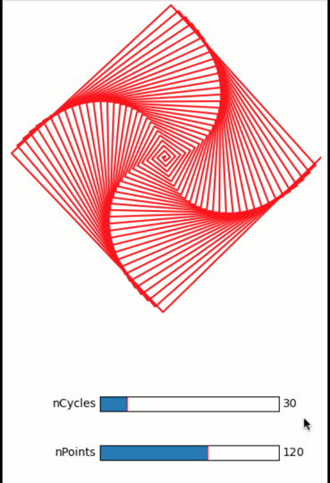

Create a GUI by connecting quibs with widgets
---------------------------------------------

**A simple demo of a quib-linked GUI with matplotlib.widgets.slider.**

-  **Features:**

   -  Quib-linked widgets
   -  Inverse assignments

.. code:: python

    from pyquibbler import iquib, override_all, q
    override_all()
    import matplotlib.pyplot as plt
    from matplotlib.widgets import Slider
    import numpy as np
    %matplotlib tk

.. code:: python

    # Figure setup:
    fig = plt.figure(figsize=(4,6))
    
    axs = fig.add_axes([0, 0.36, 1, 0.64])
    axs.axis('square');
    axs.axis((-10, 10, -10, 10));
    axs.axis('off')
    
    axs_slider1 = fig.add_axes([0.3, 0.16, 0.55, 0.03])
    axs_slider2 = fig.add_axes([0.3, 0.06, 0.55, 0.03])

.. code:: python

    # Defining quib input variables:
    nPoints = iquib(120);
    nCycles = iquib(30);
    
    # Define downstream function quib calculations based on the quib inputs:
    phi = np.linspace(0, 2 * np.pi * nCycles, nPoints);
    r = np.linspace(0, 10, nPoints);
    
    # Plot the data:
    axs.plot(r * np.cos(phi), r * np.sin(phi), 'r-');

.. code:: python

    # Create quib-linked slider widgets:
    Slider(ax=axs_slider1, label='nCycles', valmin=0, valmax=200, valstep=1, valinit=nCycles);
    Slider(ax=axs_slider2, label='nPoints', valmin=0, valmax=200, valstep=1, valinit=nPoints);

