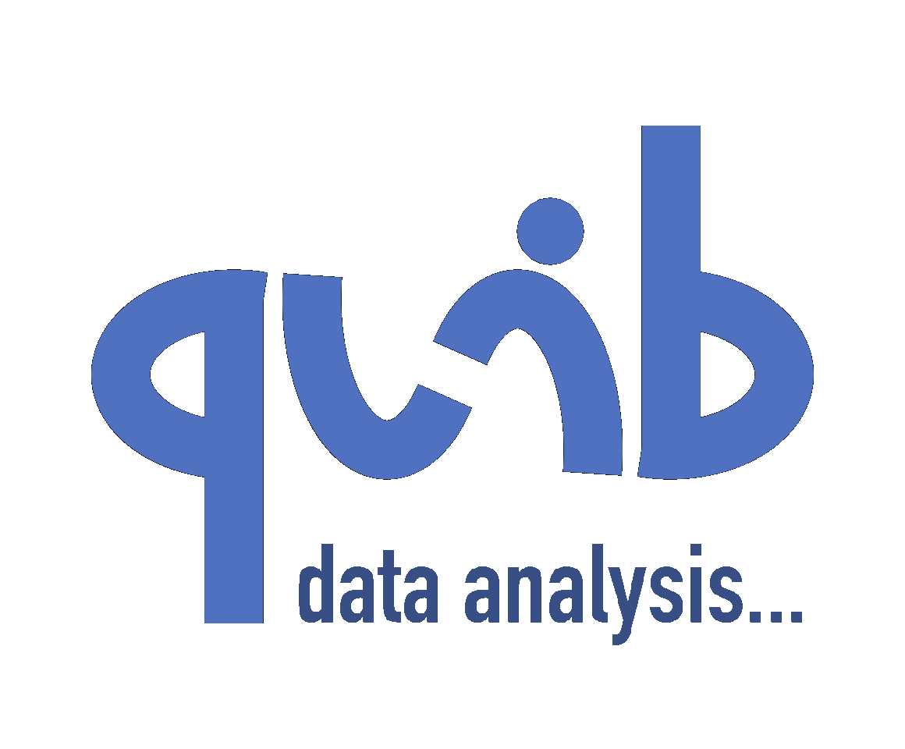

Data Quibbler
=============

**Interactive, transparent, and efficient data analytics.**

.. toctree::
   :maxdepth: 1

   What-is-it
   Rationale

Getting started with Quibbler
-----------------------------

.. toctree::
   :maxdepth: 1

   Installation
   Quickstart
   Examples

User guide
----------
.. toctree::
   :maxdepth: 1

   Introduction
   Graphics
   Inverse-assignments
   Overriding-default-functionality
   User-defined-functions
   Diverged-evaluation
   Random-functions
   Quib-naming
   Project-save-load

Functions
---------
.. toctree::
   :maxdepth: 1

   List_of_functions
   List-of-quiby-functions

Classes
-------
.. toctree::
   :maxdepth: 1

   major_classes/Quib_class
   major_classes/Project_class
   Quibbler_Enums

Index
-----

* :ref:`genindex`

