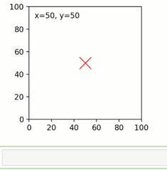
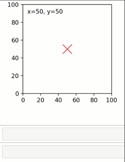
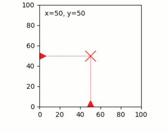
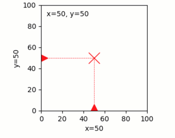
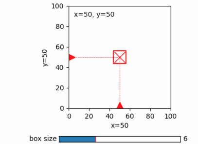
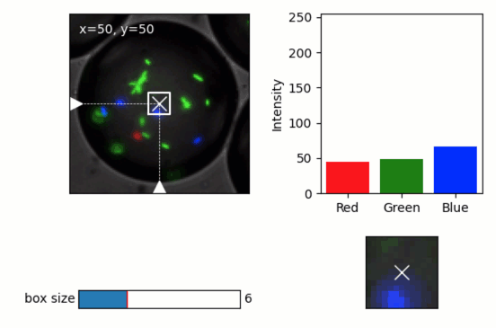

Graphics quibs
--------------

Quibbler easily creates live interactive graphics
~~~~~~~~~~~~~~~~~~~~~~~~~~~~~~~~~~~~~~~~~~~~~~~~~

Quibs can be used as arguments in most *Matplotlib* graphics functions,
creating *graphics quibs* - quibs that represents “live”,
reactive-interactive, graphics. Indeed, such graphics quibs are
bi-directionally linked to their source data. Any changes to upstream
quibs are propagated downstream to immediately affect the graphics; and,
conversely, user interactions with the graphics (dragging, clicking)
propagates backwards to affect the values of upstream quibs. Combining
quibs with widgets and graphics, we can thereby readily create a highly
interactive app-like analysis of our data.

Notably, such interactive pipelines are naturally created in *Quibbler*
without us needing to worry about the traditional, and often tedious,
programming of specific callback functions for each interactive
behavior. Unlike in “regular” programming, where in order to create
interactive analysis we need to specifically program callback functions
for each graphics object or widget, in *Quibbler*, we inherently get
interactive functionality without requiring us to deal with such
what-to-do-if behaviors. Instead, we can set our mind on the analysis
from a data-oriented forward-looking standpoint, and let *Quibbler* deal
with any asynchronous graphics or widget events, deciding what needs to
change, what needs to re-run, and what to re-plot in order to make
things interactive and fun.

Here, to demonstrate the key features of graphics quibs, we will build
towards a simple example of building an interactive app for probing the
RGB intensities of an image at a chosen point (x,y).

Upstream changes automatically refresh downstream graphics quibs
~~~~~~~~~~~~~~~~~~~~~~~~~~~~~~~~~~~~~~~~~~~~~~~~~~~~~~~~~~~~~~~~

When we apply a *Matplotlib* graphics function to quib arguments, we get
a *graphics quib* - a quib that creates graphics that automatically
refreshes upon upstream changes.

In general, when a quib changes, the values of any downstream dependent
quibs are invalidated, but are not immediately recalculated (deferred
evaluation). Graphics quibs form an exception to this rule; by default,
when graphics quibs are affected by upstream changes, they immediately
recalculate, creating live updates to their graphics.

For example, consider the following code for choosing a coordinate x-y:

.. code:: python

    # Imports
    import pyquibbler as qb
    from pyquibbler import iquib, q
    qb.initialize_quibbler()
    import numpy as np
    import matplotlib.pyplot as plt
    from matplotlib.widgets import Slider
    import os
    
    %matplotlib tk

.. code:: python

    # Figure setup
    plt.figure(figsize=(5, 3))
    plt.axes([0.25, 0.25, 0.7, 0.7])
    plt.axis('square')
    plt.axis([0, 100, 0, 100])
    
    # Define x-y coordinates of chosen point:
    xy = iquib(np.array([50, 50]))
    x = xy[0]
    y = xy[1]
    
    # Plot the point as an 'x' marker:
    plt.plot(x, y, 'xr', markersize=16, picker=True)
    
    # Add text indicating the coordinates of the point:
    text_label = q('x={}, y={}'.format, x, y)
    plt.text(5, 95, text_label, va='top', ha='left');

As we see, making an upstream change to the input quib ``xy``, for
example setting ``xy[1] = 40``, refreshes the position of the x-y point
as well as the text, as both of which depend on the function quibs ``x``
and ``y`` which depend on ``xy``.

User interactions with graphics are translated into upstream quib assignments
~~~~~~~~~~~~~~~~~~~~~~~~~~~~~~~~~~~~~~~~~~~~~~~~~~~~~~~~~~~~~~~~~~~~~~~~~~~~~

The above example demonstrates how upstream changes affect downstream
quib graphics. Importantly, this relationship can also go backwards:
changing the graphics of a graphics quib is translated into assignments
to the corresponding upstream quib arguments, and from there, through
inverse assignments, to any further upstream quibs.

Such *graphics-driven assignments* are currently supported for plt.plot
and for common widgets (see below). To enable graphics-driven
assignments for plt.plot, we indicate ``picker=True`` in the plot
creation function.

In our point-choosing example code above, we used plt.plot with with
``picker=True``, thereby moving the marker is enabled and such movements
triggers graphics-driven assignments to the arguments of the plot, in
this case to the quibs ``x`` and ``y``. As ``x`` and ``y`` are function
quibs not allowing overriding (``allow_overriding=False`` by default for
function quibs), these assignments propagate, through
inverse-assignments, higher upstream to ``xy`` where they are ultimately
actualized. Any quib graphics that depend on ``xy``, such as the text
message, is then immediately refreshed:

Restricting object dragging horizontally or vertically
^^^^^^^^^^^^^^^^^^^^^^^^^^^^^^^^^^^^^^^^^^^^^^^^^^^^^^

In the above example, both the x and y arguments of the plt.plot
function are quibs and thereby *Quibbler* allows dragging the marker
freely in both the x and y directions. Alternatively, using non-quib
arguments as either x or y, or using quibs that do not allow inverse
assignments (quibs with ``allow_overriding=False`` and
``assigned_quibs=[]``), we can restrict dragging either vertically or
horizontally.

For example, in the code below, we add horizontally and vertically
sliding markers for setting the x-y coordinates of our chosen point:

.. code:: python

    # Add horizontal and vertical guiding lines:
    plt.plot([0, x], [y, y], 'r--', linewidth=0.5)
    plt.plot([x, x], [0, y], 'r--', linewidth=0.5)
    
    # Add horizontal and vertical draggable markers: 
    plt.plot(1, y, '>r', markersize=16, picker=True)
    plt.plot(x, 1, '^r', markersize=16, picker=True);

For dragging on more complex paths, see: :doc:`examples/quibdemo_drag_on_curve`

Quiby setters of axis attributes
~~~~~~~~~~~~~~~~~~~~~~~~~~~~~~~~

Using a quibs as an argument to a setter of an axis property creates a
graphics quib that sets the property. Thereby, the specified axis
property will automatically refresh upon upstream changes. Such quiby
behavior is supported for diverse axis properties including axis limits
(i.e., ``set_xlim``, ``set_ylim``, ``plt.xlim``, ``plt.ylim``) axis
ticks (``set_xticks``, ``set_yticks``, ``plt.xticks``, ``plt.yticks``),
axis labels and title (i.e., ``set_xlabel``, ``set_ylabel``,
``set_title``, ``plt.xlabel``, ``plt.ylabel``, ``plt.title``) and other
attributes (e.g., ``set_visible``, ``set_facecolor``).

As an example, let’s set the x-label and y-label of our
coordinate-choosing axes to indicate the chosen x and y values. These
labels will thereby update automatically as the markers setting ``xy``
are dragged:

.. code:: python

    plt.xlabel(q('x={}'.format, x))
    plt.ylabel(q('y={}'.format, y));

Using quibs with widgets
~~~~~~~~~~~~~~~~~~~~~~~~

Quibs can be used as arguments to *Matplotlib* widget functions,
creating bi-directionally linked widget graphics quibs. Like with other
graphics quibs, widgets created with quib arguments automatically update
upon upstream changes that affect their arguments. In addition, if a
given quib is set as the initial value-setting kwarg of the widget, then
interacting with the widget creates graphics-driven assignments to this
given quib. This behavior allows to easily create interactive GUIs
without a need for the classical, and more cumbersome, use of callback
functions.

Quib-supported widgets and their corresponding value-setting kwargs:

::

   Slider(valinit=quib, ...)
   TextBox(initial=quib, ...)
   CheckButtons(actives=quib, ...)
   RaioButtons(active=quib, ...)
   RectangleSelector(extents=quib, ...)

(note that while normally *Matplotlib* does not allow specifying
``extents`` as a parameter for RectangleSelector, such specification is
supported in the *Quibbler* implementation of RectangleSelector)

For example, let’s define a box around our point x-y and create a Slider
to control the size of this box:

.. code:: python

    # Plot a square around the point (x,y):
    box_size = iquib(6) # size of the square
    plt.plot(x + box_size * np.array([-1, 1, 1, -1, -1]), 
             y + box_size * np.array([-1, -1, 1, 1, -1]), 'r-');
    
    # Create a slider to control the box size:
    ax = plt.axes([0.35, 0.02, 0.5, 0.04])
    Slider(ax=ax, valmin=0, valmax=20, valstep=2, label="box size", valinit=box_size);

Setting ``Slider(..., valinit=box_size)`` enables graphics-driven
assignments from the widget to ``box_size``:

Quibbler-based GUI applications
~~~~~~~~~~~~~~~~~~~~~~~~~~~~~~~

Combining widgets and draggable graphics with quibs allows us to quickly
and easily build powerful GUI-like interaction with our data. As an
example, we apply below our point-choosing implementation to probe the
RGB intensities of an image (here, an image of red, green and blue
labeled bacteria growing in a water-in-oil droplet).

.. code:: python

    # Load an image from file:
    filename = iquib(os.path.join('..','examples','data_files','bacteria_in_a_droplet.tif'))
    img = plt.imread(filename)
    
    # Plot the image:
    plt.figure(figsize=(6, 4))
    ax = plt.axes([0.05, 0.4, 0.5, 0.5])
    ax.imshow(img, origin='lower');
    plt.setp(ax, xticks=[], yticks=[])
    
    # Define x-y coordinates of chosen point:
    xy = iquib(np.array([50, 50]))
    x = xy[0]
    y = xy[1]
    
    # Plot the point as a white marker.
    ax.plot(x, y, 'xw', markersize=12, picker=True)
    
    # Add text indicating the coordinates of the point:
    text_label = q('x={}, y={}'.format, x, y)
    ax.text(5, 95, text_label, va='top', ha='left', color='w');
    
    # Add horizontal and vertical guiding lines:
    ax.plot([0, x], [y, y], 'w--', linewidth=0.5)
    ax.plot([x, x], [0, y], 'w--', linewidth=0.5)
    
    # Add horizontal and vertical draggable markers: 
    ax.plot(1, y, '>w', markersize=16, picker=True)
    ax.plot(x, 1, '^w', markersize=16, picker=True);
    
    # Plot a square around the point (x,y):
    box_size = iquib(6) # size of the square
    plt.plot(x + box_size * np.array([-1, 1, 1, -1, -1]), 
             y + box_size * np.array([-1, -1, 1, 1, -1]), 
             'w-', picker=True);
    
    # Create a slider to control the box size:
    ax = plt.axes([0.15, 0.08, 0.3, 0.05])
    Slider(ax=ax, valmin=0, valmax=20, valstep=2, label="box size", valinit=box_size);
    
    # Cut and plot the boxed image:
    img_cut = img[y - box_size:y + box_size + 1, x - box_size : x + box_size + 1, :]
    ax = plt.axes([0.6, 0.08, 0.3, 0.2])
    ax.imshow(img_cut, origin='lower');
    ax.plot(x - (x - box_size), y - (y - box_size), 'xw', markersize=12, picker=True)
    ax.axis([-0.5, 2 * box_size + 0.5, -0.5, 2 * box_size + 0.5])
    plt.setp(ax, xticks=[], yticks=[])
    
    # Plot the RGB of the image at the chosen point:
    rgb_point = img[y, x, :]
    ax = plt.axes([0.6, 0.4, 0.3, 0.5])
    ax.bar([1, 2, 3], rgb_point, color=['r', 'g', 'b']);
    ax.axis([0.5, 3.5, 0, 255])
    ax.set_ylabel('Intensity');
    ax.set_xticks([1,2,3])
    ax.set_xticklabels(['Red','Green','Blue']);

A few notes on the above implementation. Beyond the use of draggable
markers and widgets demoed in the introduction above, we also use here
the following features:

-  Setting ``picker=True`` for the plot of the box allows dragging the
   box leading to assignment into the ``x`` and ``y`` quibs (as they are
   specified as the first argument in the ``+`` operator, see
   :doc:`Inverse-assignments`).

-  Using a quiby setter of the axis limits
   (``ax.axis([-0.5, 2 * box_size + 0.5, -0.5, 2 * box_size + 0.5])``)
   dynamically changes the axis to fit the cut image as it size grows or
   shrinks.

-  Plotting the x-marker in at the center of the cut image, we shift to
   new coordinates ``x - (x - box_size), y - (y - box_size)`` thereby
   allowing dragging of this x-marker to affect ``x`` and ``y`` (the
   marker stays in place as expected since its dependence on ``x`` and
   ``y`` cancels out)

Graphics refresh mode
~~~~~~~~~~~~~~~~~~~~~

For computationally heavy calculations, we might prefer to disable
immediate recalculation for graphics quib. The ``graphics_update``
property allows us to specify, for each given quib, when it will be
updated. The following options are available:

``'drag'``: Update continuously as upstream quibs are being dragged, or
upon programmatic assignments to upstream quibs (default for graphics
quibs).

``'drop'``: Update only at the end of dragging of upstream quibs (at
mouse ‘drop’), or upon programmatic assignments to upstream quibs.

``'central'``: Do not automatically update graphics upon upstream
changes. Only update upon explicit request for the quibs ``get_value()``
or upon the central redraw command: ``qb.refresh_graphics()``

``'never'``: Do not automatically update graphics upon upstream changes.
Only update upon explicit request for the quibs ``get_value()`` (default
for non-graphics quibs).

