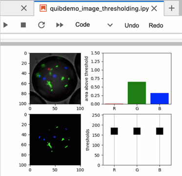
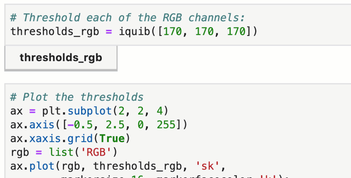

Quibbler integration with Jupyter lab
-------------------------------------

The *pyquibbler-labextension* is a *Jupyter lab* extension that provides
added *Quibbler* functionality within Jupyter notebooks. In particular,
the Jupyter lab extensions allows:

-  Integrated Undo/Redo functionality.

-  View and edit quib assignments.

-  Save/Load quib assignments within the notebook.

**Note.** Running *Quibbler* in Jupyter lab does *not* require the
Jupyter lab extension. All the power of *Quibbler* including interactive
graphics etc works independent of the *Jupyter lab* extension. The
extension only provides the additional integrated functionality as
listed above and described below.

Installation
~~~~~~~~~~~~

To install the *pyquibbler-labextension*, first make sure you have
installed *Jupyter lab* (``pip install jupyterlab``). Then simply
install the extension with:

``pip install pyquibbler-labextension``

Fire it up
~~~~~~~~~~

Now you can start your *Jupyter lab* (``jupyter lab`` at the terminal).
In the *Jupyter lab* window, you will see the *pyquibbler-labextension*
listed in the Extension Manager (on the left). You will also see two new
buttons for ``Undo`` and ``Redo``, as well as a ``Quibbler`` menu above.

.. image:: images/labext_open.png

Undo / Redo
~~~~~~~~~~~

The ``Undo`` and ``Redo`` buttons at the top of the notebook function to
undo and redo quib assignments. Hitting these buttons is the same as
executing the :py:func:`~pyquibbler.undo` and :py:func:`~pyquibbler.redo` *Quibbler* functions.

Here, for example, is how these functionalities behave when running the
demo :doc:`examples/quibdemo_image_thresholding`:

Viewing and editing quib assignments
~~~~~~~~~~~~~~~~~~~~~~~~~~~~~~~~~~~~

The *Quibbler* lab extension provides an “Override Editor”, allowing
easily viewing and editing the list of overriding assignments made to
each quib. This functionality is enabled by checking the “Show Quibs
under Notebook cells” option in the *Quibbler* menu. Then, when we
execute a given notebook cell, any newly created overriding-accepting
quibs will automatically appear as push buttons below the notebook cell
(overriding-accepting quibs include input quibs, or function quibs whose
:py:attr:`~pyquibbler.Quib.allow_overriding` is set to ``True``; see
:doc:`Overriding-default-functionality`).

| For example, here is how this looks in our
| :doc:`examples/quibdemo_image_thresholding`:

.. image:: images/labext_quib_editor.gif

Pressing the quib’s push button opens its Overriding Editor. In the
Editor, override assignments are listed as lines, with assignment path
shown on the left and the assigned value on the right.

Graphics-driven assignments
^^^^^^^^^^^^^^^^^^^^^^^^^^^

Interaction with graphics is :doc:`inverse propagated<Inverse-assignments>`
to override upstream quibs. Such graphics-driven assignments can be
viewed, in real time, in the Overriding Editor.

Manual assignments
^^^^^^^^^^^^^^^^^^

Overriding assignments can be made manually by entering the path and
value. The assignment path can be any Python acceptable syntax, like
``[1]`` for list or arrays, ``[3,:]`` for arrays, or ``['year']`` for
dicts. Deep assignment paths are also allowed, like ``[0][2]``.

To make an assignment that replaces the whole quib value (equivalent to
:py:meth:`~pyquibbler.Quib.assign()`), leave the assignment path empty (see example in
:doc:`examples/quibdemo_COVID_analysis`).

New overriding assignments can be added by pressing the ``Add Override``
button.

Assignments can be removed by pressing the circular ‘x’ button on the
right, leading to the quib resuming its default value.

Saving quib overriding assignments into Jupyter notebook
~~~~~~~~~~~~~~~~~~~~~~~~~~~~~~~~~~~~~~~~~~~~~~~~~~~~~~~~

Overriding assignments to quibs can be saved as part of the notebook,
allowing restoring prior values both within the session and when
restarting the notebook as a new session. In chapter
:doc:`Project-save-load`, we reviewed how quib assignments can be saved
into external files. The *Jupyter lab* extension allows us instead to
save quib assignments into the notebook, which is typically much simpler
and convenient. To enable saving quib assignments into the notebook
check the “Save/Load inside Notebook” option in the Jupyter lab
*Quibbler* menu.

Once enabled, quib assignments can easily be saved/loaded, either
globally for the entire notebook by choosing Save/Load from the
*Quibbler* menu (equivalent to :py:func:`~pyquibbler.save_quibs`, :py:func:`~pyquibbler.load_quibs`), or
individually by clicking the Save/Load buttons at the bottom of the
Overriding Editor of the relevant quib (equivalent to the quibs’ methods
:py:meth:`~pyquibbler.Quib.save()`, :py:meth:`~pyquibbler.Quib.load()`).

**Note.** Hitting Save will both save the quib assignments into the
notebook and save the notebook to file.

See also
~~~~~~~~

-  :doc:`Project-save-load`

-  :doc:`Inverse-assignments`

-  :doc:`Overriding-default-functionality`
