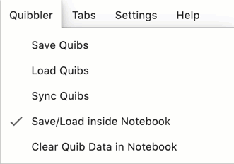
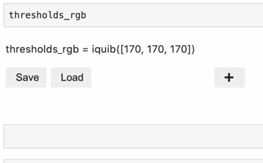

Using Quibbler with Jupyter lab
-------------------------------

*Quibbler* provides several user-interface functionalities available
when working within within the *Jupyer lab* environment:

-  Save/Load quib assignments within the notebook*.

-  Integrated Undo/Redo buttons*.

-  View and edit quib properties, assignments and value.

-  Display a quib-dependency graph.

\* The two first features require the ``pyquibbler-labextension`` (see
installation below).

Installing the Jupyter lab Quibbler extension
~~~~~~~~~~~~~~~~~~~~~~~~~~~~~~~~~~~~~~~~~~~~~

To install the *pyquibbler-labextension*, first make sure you have
installed *Jupyter lab* (``pip install jupyterlab``). Then simply
install the extension with:

``pip install pyquibbler-labextension``

**Note.** Using *Quibbler* in Jupyter lab *does not* require the
*Jupyter lab* extension. All the power of *Quibbler* including
interactive graphics etc works independently of the *Jupyter lab*
extension. The extension only provides the additional functionalities of
save/load into the notebook and the integrated undo/redo buttons.

Fire it up
~~~~~~~~~~

Now you can start your *Jupyter lab* (``jupyter lab`` at the terminal).
In the *Jupyter lab* window, you will see the *pyquibbler-labextension*
listed in the Extension Manager (on the left). You will also see two new
buttons for ``Undo`` and ``Redo``, as well as a ``Quibbler`` menu above.

.. image:: images/labext_open.png

Undo / Redo
~~~~~~~~~~~

The ``Undo`` and ``Redo`` buttons at the top of the notebook function to
undo and redo quib assignments. Hitting these buttons is the same as
executing the :py:func:`~pyquibbler.undo` and :py:func:`~pyquibbler.redo` *Quibbler* functions.

Here, for example, is how these functionalities behave when running the
demo :doc:`examples/quibdemo_image_thresholding`:

.. image:: images/labext_undo_redo.gif

Viewing and editing quib assignments
~~~~~~~~~~~~~~~~~~~~~~~~~~~~~~~~~~~~

Quibs are displayed in Jupyter lab as interactive “Quib Editors”. To
display a given quib, simply execute its variable at the end of a
Jupyter lab cell:

In the Quib Editor, override assignments are listed as lines of
assignment text.

Graphics-driven assignments
^^^^^^^^^^^^^^^^^^^^^^^^^^^

Interaction with graphics is :doc:`inverse propagated<Inverse-assignments>`
to override upstream quibs. Such graphics-driven assignments can be
viewed, in real time, in the Quib Editor.

Manual assignments
^^^^^^^^^^^^^^^^^^

Overriding assignments can be made manually by entering the path and
value of the assignment. The assignment path can be any Python
acceptable syntax, like ``[1]`` for list or arrays, ``[3,:]`` for
arrays, or ``['year']`` for dicts. Deep assignment paths are also
allowed, like ``[0][2]``. For example, to override the value of a list
quib at element 2 with a new value 97, add an assignment text: “[2] =
97”.

To make an assignment that replaces the whole quib value (equivalent to
:py:meth:`~pyquibbler.Quib.assign()`), do not specify a path, just type in the new value
for the quib directly (e.g., “[2, 3]”), or append it with an equal sign
(e.g., “= [2, 3]”).

New overriding assignments can be added by pressing the ``+`` button.

Assignments can be removed by pressing the circular ``-`` button on the
right of each assignment. Removing an assignment leads to the quib
resuming its default value.

Saving quib overriding assignments into Jupyter notebook
~~~~~~~~~~~~~~~~~~~~~~~~~~~~~~~~~~~~~~~~~~~~~~~~~~~~~~~~

Overriding assignments to quibs can be saved as part of the notebook,
allowing restoring prior values both within the session and when
restarting the notebook as a new session. In chapter
:doc:`Project-save-load`, we reviewed how quib assignments can be saved
into external files. The *Jupyter lab* extension allows us instead to
save quib assignments into the notebook, which is typically much simpler
and convenient. To enable saving quib assignments into the notebook
check the “Save/Load inside Notebook” option in the Jupyter lab
*Quibbler* menu.

Once enabled, quib assignments can easily be saved/loaded, either
globally for the entire notebook by choosing Save/Load from the
*Quibbler* menu (equivalent to :py:func:`~pyquibbler.save_quibs`, :py:func:`~pyquibbler.load_quibs`), or
individually by clicking the Save/Load buttons at the bottom of the Quib
Editor of the relevant quib (equivalent to the quibs’ methods
:py:meth:`~pyquibbler.Quib.save()`, :py:meth:`~pyquibbler.Quib.load()`).

**Note.** Hitting the Save button will both save the quib assignments
into the notebook and save the notebook to file.

Display a quib dependency graph
~~~~~~~~~~~~~~~~~~~~~~~~~~~~~~~

Within Jupyter lab, we can use the :py:func:`~pyquibbler.dependency_graph` function to
display the network of quibs upstream/downstream of a given focal quib.

See :doc:`Quib-relationships` for more detail and an example graph.

See also
~~~~~~~~

-  :doc:`Project-save-load`

-  :doc:`Inverse-assignments`

-  :doc:`Overriding-default-functionality`

-  :doc:`Quib-relationships`

