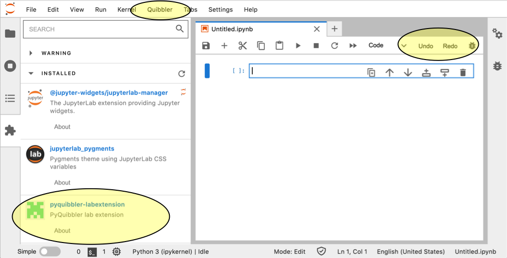
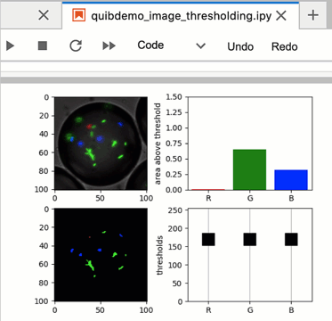

Quibbler integration with Jupyter lab
-------------------------------------

The *pyquibbler-labextension* is a *Jupyter lab* extension that provides
added *Quibbler* functionality within Jupyter notebooks. The Jupyter lab
extensions allows:

-  Integrated Undo/Redo functionality.

-  View and edit assignments to quibs.

-  Save/Load quib assignments within the notebook.

**Note.** Running *Quibbler* in Jupyter lab *does not* require the
Jupyter lab extension. All interactive graphics etc works independent of
the extension. The extension only provides the additional integrated
functionality listed above.

Installation
~~~~~~~~~~~~

To install the *pyquibbler-labextension*, first make sure you have
installed Jupyter lab (``pip install jupyterlab``). Then simply install
the extension with:

``pip install pyquibbler-labextension``

Fire it up
~~~~~~~~~~

Now you can start your Jupyter lab (``jupyter lab`` at the terminal). In
the Jupyter lab window, you will see the *pyquibbler-labextension*
listed in the Extension Manager (on the left). You will also see two new
buttons for ``Undo`` and ``Redo``, as well as a ``Quibbler`` menu above.

Undo / Redo
~~~~~~~~~~~

The ``Undo`` and ``Redo`` buttons at the top of the notebook function to
undo and redo quib assignments. Hitting these buttons is the same as
executing the :py:func:`~pyquibbler.undo` and :py:func:`~pyquibbler.redo` functions.

Here, for example, is how these functionalities behave when running the
demo :doc:`examples/quibdemo_image_thresholding`:

Viewing and editing quib assignments
~~~~~~~~~~~~~~~~~~~~~~~~~~~~~~~~~~~~

The *Quibbler* lab extension allows viewing and editing any assignments
made to quibs. This behavior is enabled by checking the “Show Quibs
under notebook cells” option in the *Quibbler* menu.

When enabled, quibs that accept assignments will automatically appear as
push buttons below the notebook cell where they are created (quibs that
accept assignments are input quibs or function quibs whose
:py:attr:`~pyquibbler.Quib.allow_overriding` is set to ``True``; see
:doc:`Overriding-default-functionality`).

.. image:: images/labext_quib_editor.gif

Pressing a quib push button opens the Assignment Editor. In the editor,
assignments are shown as lines, with assignment path shown on the left
and the assigned value on the right. The assignment path can be any
Python acceptable syntax, like ``[1]`` for list or arrays, ``[3,:]`` for
arrays, or ``['year']`` for dicts. Deep assignment paths are also
allowed, like ``[0][2]``. To make an assignment that replace the whole
quib value, leave the assignment path empty (equivalent to
:py:meth:`~pyquibbler.Quib.assign()`, see example in :doc:`examples/quibdemo_COVID_analysis`).

Interaction with graphics quibs is automatically translated to
assignments to upstream quibs which can be viewed in real time in
Assignment Editor (see chapter on :doc:`inverse-assignments`).

New overriding assignments can be added by pressing ‘Add Override’
button.

Assignments can be removed by presssing the circular ‘x’ button on the
right, leading to the quib resuming its default value.

Saving quib assignments into Jupyter notebook
~~~~~~~~~~~~~~~~~~~~~~~~~~~~~~~~~~~~~~~~~~~~~

Assignments to quibs can be saved as part of the notebook, allowing
restoring prior values within the session or when restarting the
notebook as a new session. In chapter :doc:`Project-save-load`, we reviewed
how quib assignments can be saved into external files. The Jupyter lab
extension allows us instead to save quib assignments into the notebook,
which is typically much simpler and convenient. To enable saving quib
assignments into the notebook check the “Save Quib Assignments into
Notebook” option in the Jupyter lab *Quibbler* menu.

Once enabled, quib assignments can easily be saved/load, either globally
for the notebook by choosing Save/Load from the *Quibbler* menu, or
individually by clicking the Save/Load buttons at the bottom of the
Assignment Editor of the relevant quib.

**Note.** Hitting Save will both save the quib assignments into the
notebook and save the notebook to file.

.. image:: images/labext_quib_save.gif

See also
~~~~~~~~

-  :doc:`Project_save_load`

-  :doc:`Inverse-assignments`

-  :doc:`Overriding-default-functionality`
