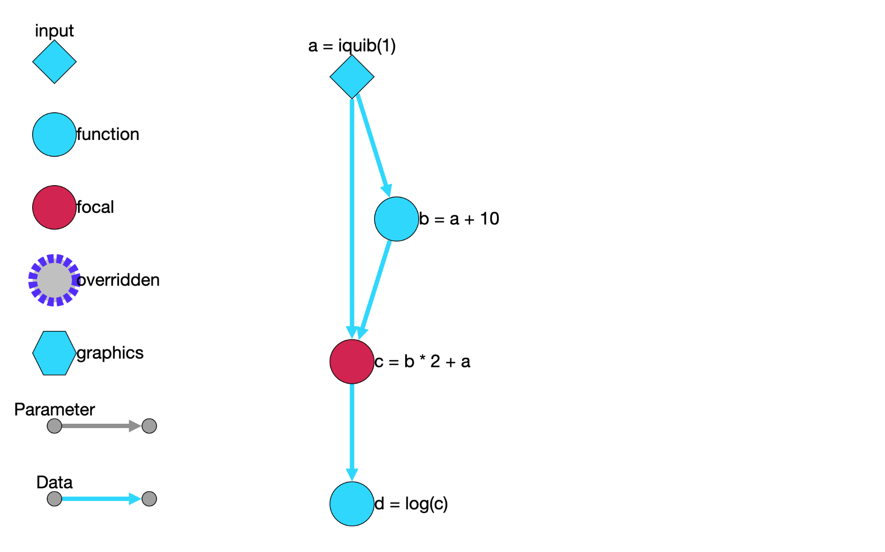

Quib dependency network
-----------------------

In *Quibbler*, each quib is connected to quibs that it depends on
(upstream quibs) and quibs that depend on it (downstream). *Quibbler*
provides simple tools to transverse this relationship network, revealing
the parameters affecting for a focal downstream result, or understanding
what downstream results are affected by a given parameter or source
data.

.. code:: python

    # Quibbler import:
    import pyquibbler as qb
    from pyquibbler import iquib
    qb.initialize_quibbler()

Parents and children
~~~~~~~~~~~~~~~~~~~~

For each quib, we can get the quibs immediately upstream to it (parents)
or immediately downstream to it (children) using the
:py:attr:`~pyquibbler.Quib.get_parents`, :py:attr:`~pyquibbler.Quib.get_children` methods.

.. code:: python

    a = iquib(1)
    b = iquib(2)
    c = a + b

.. code:: python

    c.get_parents()

.. code:: none

    {a = iquib(1), b = iquib(2)}

.. code:: python

    a.get_children()

.. code:: none

    {b < a, c = a + b}

When we consider the children or parents of a quib, we might get unnamed
quibs, typically representing intermediate results. For example:

.. code:: python

    a = iquib(1)
    c = (a + 10) * 2
    c.get_parents()

.. code:: none

    {a + 10}

To byass these intermediate quibs and get the more relevant, named
quibs, we can use the ``bypass_intermediate_quibs`` option:

.. code:: python

    c.get_parents(bypass_intermediate_quibs=True)

.. code:: none

    {a = iquib(1)}

Ancestors and descendants
~~~~~~~~~~~~~~~~~~~~~~~~~

To recursively find all the quibs that affect a focal quib (ancestors)
or all the quibs that are affected by a focal quib, we use the
:py:attr:`~pyquibbler.Quib.get_ancestors`, :py:attr:`~pyquibbler.Quib.get_descendants`:

.. code:: python

    import numpy as np
    
    a = iquib(1)
    b = a + 10
    c = (b * 2) + a
    d = np.log(c)

.. code:: python

    d.get_ancestors()

.. code:: none

    {a = iquib(1), b = a + 10, b * 2, c = b * 2 + a}

Again, we can limit to named quibs:

.. code:: python

    d.get_ancestors(bypass_intermediate_quibs=True)

.. code:: none

    {a = iquib(1), b = a + 10, c = b * 2 + a}

For example, to find all the inputs affecting a focal quib, we can use:

.. code:: python

    {ancestor for ancestor in d.get_ancestors() if ancestor.is_iquib}

.. code:: none

    {a = iquib(1)}

Displaying the dependency graph
~~~~~~~~~~~~~~~~~~~~~~~~~~~~~~~

When working within *Jupyter lab* (either with or without the
*pyquibbler-labextension*), we can graphically display the relationship
graph of connected quibs, using the :py:func:`~pyquibbler.dependency_graph` function.

.. code:: python

    from pyquibbler import dependency_graph

.. code:: python

    dependency_graph(c)

The dependency graph allows multiple options for restricting the network
to quibs affecting or affected by a focal quib. See the function
documentation for more detail (:py:func:`~pyquibbler.dependency_graph`)
