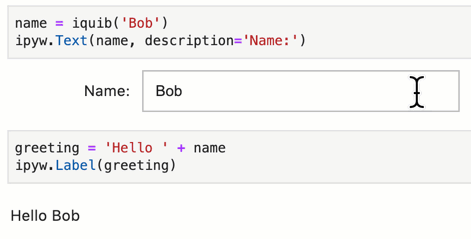
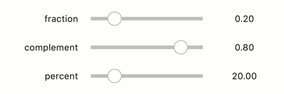
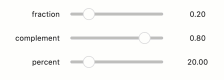
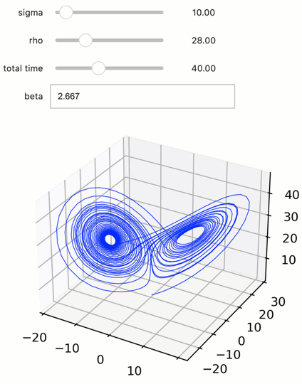

Quiby ipywidgets
----------------

Quibs can easily connect with *ipywidgets*
~~~~~~~~~~~~~~~~~~~~~~~~~~~~~~~~~~~~~~~~~~

Quibs can be used as arguments in *ipywidgets*, creating “quiby widgets”
that are bi-directionally to their quib arguments. Any change to
upstream quibs is propagated downstream to affect the widgets; and,
conversely, user interactions with the widgets is inverse propagated
backwards to affect the values of upstream quibs. Combining quibs with
ipywidgets and graphics, we can thereby readily and easily create
interactive app-like analysis of our data.

Imports
^^^^^^^

.. code:: python

    from pyquibbler import iquib, initialize_quibbler
    initialize_quibbler()
    
    import ipywidgets as ipyw

Using quibs as arguments in ipywidgets creates quiby widgets
~~~~~~~~~~~~~~~~~~~~~~~~~~~~~~~~~~~~~~~~~~~~~~~~~~~~~~~~~~~~

When we execute an *ipywidget* function with quib arguments, we get a
quiby widget - a widget that is bi-directionally linked to the value of
the quib. Setting the widget affect the value of the quib and changing
the quib value affects the widget.

For example:

As the quib changes, any downstream quibs, graphics and widgets will
also be affected.

For example:

Quibs allows functional link between widget
~~~~~~~~~~~~~~~~~~~~~~~~~~~~~~~~~~~~~~~~~~~

We often want to link the trait values of different quibs (for example,
representing a value as a fraction in one widget or as percent in
another widget). While in *ipywidgets*, widget traits can be linked
using ``ipywidgets.jslink``, creating functional relationships between
traits requires implementing “observe” callback functions which are
called when a trait value changes and which implement functional
conversions from a given widget trait to another. Using *Quibbler*, in
contrast, widgets that use dependent quibs become inherently linked; we
do not need to worry about linking or about specify any what-to-do-if
callback functions.

As a simple example, compare the “standard” and “quiby” implementations
of a code which creates three connected widgets representing a given
value as a ‘fraction’, as a complement of that fraction (complement = 1
- fraction) and as a percent (percent = fraction \* 100):

**Linking widgets: the “standard” way**

Normally, without using quibs, to link our ‘fraction’, ‘complement’ and
‘percent’, we need to implement callback functions that transform new
values of each of these traits to their corresponding values in the
other traits. Our code will look something like that:

.. code:: python

    fraction_widget = ipyw.FloatSlider(0.2, min=0, max=1, step=0.05, description='fraction')
    complement_widget = ipyw.FloatSlider(0.8, min=0, max=1, step=0.05, description='complement')
    percent_widget = ipyw.FloatSlider(20, min=0, max=100, step=5, description='percent')
    
    def on_fraction_change(changes):
        percent_widget.value = changes['new'] * 100
        complement_widget.value = 1 - changes['new']
        
    def on_complement_change(changes):
        fraction_widget.value = 1 - changes['new']
        
    def on_percent_change(changes):
        fraction_widget.value = changes['new'] / 100
        
    fraction_widget.observe(on_fraction_change, 'value')
    complement_widget.observe(on_complement_change, 'value')
    percent_widget.observe(on_percent_change, 'value')
    
    ipyw.VBox([fraction_widget, complement_widget, percent_widget])

**Linking widgets: the “quiby” way**

In contrast with the cumbersome code above, implementing these same
widgets with quibs, we do not need to worry about callback functions;
multiple widgets that depend on the same quib are all inherently linked.
We can therefore get the same functionality as above with a much simpler
code:

.. code:: python

    fraction = iquib(0.2)
    ipyw.VBox([ipyw.FloatSlider(fraction, min=0, max=1, step=0.05, description='fraction'),
               ipyw.FloatSlider(1 - fraction, min=0, max=1, step=0.05, description='complement'),
               ipyw.FloatSlider(fraction * 100, min=0, max=100, step=5, description='percent')])

Any widget trait can be a quib
~~~~~~~~~~~~~~~~~~~~~~~~~~~~~~

Quibs can be used as arguments not only for the ‘value’ of an ipywidget,
but also for any other traits, making these traits dynamically dependent
on the quib’s value.

For example, we can set the min and the max of a Slider according to the
values of a quib that are set in another slider:

Quibs can be used as arguments not only for the ‘value’ of an ipywidget,
but also for other traits, making these traits dependent on the quib’s
value.

For example, we can set the min and max of a Slider according to the
values of a quib that are set in another slider:

.. code:: python

    min_max = iquib([0, 100])
    value = iquib(20)
    ipyw.VBox([
        ipyw.IntRangeSlider(value=min_max),
        ipyw.IntSlider(value=value, min=min_max[0], max=min_max[1]),
    ])

Quibbler-based GUI applications
~~~~~~~~~~~~~~~~~~~~~~~~~~~~~~~

Combining *ipywidgets* and graphics with quibs allows us to quickly
build interactive applications.

As an example, consider an app to allow playing with the parameters of
an ODE solver. In particular, we implement here an app for solving the
Lorenz equations:

.. code:: python

    %matplotlib widget
    
    import pyquibbler as qb
    from pyquibbler import iquib, quiby
    qb.initialize_quibbler()
    
    import ipywidgets as ipyw
    import numpy as np
    from scipy.integrate import solve_ivp
    import matplotlib.pyplot as plt
    
    
    @quiby
    def solve_lorenz(y0, t_final, s, r, b):
    
        def lorenz_dydt(t, y):
    
            xp = s*(y[1] - y[0])
            yp = y[0] * (r - y[2]) - y[1]
            zp = y[0]*y[1] - b*y[2]
    
            return np.asarray([xp, yp, zp])
    
        return solve_ivp(lorenz_dydt, [0, t_final], y0, method='RK45', rtol=1e-6)
    
    # Define parameters
    sigma = iquib(10.)
    rho = iquib(28.)
    beta = iquib(2.667)
    
    t_final = iquib(40)
    y0 = iquib([.2, .3, .4])
    
    # solve the ODEs
    sol = solve_lorenz(y0, t_final, sigma, rho, beta)
    y = sol['y']
    
    # plot solution
    output = ipyw.Output()
    with output:
        fig = plt.figure(figsize=(4, 3))
        fig.canvas.toolbar_visible = False
        fig.canvas.header_visible = False
        fig.canvas.footer_visible = False
        fig.canvas.toolbar_visible = False
        fig.canvas.header_visible = False
        fig.canvas.resizable = False
        ax = plt.axes([0, 0, 1, 1], projection='3d')
        ax.plot3D(y[0], y[1], y[2], 'blue', linewidth=0.5);
        plt.show()

.. code:: python

    widgets = ipyw.VBox([
        ipyw.FloatSlider(sigma, description='sigma'),
        ipyw.FloatSlider(rho, description='rho'),
        ipyw.FloatSlider(beta, description='beta'),
        ipyw.FloatSlider(t_final, description='total time'),
    ])
    ipyw.HBox([widgets, output])

See also
~~~~~~~~

-  :doc:`Graphics`

-  :doc:`Inverse-assignments`
