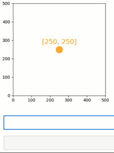
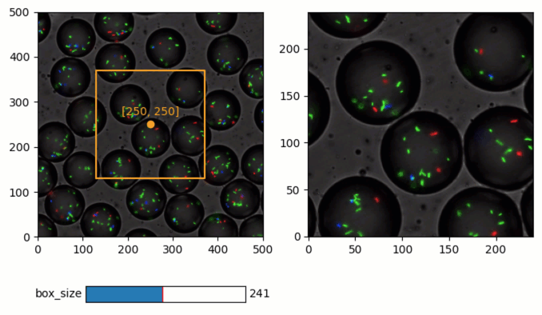

Quickstart
----------

*Quibbler* allows easily creating highly interactive and efficient data
analysis applications. Importantly, in *Quibbler*, efficiency and
interactivity are enabled naturally, using completely standard *Python*,
*NumPy* and *Matplotlib* programming syntax. There is thereby very
little to learn to get started.

This page provides a minimal-demo quickstart to quickly get you up and
running.

For additional demos, consider also the :doc:`Examples`.

For a more methodological tour, see the :doc:`Introduction` and the
complete :doc:`User Guide<index>`.

Setting up
~~~~~~~~~~

Install
^^^^^^^

Before starting, please first :doc:`install Quibbler<Installation>`.

Import
^^^^^^

*Quibbler* for *python*, ``pyquibbler``, is conventionally imported as
``qb``. In addition, it is convenient to specifically import some
often-used functions such as ``iquib`` (which will be explained below).
Following import, we execute ``qb.initialize_quibbler()``, which
initializes *Quibbler* and configures *NumPy* and *Matplotlib* functions
to work with *Quibbler*. A typical import therefore looks as follows:

.. code:: python

    # Quibbler import:
    import pyquibbler as qb
    from pyquibbler import iquib
    qb.initialize_quibbler()
    
    # Other imports:
    import numpy as np
    import matplotlib.pyplot as plt

Graphics backend
^^^^^^^^^^^^^^^^

``pyquibbler`` works well with the ``tk`` backend. In *PyCharm*, specify
``matplotlib.use("TkAgg")``. In *Jupyter Lab*, specify:

.. code:: python

    %matplotlib tk

Example of a minimal app
~~~~~~~~~~~~~~~~~~~~~~~~

As a simple example, we will build towards a simple data analysis app
for cutting a square sub-image from a source image with a specified
width around a chosen x-y point.

Writing such a code classically will require the use of callback
functions to implement user interactions. In *Quibbler*, in contrast, we
just need to define our parameters and plot them; the resulting graphics
is automatically interactive.

Let’s start with a code for interactively choosing our x-y point:

.. code:: python

    # Figure setup
    plt.figure(figsize=(4, 5))
    plt.axis('square')
    plt.axis([0, 500, 0, 500]);

.. code:: python

    # Plot a "live" marker and text at defined xy-coordinates:
    xy = iquib([250, 250])
    x, y = xy
    plt.plot(x, y, 'o', color='Orange', markersize=16)
    plt.text(x, y + 30, xy, color='Orange', fontsize=16, ha='center');

As we can see, except for the use of the function :py:func:`~pyquibbler.iquib`
(explained below), the rest is a completely standard *Python* code for
plotting a marker at position x=250, y=250 and adding next to it a text
label specifying these coordinates. Indeed, running this code plots the
marker and the text as classically expected. Yet, unlike in classical
programming, in *Quibbler* the data items and graphics are all
bi-directionally linked. First, assigning new values to an upstream
variable, say assigning ``xy[0] = 100``, immediately refreshes all
downstream graphics (the marker and the text move and the text label
refreshes). Second, the plotted marker is in fact draggable and, as we
drag it, we see that it leads to changes in the upstream variable ``xy``
and in any dependent graphics, such as the text label and location.

In *Quibbler*, thereby, we can easily get interactive functionality
while using completely standard programming syntax and without the need
for the tedious programming of event-specific callback functions for
implementing each interactive behavior.

How does it work?
~~~~~~~~~~~~~~~~~

Below, we briefly explain the above example, while providing a more
general view of *Quibbler* functionality. You can also skip this section
and continue with building our image-cutting example app below.

The quib object
^^^^^^^^^^^^^^^

*Quibbler* functionality is based on the :py:class:`~pyquibbler.Quib` object. The quib is an
object that represents an output *value* as well as the *function* and
*arguments* used to calculate this value. There are two major types of
quibs: input quibs (i-quibs) which take a regular *Python* object as
their argument and present it as their value, and function quibs
(f-quibs) that calculate their output value by applying a given function
to a given list of arguments, which could include other quibs and any
other *Python* objects.

Input-quibs
^^^^^^^^^^^

Input-quibs are created using the function :py:func:`~pyquibbler.iquib`, which
transforms any regular *Python* object into a quib. In our case,
``xy = iquib([250, 250])`` creates an i-quib ``xy`` whose value is the
list ``[250, 250]``.

Function-quibs
^^^^^^^^^^^^^^

Function-quibs are created naturally whenever we use quibs as part of
standard expressions, functions or statements. Indeed, *Quibbler*
modifies standard functions and operators such that they can work
directly with quibs. Such *Quibbler*-supported functions, also called
*quiby* functions, include not only many standard *Python*, *NumPy* and
*Matplotlib* functions (see :doc:`List-of-quiby-functions`), but also
operators (such as ``+``, ``-``, ``<``, ``>``, ``**``, ``@``, etc.), and
any indexing syntax (e.g., if ``xy`` is a quib, ``xy[0]`` is a function
quib, whose function is to get the 0’th item from ``xq``). We can
therefore easily define a chained network of function quibs using
standard programming syntax.

In our case, ``x, y = xy`` creates the f-quibs ``x = xy[0]`` and
``y = xy[1]`` whose function is to reference ``xy`` at positions 0 and
1, respectively. Next, the command ``plt.plot(x, y, ...)`` defines an
f-quib whose function is to perform ``plt.plot`` on the *values* of
``x`` and ``y``. Similarly, ``y + 30`` is a function quib that adds 30
to the value of ``y``, and then ``plt.text(...)`` is a function quib
that calls the *Matplotlib* function ``plt.text`` with the values of its
quib arguments.

Upstream changes automatically propagate to affect the value of downstream quibs
^^^^^^^^^^^^^^^^^^^^^^^^^^^^^^^^^^^^^^^^^^^^^^^^^^^^^^^^^^^^^^^^^^^^^^^^^^^^^^^^

All of these quibs are created *declaratively*: they are functional
objects whose value changes upon upstream changes. As seen in the video
above, we can probe the value of any quib using the ``get_value``
method. When we make an assignment to the upstream i-quib ``xy``, say
assigning ``xy[0] = 100``, we change the value of ``xy``, which in turn
changes the value of ``x``, which in turn changes the plot and the text.

Interaction with the graphics is inverse-propagated, leading to changes in upstream quibs
^^^^^^^^^^^^^^^^^^^^^^^^^^^^^^^^^^^^^^^^^^^^^^^^^^^^^^^^^^^^^^^^^^^^^^^^^^^^^^^^^^^^^^^^^

The relation above can also go backward. *Quibbler* allows dragging the
plotted graphics while translating such user interactions with the
graphics into assignments to the corresponding quib arguments of the
``plt.plot`` function. Such assignments into the arguments of the
``plot`` function are then *inverse-propagated* further upstream,
ultimately actualized as changes to upstream quibs (typically reaching
upstream i-quibs; see :doc:`Inverse-assignments`). In our case dragging the
marker is initially translated into assignments to the ``x`` and ``y``
quibs. Since ``x`` and ``y`` are function quibs, these assignments are
further inverse-propagated upstream to the i-quib ``xy`` where they are
actualized. The resulting change in ``xy`` then percolates downstream to
affect the plotted marker as well as text position and the text label.

Building interactive data analysis apps
~~~~~~~~~~~~~~~~~~~~~~~~~~~~~~~~~~~~~~~

The above principles can be used to easily build powerful bi-directional
relationships between data, parameters and graphics.

Continuing towards building our image-extracting app, let us extend the
coordinate-choosing code above, allowing the interactive specification
of a square area around this chosen point. We will define and plot our
square area as a box extending length ``d`` from our defined x-y
coordinates:

.. code:: python

    # Define and plot a square around the xy-point
    d = iquib(120)
    plt.plot(d * np.array([ -1,  1,  1, -1, -1]) + x, 
             d * np.array([ -1, -1,  1,  1, -1]) + y, 
             color='Orange');

As we can see, this plot too is automatically interactive. Dragging any
of the corners of the square is inverted into an assignment to the iquib
``d`` which then refreshes all other corners of the plotted square (to
further understand how *Quibbler* chooses to invert these dragging
actions into changes in ``d`` rather than in ``x`` or ``y``, see
:doc:`Inverse-assignments`, or the
:doc:`examples/quibdemo_drag_whole_object_vs_individual_points` example).

Connecting quibs with widgets
~~~~~~~~~~~~~~~~~~~~~~~~~~~~~

Quibs can also readily connect with standard *Matplotlib* widgets,
easily enabling interactive data exploration. Here again, unlike in
standard programming, using quibs in widgets automatically creates an
interactive behavior without requiring us to specifically implement a
callback function for each widget.

As an example, let’s add a slider controlling the size of our square
box.

As the box is extending from ``-d`` to ``d``, we will define its size
by:

.. code:: python

    box_size = 2 * d + 1

To connect widgets with quibs, we simply use standard *Matplotlib*
widgets, while specifying a quib as the value of the widget. In our
case, we will create a slider with its value set to the function quib
``box_size``:

.. code:: python

    from matplotlib.widgets import Slider
    main_ax = plt.gca()
    slider_ax = plt.axes([0.3, 0.05, 0.5, 0.04])
    Slider(ax=slider_ax, label='box_size', valmin=1, valmax=500, 
           valinit=box_size);

.. image:: images/Quickstart_widget_box_size.gif

As we can see, the created widget is bi-directionally linked with the
data. First, when we drag the square corners, ``d`` changes and the
slider automatically moves. Conversely, when we drag the slider, these
interactions are inverted into assignments to ``box_size`` and, since
``box_size`` is a function quib, the change further propagates to affect
``d``, thereby refreshing the plotted square. Note that as ``d`` is
defined as an integer, ``box_size``, which is defined as ``2 * d + 1``
is, by definition, an odd number. Indeed, as we drag the slider,
*Quibbler* restricts the dragging to odd numbers (to understand more on
dragging between restricted values, see
:doc:`examples/quibdemo_drag_fixed_values`).

Loading data from files
~~~~~~~~~~~~~~~~~~~~~~~

Function quibs can also implement functions that read data from files.
Simply setting the file name as a quib, a standard file-accessing
function will create a function quib that loads the file.

In our example, we will load and plot the source image that we want to
cut based on our defined square. Let’s look at an example of a
microscopy image of fluorescently-labeled bacteria growing inside small
micro-droplets (credit: Einat Tamar, Kishony lab, Technion):

.. code:: python

    # Load and plot source image
    filename = iquib('bacteria_in_droplets.tif')
    img = plt.imread(filename)
    main_ax.imshow(img);

Concluding our image cutting app
~~~~~~~~~~~~~~~~~~~~~~~~~~~~~~~~

We are now ready to conclude our app. We will use the quibs ``x``, ``y``
and ``d``, defined above, to extract a square region from our source
image. To do this, we will simply define
``img_cut = img[y-d:y+d, x-d:x+d, :]``, which creates a function quib
that performs the slicing operation. A plot of this sub-image will
thereby automatically update when we move our center x-y point, or
change the width of our defined square.

Here thereby is our entire code:

.. code:: python

    # Prepare figure
    plt.figure(figsize=(8, 5))
    plt.subplot(1, 2, 1)
    plt.axis('square')
    plt.axis([0, 500, 0, 500]);
    
    # Plot a "live" marker and text at defined xy-coordinates:
    xy = iquib([250, 250])
    x, y = xy
    plt.plot(x, y, 'o', color='Orange')
    plt.text(x, y + 20, xy, color='Orange', ha='center');
    
    # Define and plot a square around the xy-point
    d = iquib(120)
    plt.plot(d * np.array([ -1,  1,  1, -1, -1]) + x, 
             d * np.array([ -1, -1,  1,  1, -1]) + y, 
             color='Orange');
    
    # Define the box-size slider:
    box_size = 2 * d + 1
    slider_ax = plt.axes([0.2, 0.05, 0.25, 0.04])
    Slider(ax=slider_ax, label='box_size', valmin=1, valmax=500, 
           valinit=box_size);
    
    # Load and plot source image
    filename = iquib('bacteria_in_droplets.tif')
    img = plt.imread(filename)
    plt.subplot(1, 2, 1).imshow(img);
    
    # Cut and plot the sub-image:
    img_cut = img[y-d:y+d, x-d:x+d, :]
    plt.subplot(1, 2, 2).imshow(img_cut, origin='lower');

Conclusions
~~~~~~~~~~~

As we have seen, *Quibbler* provides a fast, easy and intuitive way to
analyze data in an inherently interactive way. Notably, such interactive
analysis appears naturally in *Quibbler* without us needing to worry
about the traditional, and often tedious, programming of specific
callback functions for each interactive behavior. Instead, we can set
our mind on the analysis from a data-oriented forward-looking
standpoint, and let *Quibbler* deal with any asynchronous graphics or
widget events.

Other major features of *Quibbler*
^^^^^^^^^^^^^^^^^^^^^^^^^^^^^^^^^^

Beyond **Interactivity**, other important capabilities of *Quibbler*,
not demonstrated above, include:

**1. Efficiency.** Upon changes to parameters, *Quibbler* tracks and
identifies which specific downstream data items, or even specific
elements thereof, are affected and only recalculates these affected
items. See :doc:`Diverged-evaluation`.

**2. Traceability** *Quibbler* allows us to easily probe which specific
inputs affect a downstream result, and vise versa, which downstream
results are affected by a given focal parameter. See :py:attr:`~pyquibbler.Quib.ancestors`,
:py:attr:`~pyquibbler.Quib.descendants`.

**3. Overriding**. Function quibs can be overridden, streamlining
exception specifications to default behaviors. See
:doc:`Overriding-default-functionality`.

**4. Transparency.** Inputs, as well as exceptions and overrides, are
saved in simple human-readable files. See :doc:`Project-save-load` and the
*Quibbler* Jupyter lab extension. See :doc:`Jupyter-lab-ext`.

