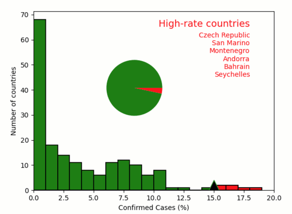

COVID-19 analysis
-----------------

**Analysis of COVID-19 infection rate by country.**

-  **Features**

   -  Reading data from external files
   -  Graphics-driven assignments

-  **Try me**

   -  Drag the high-rate threshold (triangle marker)

.. code:: python

    from pyquibbler import iquib, q, initialize_quibbler
    initialize_quibbler()
    from matplotlib import pyplot as plt
    import numpy as np
    
    %matplotlib tk

.. code:: python

    # Load data file of COVID statistics per countries
    file_name = iquib('COVID_Fatality.csv')  # <-- input
    
    dtype = [("Country", str, 32), ("ConfirmedCases", int), ("Deaths", int),  ("Population", float)]
    fatality_table = np.genfromtxt(file_name, dtype=dtype, delimiter=',', names=True)

.. code:: python

    # Figure setup
    plt.xlabel("Confirmed Cases (%)")
    plt.ylabel("Number of countries")
    plt.axis([0, 20, 0, 70]);

.. code:: python

    # Calculate and plot histogram of infection rate
    rate = fatality_table['ConfirmedCases'] / fatality_table['Population'] * 100
    plt.hist(rate, np.arange(0, 20, 1), facecolor='g');

.. code:: python

    # Threshold high-rate countries
    threshold = iquib(15.) # <-- input
    above_threshold = rate >= threshold
    plt.hist(rate[above_threshold], np.arange(0, 20, 1), facecolor='r')
    plt.plot([threshold, threshold], plt.ylim(), 'd--k', markersize=18);

.. code:: python

    # Plot pie chart
    totals = np.array([np.sum(~above_threshold), np.sum(above_threshold)])
    ax = plt.axes([0.2, 0.5, 0.3, 0.3])
    plt.pie(totals, colors=['g', 'r'], labels=totals);

.. code:: python

    # List high-rate countries
    text_props = {'va': 'top', 'ha': 'right', 'color': 'r'}
    plt.text(18, 68, 'High-rate countries', fontsize=14, **text_props)
    plt.text(18, 63, q("\n".join, fatality_table[above_threshold]['Country']), **text_props);

