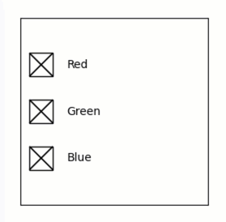

Quib-linked CheckButtons widget
-------------------------------

**A demo of interactive quib-linked matplotlib CheckButtons widget.**

-  **Features:**

   -  Quiby widgets.
   -  Quiby axis attributes.

-  **Try me:**

   -  Try playing with the check-buttons.

.. code:: python

    from pyquibbler import iquib, initialize_quibbler, q
    initialize_quibbler()
    import matplotlib.pyplot as plt
    from matplotlib import widgets
    %matplotlib tk

.. code:: python

    # Prepare figure
    plt.figure(figsize=(3, 3))
    ax = plt.gca()

.. code:: python

    # Define input quib for colors
    colors = iquib([True, True, True])

.. code:: python

    # Define a quib-widget
    widgets.CheckButtons(ax=ax, labels=['Red', 'Green', 'Blue'], actives=colors);

.. code:: python

    # Set the color of the axis to the quib colors
    ax.set_facecolor(colors);

