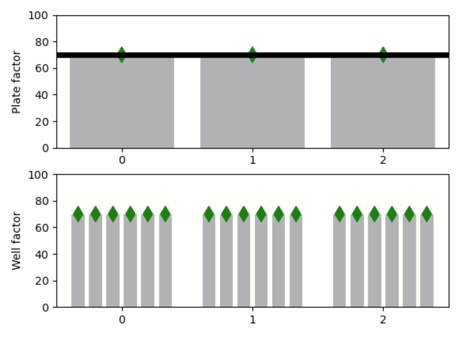

Overriding default values (two-levels)
--------------------------------------

**A demo of two-level default and overriding.**

Say we have several “plates”, and each of these plates has several
“wells”, and we want to apply a function to each well in each plate with
some default factor. We need a way to choose this factor globally, but
we might sometimes need to adjust it for a specific plate and even for a
specific well within a plate. Essentially, we would like to replicate
the “default factor” for each plate and then to replicate these plate
factors for each well, while allowing “overriding” of these copies at
each level. In *Quibbler*, as shown here, such behavior is achieved
quite seamlessly using overriding of function quibs.

-  **Features**

   -  Overriding
   -  Override mask
   -  Graphics-driven assignments
   -  Inverse assignments
   -  Assignment template

-  **Try me**

   -  Drag the horizontal line to change the “default factor”
   -  Drag the “per-plate factor” markers will prompt asking if
      assignments should be interpreted as overrides to the
      “plate-facor”, or propagate upstream to change the default.
   -  Drag the “per-well factor” markers will prompt asking if
      assignments should be interpreted as overrides at the well level,
      or inverse-propagate one step up to the plate level, or two step
      up to the default level.

.. code:: python

    from pyquibbler import iquib, initialize_quibbler, q
    initialize_quibbler()
    import matplotlib.pyplot as plt
    from matplotlib.colors import ListedColormap
    import numpy as np
    %matplotlib tk

.. code:: python

    # Set number of plate and number wells per plate
    n_plates = iquib(3)
    n_wells = iquib(6)

.. code:: python

    # Figure setup
    plt.figure()
    
    ax1 = plt.subplot(2, 1, 1)
    ax1.axis([-0.5, n_plates - 0.5, 0, 100])
    ax1.set_ylabel('Plate factor')
    ax1.set_xticks(np.arange(n_plates))
    
    ax2 = plt.subplot(2, 1, 2)
    ax2.axis([-0.5, n_plates - 0.5, 0, 100])
    ax2.set_ylabel('Well factor')
    ax2.set_xticks(np.arange(n_plates));

.. code:: python

    # Common properties
    input_properties = {
        'assignment_template': (0, 100, 1), 
        'allow_overriding': True
    }

.. code:: python

    # Scatter with two colors
    def two_color_scatter(ax, x, y):
        return ax.scatter(x, y, 
                          marker='d', s=100, zorder=2, 
                          cmap=ListedColormap(['green', 'red']),
                          c=y.get_override_mask(),
                          vmin = 0, vmax = 1,
                          pickradius=10)

.. code:: python

    # Define and plot the default factor
    default_factor = iquib(70).setp(**input_properties)
    ax1.axhline(default_factor, color='k', linewidth=5);

.. code:: python

    # Define and plot the per-plate factor
    plate_factor = np.repeat(default_factor, n_plates, 0)
    plate_factor.setp(**input_properties)
    x = np.arange(n_plates)
    ax1.bar(x, plate_factor, color=(0.7, 0.7, 0.7))
    two_color_scatter(ax1, x, plate_factor);

.. code:: python

    # Define and plot the per-plate-per-well factor
    well_factor = np.repeat(plate_factor, n_wells, 0)
    well_factor.setp(**input_properties)
    dd = np.linspace(-0.4, 0.4, n_wells + 1)
    dd = (dd[0:-1] + dd[1:]) / 2.
    xx = np.ravel(x + np.reshape(dd, (n_wells, 1)), 'F')
    ax2.bar(xx, well_factor, color=(0.7, 0.7, 0.7), width=0.1)
    two_color_scatter(ax2, xx, well_factor);

