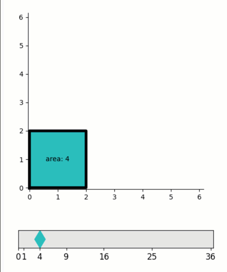

Dragging graphics between fixed points
--------------------------------------

**A demo of interactively choosing among a fixed set of values.**

-  **Features**

   -  Graphics-driven assignments
   -  Inverse assignments
   -  Assignment template

-  **Try me**

   -  Drag the cyan diamond marker to choose a square number.
   -  Drag the corner of the cyan square.

.. code:: python

    from pyquibbler import iquib, initialize_quibbler, q
    initialize_quibbler()
    import matplotlib.pyplot as plt
    import numpy as np
    %matplotlib tk

.. code:: python

    # Prepare figure, axes
    fig = plt.figure(figsize=(5, 6))
    
    ax1 = fig.add_axes([0.1, 0.1, 0.8, 0.06])
    ax1.set_ylim([0, 1])
    ax1.set_xlim([0, 36.5])
    area_options = np.array(range(0, 7)) ** 2
    ax1.set_xticks(area_options)
    ax1.set_xticklabels(area_options, fontsize=12)
    ax1.set_yticks([])
    ax1.set_facecolor([0.9, 0.9, 0.9])
    
    ax2 = fig.add_axes([0.1, 0.3, 0.8, 0.6])
    ax2.axis('square')
    ax2.axis([-0.05, 6.15, -0.05, 6.15])
    ax2.spines['top'].set_visible(False)
    ax2.spines['right'].set_visible(False)

.. code:: python

    # Define x, x_square
    # (use assingment_template to limit values of x)
    x = iquib(2).setp(assignment_template=(0, 6, 1))
    x_square = x ** 2

.. code:: python

    # Plot draggable x_square. 
    # (the marker position will be limitted to square numbers)
    ax1.plot(x_square, 0.5, 'dc', markersize=18, picker=True, pickradius=25);

.. code:: python

    # Plot the black sqaure, with text, and a draggable corner
    ax2.plot([0, x, x, 0, 0], [0, 0, x, x, 0], 'k-', linewidth=4)
    ax2.text(x/2, x/2, q("area: {:.0f}".format, x_square), ha='center',  va='center')
    ax2.plot(x, x, 'sc', markersize=14, picker=True);

