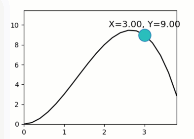

Dragging graphics along a curved line
-------------------------------------

**A demo of interactively dragging a point along a curved line.**

-  **Features**

   -  Graphics quibs
   -  Graphics-driven assignments
   -  Dragging with functional constrains

-  **Try me**

   -  Try dragging the circle along the functional curve.

.. code:: python

    from pyquibbler import iquib, initialize_quibbler, q
    initialize_quibbler()
    import matplotlib.pyplot as plt
    import numpy as np
    %matplotlib tk

.. code:: python

    # Define and plot a curve:
    curve_function = lambda v: 4 * v ** 2 - v ** 3
    graph_xs = np.arange(0, 4, .2)
    graph_ys = curve_function(graph_xs)
    plt.figure(figsize=(4, 3))
    plt.plot(graph_xs, graph_ys, 'k')
    plt.axis([0, 4, 0, 12])
    
    # Define x-y quibs:
    point_x = iquib(3.)
    point_y = q(curve_function, point_x)
    
    # Plot the x-y point:
    plt.plot(point_x, point_y, 
             marker='o', markerfacecolor='c', 
             markersize=18, pickradius=20)
    
    # Define and plot text:
    xy_str = q("X={:.2f}, Y={:.2f}".format, point_x, point_y)
    plt.text(point_x, point_y + .6, xy_str, 
             ha="center", va="bottom", fontsize=13);

