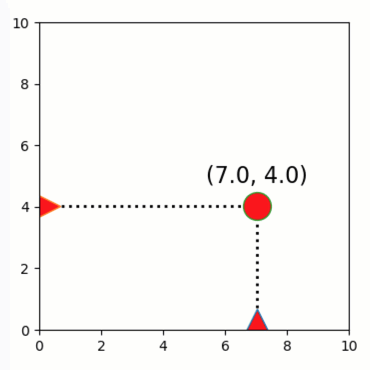

Dragging graphics vertically/horizontally
=========================================

**A demo of interactive graphics-driven assignments with
vertical/horizontal dragging.**

-  **Features**

   -  Graphics-driven assignments
   -  Horizontal/vertical dragging
   -  Inverse assignments

-  **Try me**

   -  Try dragging the circle - note that it can move freely.
   -  Try dragging the axis-sliders - note that they can only move
      horizontally / vertically.

.. code:: python

    from pyquibbler import iquib, initialize_quibbler, q
    initialize_quibbler()
    import matplotlib.pyplot as plt
    import numpy as np
    %matplotlib tk

.. code:: python

    # Figure setup and graphic properties
    plt.figure(figsize=(4, 4))
    plt.axis([0, 10, 0, 10])
    marker_props = {'markerfacecolor': 'r', 
                    'markeredgecolor': 'k', 'markersize': 22}
    
    # Define x-y coordinates
    x = iquib(7.)
    y = iquib(4.)
    
    # Lines connecting x-y dot to axes
    plt.plot([x, x], [0, y], 'k:', linewidth=2)
    plt.plot([0, x], [y, y], 'k:', linewidth=2)
    
    # Freely draggable dot
    plt.plot(x, y, 'o', **marker_props)
    
    # Vertical and horizontal sliders
    plt.plot(x, 0.2, '^', **marker_props)
    plt.plot(0.2, y, '>', **marker_props)
    
    # Text above dot
    plt.text(x, y + 0.6, 
             q("({:3.1f}, {:3.1f})".format, x, y),
             ha="center", va="bottom", fontsize=16);

