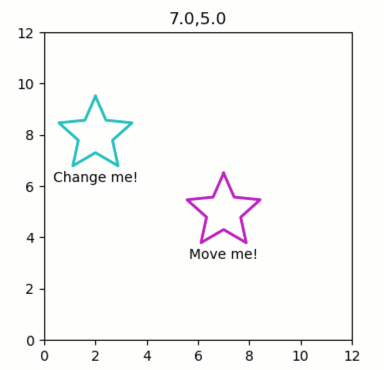

Dragging whole object versus individual points
----------------------------------------------

**Moving a graphics object as a whole, or refining individual data
points.**

-  **Features:**

   -  Graphics-driven assignments
   -  Directing inverse assignments of binary operators
   -  Dragging individual points versus whole object
   -  Use of ``q`` syntax for non-quiby functions

-  **Try me:**

   -  Try dragging the ‘Move me!’ star - it will move as a whole.
   -  Try dragging the ‘Change me!’ star - it will change individual
      points.

.. code:: python

    from pyquibbler import iquib, initialize_quibbler, q
    initialize_quibbler()
    import matplotlib.pyplot as plt
    import numpy as np
    from numpy import pi
    %matplotlib tk

.. code:: python

    # Figure setup:
    fig1 = plt.figure(figsize=(4, 4))
    ax = fig1.gca()
    ax.axis('square')
    ax.axis([0, 12, 0, 12]);

.. code:: python

    # Define star coordinates:
    nPoints = iquib(5)
    dtet = 2 * pi / (2 * nPoints)
    tet = np.arange(0.5 * pi, 2.5 * pi, dtet)
    rR = np.array([1.5, 0.7])
    rs = np.tile(rR, (nPoints,))
    xy_star = np.array([np.cos(tet), np.sin(tet)]) * rs;

.. code:: python

    # Allow changing the coordinates:
    xy_star.allow_overriding = True

.. code:: python

    # Close the shapes by connecting the last point to the first point
    xy_star_circ = np.concatenate([xy_star, xy_star[:, [0]]], axis=1)

.. code:: python

    def plot_star(ax, xy, txt, color):
        x, y = xy
        ax.text(np.mean(x), np.min(y) - 0.2, txt, ha='center', va='top')
        ax.plot(x, y, linewidth=2, color=color);

.. code:: python

    # Define and draw movable star:
    xy_center_movable = iquib(np.array([[7.], [5.]]))
    
    # using x_center_movable as the first argument in the summation 
    # (to which the inverse-assignment is channeled):
    xy_movable_star = xy_center_movable + xy_star_circ
    txt = q('Move me!\n{:.1f},{:.1f}'.format, xy_center_movable[0, 0], xy_center_movable[1, 0])
    plot_star(ax, xy_movable_star, txt, color='m');

.. code:: python

    # Define and draw changeable star:
    xy_center_fixed = iquib(np.array([[2.], [8.]]))
    
    # using x_star_circ as the first argument in the summation
    xy_changeable_star = xy_star_circ + xy_center_fixed
    plot_star(ax, xy_changeable_star, 'Change me!', color='c');

