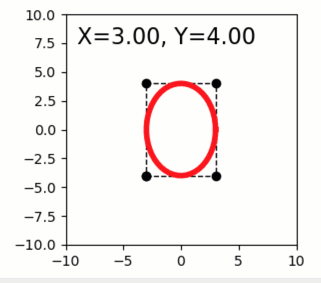

Dragging graphics affects upstream quibs
----------------------------------------

**A simple demo of interactive graphics-driven assignments.**

-  **Features:**

   -  Graphics quibs
   -  Graphics-driven assignments
   -  Inverse assignments

-  **Try me:**

   -  Try dragging the red marker; note the change in X,Y text, square,
      ellipse.

.. code:: python

    from pyquibbler import iquib, initialize_quibbler, q
    import matplotlib.pyplot as plt
    import numpy as np
    initialize_quibbler()
    %matplotlib tk

.. code:: python

    # Figure setup:
    fig1 = plt.figure(figsize=(4, 3))
    plt.axis('square')
    plt.axis([-10, 10, -10, 10]);

.. code:: python

    # Define input quibs for x-y coordinates:
    xy = iquib(np.array([3., 4.]))
    x = xy[0]
    y = xy[1]

.. code:: python

    # Plot additional graphics based on x and y.
    # these downstream graphics will change when the marker is moved:
    
    # Text:
    plt.text(-9, 9, q('X={:.2f}, Y={:.2f}'.format, x, y), fontsize=16, va='top')
    
    # Rectangle:
    plt.plot(x * np.array([-1, 1, 1, -1, -1]), y * np.array([-1, -1, 1, 1, -1]), 
             'k--o', linewidth=1, picker=True)
    
    # Ellipse:
    phi = np.linspace(0, 2 * np.pi, 50)
    plt.plot(x * np.cos(phi), y * np.sin(phi), 'r-', linewidth=4);

