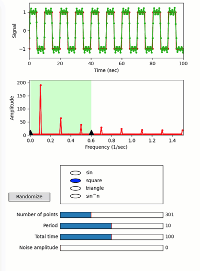

Signal analysis with random noise
---------------------------------

**A demo of a quib-based GUI for signal analysis.**

-  **Features**

   -  Random quibs
   -  Graphics-driven assignments
   -  Inverse assignments
   -  Linking quibs with matplotlib.widgets: Slider, RadioButtons

-  **Try me**

   -  Try dragging the triangle markers to specify the band-width.
   -  Try playing with the sliders, or specifying a different function
      with the radio buttons.

.. code:: python

    from pyquibbler import iquib, initialize_quibbler, q, \
        quiby, reset_random_quibs
    import numpy as np
    import matplotlib.pyplot as plt
    import matplotlib.patches as patches
    from matplotlib import widgets
    from matplotlib.patches import Rectangle
    initialize_quibbler()
    %matplotlib tk

.. code:: python

    # Total time (sec):
    total_time = iquib(100)
    
    # Number of time points (limited to even numbers between 0 and 1000):
    num_time_points = iquib(300).setp(assignment_template=(0, 1000, 2))
    
    # Time vector:
    t = np.linspace(0, total_time,num_time_points)
    
    # Period (sec):
    period = iquib(10)
    w = 2 * np.pi / period
    
    # Type of functions:
    nSin = iquib(3).setp(assignment_template=(1, 13, 2))
    signal_fnc_list = ['sin', 'square', 'triangle', 'sin^n']
    signal_fnc_chosen = iquib(1)
    
    # Signal as a function of time:
    @quiby
    def get_signal(t, w, chosen, power):
        return {0: lambda s, n: s,
                1: lambda s, n: (s > 0) * 2 - 1,
                2: lambda s, n: np.arcsin(s),
                3: lambda s, n: s ** n}[chosen](np.sin(w * t), power)
    
    signal = get_signal(t, w, signal_fnc_chosen, nSin)
    
    # Add Noise:
    noise_amp = iquib(0.0)
    noise = noise_amp * np.random.randn(num_time_points)
    
    measurement = signal + noise
    
    # Bandwidth:
    min_freq = iquib(0.0)
    max_freq = iquib(0.6)
    
    # FFT:
    spectrum = q(np.fft.fft, measurement)
    dfreqs = 1/total_time  # Frequency resolution
    freqs = np.concatenate([
        np.arange(0, (num_time_points - 1) / 2), 
        np.arange(num_time_points / 2, 0, -1)]) * dfreqs  # Frequency vector
    
    # Apply band filter
    spectrum_filtered = spectrum * ((freqs>=min_freq) & (freqs<=max_freq))
    
    # Inverse FFT:
    S0 = q(np.fft.ifft, spectrum_filtered);

.. code:: python

    # figure setup:
    fig = plt.figure(1, figsize=(6, 8))

.. code:: python

    # signal vs time 
    ax1 = fig.add_axes((0.15, 0.78, 0.75, 0.2))
    ax1.set_ylim([np.min(measurement) - 0.5 - noise_amp, 
                   np.max(measurement) + 0.5 + noise_amp])
    ax1.set_xlim([0, total_time])
    ax1.set_xlabel('Time (sec)')
    ax1.set_ylabel('Signal')
    ax1.plot(t,np.real(measurement), '.-', color=[0.8, 0, 0])
    ax1.plot(t,np.real(S0), '.-', color=[0, 0.7, 0]);

.. code:: python

    # spectrum
    ax2 = fig.add_axes((0.15, 0.5, 0.75, 0.2))
    yl = np.max(np.abs(spectrum)) * 1.1
    ax2.axis([-dfreqs, np.max(freqs) + dfreqs, 0, yl])
    ax2.set_xlabel('Frequency (1/sec)')
    ax2.set_ylabel('Amplitude')
    ax2.plot(freqs, np.abs(spectrum), 'r.-')
    width = max_freq - min_freq
    band = Rectangle((min_freq, 0), width, yl, facecolor=(0.8, 1, 0.8))
    ax2.add_patch(band)
    ax2.axvline(min_freq)
    ax2.axvline(max_freq);

.. code:: python

    # sliders of quibs:
    slider_axs = [fig.add_axes([0.3, 0.2-i*0.04, 0.5, 0.02]) for i in range(5)]
    for i, label, valmin, valmax, valstep, valinit in (
        (0, 'Number of points', 1, 1000, 2, num_time_points),
        (1, 'Period', 0, 20, 1, period),
        (2, 'Total time', 0, 200, 5, total_time),
        (3, 'Noise amplitude', 0, 2, 0.1, noise_amp),
        (4, 'Power of sin', 1, 13, 1, nSin)):
        widgets.Slider(ax=slider_axs[i], label=label, valmin=valmin, 
                       valmax=valmax, valstep=valstep, valinit=valinit)
    # Make the 'Power of sin' slider visible only when signal_fnc_chosen==3:
    is_sinN = q(lambda x: x==3, signal_fnc_chosen)
    a = slider_axs[4].set_visible(is_sinN);

.. code:: python

    # radio buttons to choose function:
    axs_radio = fig.add_axes([0.3, 0.25, 0.5, 0.14])
    btns = widgets.RadioButtons(
        ax=axs_radio, labels=signal_fnc_list, active=signal_fnc_chosen)

.. code:: python

    # Randomization button
    randomize_button = widgets.Button(
        ax=fig.add_axes([0.05, 0.26, 0.2, 0.03], xticks=[], yticks=[]), 
        label='Randomize')
    randomize_button.on_clicked(lambda x: reset_random_quibs());

