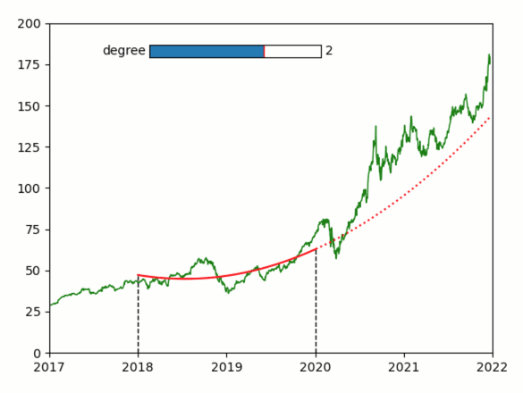

Polyfit of stock value
----------------------

**A simple demo of an interactive polyfit extrapolation of stock
values**

-  **Features**

   -  Graphics quibs
   -  Graphics-driven assignments
   -  Quib-linked widgets
   -  Inverse assignments

-  **Try me**

   -  Drag the cyan marker to move the fit period.
   -  Drag the dashed lines to change the width of the fit period.
   -  Use the slider to change the polynomial degree of the fit.

.. code:: python

    from pyquibbler import iquib, initialize_quibbler, q
    initialize_quibbler()
    
    import matplotlib.pyplot as plt
    import numpy as np
    from matplotlib.widgets import Slider
    from datetime import datetime
    %matplotlib tk

.. code:: python

    # Load data of Apple stock:
    t_init = datetime.strptime('2000-01-01', '%Y-%m-%d').timestamp()
    str2date = lambda x: (datetime.strptime(x, '%Y-%m-%d').timestamp() 
                          - t_init) / (365 * 24 * 60 * 60) + 2000
    filename = iquib('AAPL.csv')
    d = np.genfromtxt(filename, delimiter=',', names=True, converters = {0: str2date})
    
    # Initiate a figure:
    plt.figure()
    plt.axis([2017, 2022, 0, 200])
    
    # Plot the stock values:
    t = d['Date']
    y = d['Open']
    plt.plot(t, y, 'g', lw=1)
    
    # Define fit parameters:
    t_final = iquib(2020.)
    dt = iquib(2.)
    n = iquib(2)
    
    # define t_initial, starting with dt so that changes in t_initial affects dt
    t_initial = -dt + t_final 
    
    # Define downstream function quibs of the fitted period:
    fit_range = (t >= t_initial) & (t <= t_final)
    
    # Do the fit and plot
    p = np.polyfit(t[fit_range], y[fit_range], n)
    plt.plot(t[fit_range], np.polyval(p, t[fit_range]), 'r-')
    
    # Plot extrapulation:
    extrapulate_range = t > t_final
    plt.plot(t[extrapulate_range], np.polyval(p, t[extrapulate_range]), 'r:')
    
    # Plot the fit parameters:
    a11 = np.array([1, 1])
    plt.plot(t_final * a11, [0, np.polyval(p, t_final)], 'k--', lw=1)
    plt.plot(t_initial * a11, [0, np.polyval(p, t_initial)], 'k--', lw=1)
    
    # Add the slider for the polynomial degree:
    ax = plt.axes([0.3, 0.8, 0.3, 0.03])
    Slider(ax=ax, valmin=0, valmax=3, valinit=n, valstep=1, label='degree');

