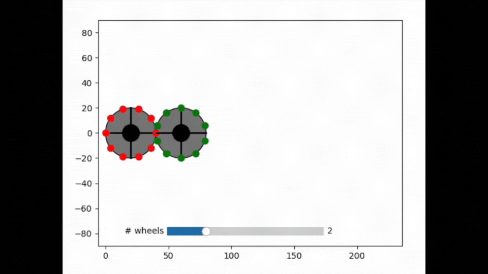

Sequencial connections
----------------------

**A simple demo of interactive graphics-driven assignments.**

-  **Features:**

   -  vectorize function with pass_quibs
   -  Graphics-driven assignments from vectorized func
   -  quiby function with pass_quibs (see alternative code below)

-  **Try me:**

   -  Rotate any of the gears.
   -  Drag gear centers to change their radius.
   -  Add or remove gears using the slider

.. code:: python

    from pyquibbler import initialize_quibbler, iquib, quiby
    initialize_quibbler()
    %matplotlib tk
    
    import matplotlib.pyplot as plt
    import numpy as np
    
    from numpy import pi, sin, cos
    from matplotlib.widgets import Slider

.. code:: python

    # create the figure
    plt.figure()
    ax = plt.gca()
    ax.axis('equal');

.. code:: python

    def create_wheel(center, n, r, phase, idx, color):
        # wheel body
        ax.add_patch(plt.Circle((center, 0), r, facecolor='gray', edgecolor='k'))
        
        # 90 deg lines
        a = phase + np.arange(4) * 2 * pi / 4
        ax.plot(cos(a[0::2])*r + center, sin(a[0::2])*r, '-k', lw=2)
        ax.plot(cos(a[1::2])*r + center, sin(a[1::2])*r, '-k', lw=2)
    
        # teeth
        a = phase + (0.5*idx + np.arange(np.abs(n))) * 2 * pi / n
        ax.plot(cos(a)*r + center, sin(a)*r, '.', markersize=15, color=color)
        
        # central axis
        ax.plot(center, 0, 'ko', markersize=20)
        
        ax.axis([-10, 240, -90, 90]);

.. code:: python

    # Parameters
    default_num_tooth = 5
    radius_per_teeth = 2
    all_colors = list('rgbmcy')
    n_w = iquib(2)
    phase0 = iquib(0.)

.. code:: python

    # Create derived quibs
    teeth_nums = (np.zeros(n_w, dtype=int) + default_num_tooth)
    teeth_nums.allow_overriding = True
    teeth_nums = teeth_nums * 2  # make sure teeth_num is even
    
    radii = teeth_nums * radius_per_teeth
    centers = -radii + np.cumsum(2 * radii)
    transmision = - teeth_nums[:-1] / teeth_nums[1:]
    
    colors = iquib(all_colors)[:n_w]
    indices = np.arange(n_w)
    
    phases = phase0 * np.concatenate(([1], np.cumprod(transmision)))

.. code:: python

    # Slider for number of wheels
    Slider(plt.axes(position=(0.3, 0.13, 0.4, 0.06)), valinit=n_w, valmin=1, valmax=5, label='# wheels');

.. code:: python

    # Implement using vectorize
    create_wheels = np.vectorize(create_wheel, pass_quibs=True, is_graphics=True)
    create_wheels(centers, teeth_nums, radii, phases, indices, colors);

.. code:: python

    # Implement using quiby (alternative)
    
    # @quiby(pass_quibs=True, is_graphics=True)
    # def create_wheels(centers, teeth_nums, radii, phases, indices, colors):
    #     n = len(centers.get_value())
    #     for i in range(n):
    #         create_wheel(centers[i], teeth_nums[i], radii[i], phases[i], indices[i], colors[i])
    
        
    # create_wheels(centers, teeth_nums, radii, phases, indices, colors);

