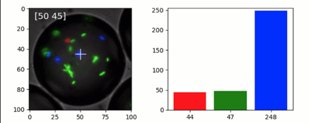

Simple quib-app for probing image RGB
-------------------------------------

**A simple demo of a quib-based GUI.**

-  **Features**

   -  Graphics quibs
   -  Graphics-driven assignments
   -  Inverse assignments

-  **Try me**

   -  Try dragging the marker and see the RGB values of the image.

.. code:: python

    from pyquibbler import iquib, initialize_quibbler, q
    initialize_quibbler()
    import matplotlib.pyplot as plt
    import numpy as np
    %matplotlib tk

.. code:: python

    plt.figure(1, figsize=(7, 3));
    plt.clf()

.. code:: python

    # Load an image:
    filename = iquib('bacteria_in_a_droplet.tif')
    img = plt.imread(filename)
    
    # Show the image:
    plt.subplot(1, 2, 1)
    plt.imshow(img)
    
    # Choose an x-y point:
    xy = iquib(np.array([50, 45]))
    plt.plot(xy[0], xy[1], 'w+', markersize=18, picker=True)
    plt.title('xy = ' + np.array2string(xy));
    
    # Plot the image RGB at the chosen point:
    plt.subplot(1, 2, 2)
    rgb = img[xy[1], xy[0], :]
    plt.bar([0, 1, 2], rgb, color=list('rgb'))
    plt.title('RGB = ' + np.array2string(rgb));

