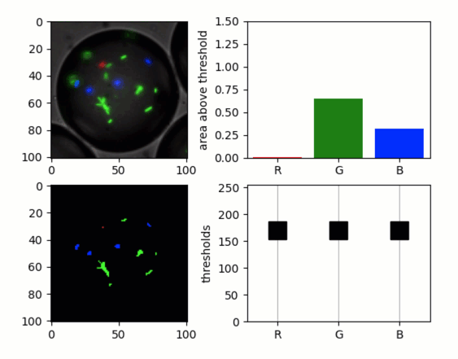

Simple quib-app for image thresholding
--------------------------------------

**A simple demo of a quib-based GUI for thresholding an image.**

-  **Features**

   -  Graphics quibs
   -  Graphics-driven assignments
   -  Inverse assignments

-  **Try me**

   -  Try dragging the RGB threshold values.

.. code:: python

    from pyquibbler import iquib, initialize_quibbler
    initialize_quibbler()

.. code:: python

    import matplotlib.pyplot as plt
    import numpy as np
    %matplotlib tk

.. code:: python

    # Load an image:
    filename = iquib('bacteria_drop.tif') 
    img = plt.imread(filename)
    
    # Show the image:
    plt.figure()
    ax = plt.subplot(2, 2, 1)
    ax.imshow(img);

.. code:: python

    # Threshold each of the RGB channels:
    thresholds_rgb = iquib([170, 170, 170])

.. code:: python

    # Plot the thresholds
    ax = plt.subplot(2, 2, 4)
    ax.axis([-0.5, 2.5, 0, 255])
    ax.xaxis.grid(True)
    rgb = list('RGB')
    ax.plot(rgb, thresholds_rgb, 'sk', 
            markersize=16, markerfacecolor='k');
    ax.set_ylabel('thresholds');

.. code:: python

    # Calculate and plot the thresholded image:
    img01 = img > np.expand_dims(thresholds_rgb, axis=(0, 1))
    plt.subplot(2, 2, 3)
    plt.imshow(img01 * 1.);

.. code:: python

    # Calculate area above threshold for each color:
    fraction_above_threshold = np.average(img01, (0, 1)) 
    
    # Plot detected areas:
    ax = plt.subplot(2, 2, 2)
    ax.bar(rgb, fraction_above_threshold * 100, color=list('rgb'))
    ax.axis([-0.5, 2.5, 0, 1.5])
    ax.set_ylabel('area above threshold');

.. code:: python

    # Show thresholds on log scale:
    log_thresholds_rgb = np.log2(thresholds_rgb)
    
    fg = plt.figure(figsize=(4, 3))
    ax = fg.gca()
    ax.plot(rgb, log_thresholds_rgb, 'sk', markersize=16, markerfacecolor='k')
    ax.axis([-0.5, 2.5, 0, 8])
    ax.xaxis.grid(True)

