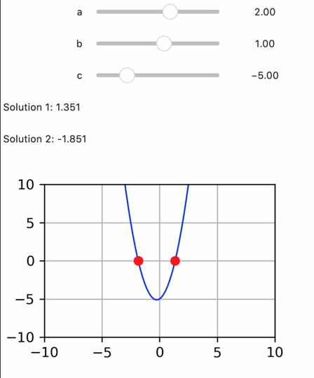

Quadratic equations with ipywidgets
-----------------------------------

**A simple demo of an interactive app for solving a quadratic equation,
implemented with quiby ipywidgets.**

-  **Features:**

   -  Quiby ipywidgets
   -  Graphics quibs
   -  Inverse assignments

-  **Try me:**

   -  Try setting the a, b, c coefficients of the quadratic equation.

.. code:: python

    from pyquibbler import iquib, initialize_quibbler, q
    initialize_quibbler()
    
    import matplotlib.pyplot as plt
    import numpy as np
    import ipywidgets as ipyw
    import warnings

.. code:: python

    # Note: running in widget mode requires installing pip install ipympl
    %matplotlib widget

.. code:: python

    # define parameters:
    a = iquib(2.)
    b = iquib(1.)
    c = iquib(-5.)
    
    # define solutions for the quadratic equation:
    solution1 = (-b + np.sqrt(b**2 - 4*a*c)) / (2*a)
    solution2 = (-b - np.sqrt(b**2 - 4*a*c)) / (2*a)
    
    # define the quadratic curve:
    x = np.linspace(-10, 10, 100)
    y = a * x**2 + b*x + c
    
    # capture figure into an Output ipywidget:
    output = ipyw.Output()
    with output, warnings.catch_warnings():
        # avoid warning on negative sqrt:
        warnings.simplefilter("ignore")
        
        # prepare figure
        fig = plt.figure(figsize=(3, 2))
        fig.canvas.header_visible = False
        fig.canvas.resizable = False
        ax = plt.gca()
        ax.axis([-10, 10, -10, 10])
        ax.grid()
        
        # plot the quadratic line and the solutions:
        ax.plot(x, y, 'blue', linewidth=1)
        ax.plot([solution1, solution2], [0, 0], 'ro')
        
        plt.show()
    
    # Show the quibs, the solutiions and the graph as ipywidgets:
    ipyw.VBox([
        ipyw.FloatSlider(a, description='a', min=-10, max=10),
        ipyw.FloatSlider(b, description='b', min=-10, max=10),
        ipyw.FloatSlider(c, description='c', min=-10, max=10),
        ipyw.Label(q('Solution 1: {:6.3f}'.format, solution1)),
        ipyw.Label(q('Solution 2: {:6.3f}'.format, solution2)),
        output
    ])

.. code:: none

    VBox(children=(FloatSlider(value=2.0, description='a', max=10.0, min=-10.0), FloatSlider(value=1.0, descriptio…

