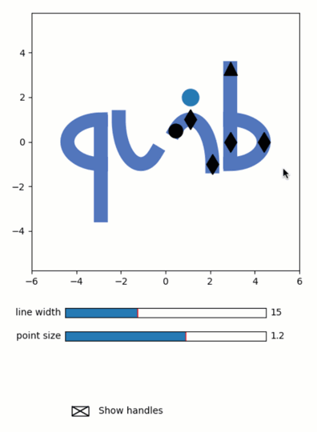

Making the quib icon
--------------------

**A demo of interactive design of the quib icon.**

-  **Features**

   -  Graphics-driven assignments
   -  Inverse assignments
   -  User-functions

-  **Try me**

   -  Drag the marker handles to change the ‘quib’ icon.
   -  Play with the sliders to choose line-width.
   -  Use the check-box to turn markers invisible.

.. code:: python

    from pyquibbler import iquib, initialize_quibbler, quiby_function, quiby
    initialize_quibbler()
    import numpy as np
    import matplotlib.pyplot as plt
    import matplotlib.widgets as widgets
    %matplotlib tk

.. code:: python

    @quiby
    def get_icon(par):
        """Returns the quib icon line path"""
        
        def arc(tet1, tet2, x0, y0, dx, dy):
            tet = np.linspace(tet1, tet2, 50) * 2 * np.pi / 360;
            return np.vstack([
                x0 + np.cos(tet) * dx,
                y0 + np.sin(tet) * dy
                ])
        
        def add_segment(added_xy):
            nonlocal xy
            xy = np.hstack([xy, [[np.NaN], [np.NaN]], added_xy]);
    
        xy = np.zeros((2,1))
        
        # make the curve of the 'q'
        add_segment(arc(90 - par['qbExtend'], 270 - par['qbExtend'], 
                        -par['Width'], 0, par['qbCurve'], 1))
    
        # make the line of the 'q'
        add_segment(np.vstack([
            -np.array([[1, 1]]) * par['Width'], 
             np.array([par['qbLineDown'], par['qbLineUp']])]))
    
        # make the 'u'
        add_segment(arc(par['uiAngle1'], 360 + par['uiAngle2'], 
                        -par['uiWidth'] - par['uiShift'], 1, par['uiWidth'], 2))
    
        # reflect
        add_segment(-xy)
        
        return xy

.. code:: python

    # Define the parameters of the icon
    
    is_handles_visible = iquib(True) 
    
    icon_props = iquib({
        'LineWidth':   15,
        'PointWidth':  1.2,
        'Width':       2.9,
        'qbCurve':     1.5,
        'qbLineDown': -3.3,
        'qbLineUp':    0.9,
        'qbExtend':    0.,
        'uiAngle1':    177,
        'uiAngle2':    -49,
        'uiWidth':     1.,
        'uiShift':     0.1,
    })
    
    point_position = iquib(np.array([0., 1.]))
    color = iquib(np.array([79, 113, 191]) / 255);

.. code:: python

    # Set the figure
    fig = plt.figure(figsize=(5, 7))
    axs = fig.add_axes([0.1, 0.4, 0.8, 0.55])
    axs.axis('equal')
    axs.axis([-6, 6, -6, 6]);

.. code:: python

    # Plot the icon
    xy = get_icon(icon_props)
    axs.plot(xy[0], xy[1], linewidth=icon_props['LineWidth'], color=color);

.. code:: python

    # add the dot abobe the 'i'
    axs.plot(point_position[0] + icon_props['uiWidth'] + icon_props['uiShift'], 
             point_position[1] + 1, 
             marker='o', markersize=icon_props['LineWidth']*icon_props['PointWidth'], picker=True);

.. code:: python

    # Plot the handle-markers
    options = {'markersize':icon_props['LineWidth'], 'picker':True, 'visible':is_handles_visible}
    
    axs.plot(icon_props['Width'], 0, 'dk', **options)
    axs.plot(icon_props['qbCurve'] + icon_props['Width'], 0, 'dk', **options)
    axs.plot(icon_props['Width'], -icon_props['qbLineDown'], '^k', **options)
    axs.plot(icon_props['uiWidth'] + icon_props['uiShift'], 1, 'dk', **options)
    axs.plot(icon_props['uiShift'] + 2 * icon_props['uiWidth'], -1, 'dk', **options)
    
    tet2 = icon_props['uiAngle2'] * (2*np.pi/360)
    axs.plot(-np.cos(tet2) * icon_props['uiWidth'] + icon_props['uiWidth'] + icon_props['uiShift'],
             -np.sin(tet2) * 2 - 1, 'ok', **options);

.. code:: python

    # Make the Sliders widgets
    axs = fig.add_axes([0.2, 0.3, 0.6, 0.02])
    widgets.Slider(ax=axs, valmin=1, valmax=40, 
                   label='line width', valinit=icon_props['LineWidth']);
    
    axs = fig.add_axes([0.2, 0.25, 0.6, 0.02])
    widgets.Slider(ax=axs, valmin=0, valmax=2, 
                   label='point size', valinit=icon_props['PointWidth']);

.. code:: python

    # Make the CheckButtons widget
    axs = fig.add_axes([0.2, 0.02, 0.4, 0.16])
    axs.axis('off')
    w = widgets.CheckButtons(ax=axs, labels=['Show handles'], actives=[is_handles_visible]);

