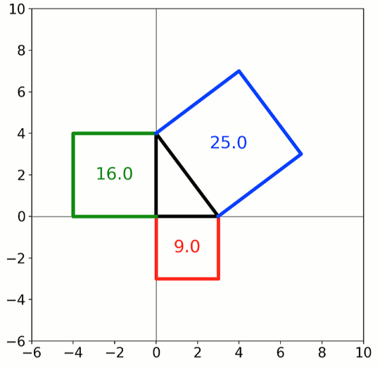

Interactive Pythagoras theorem
------------------------------

**A simple demo of a an interactive triangle with the Pythagorean
squares.**

-  **Features**

   -  Graphics-driven assignments
   -  Inverse assignment
   -  Binary operators

-  **Try me**

   -  Try adjusting the legs of the triangle or any of the vertices of
      the squares.

.. code:: python

    from pyquibbler import iquib, initialize_quibbler, quiby, reset_random_quibs
    initialize_quibbler()
    
    import matplotlib.pyplot as plt
    import numpy as np
    %matplotlib osx

.. code:: python

    # Prepare figure
    plt.figure(0, figsize=(7, 7))
    plt.clf()
    plt.axis([-6, 10, -6, 10])
    plt.axis('square')
    plt.xticks(np.arange(-6, 12, 2))
    plt.yticks(np.arange(-6, 12, 2))
    plt.axvline(0, linewidth=0.5, color='k')
    plt.axhline(0, linewidth=0.5, color='k');

.. code:: python

    # Define triangle legs:
    ab = iquib([3., 4.])
    a, b = ab
    
    # Draw triangle:
    plt.plot([0, a, 0, 0], [0, 0, b, 0], color='black')
    
    # Draw squares:
    plt.plot([0, 0, a, a], [0, -a, -a, 0], color='red')
    plt.plot([0, -b, -b, 0], [0, 0, b, b], color='green')
    plt.plot([0, b, b+a, a], [b, a+b, a, 0], color='blue')
    
    # Add area text:
    props = dict(ha='center', va='center', fontsize=16)
    plt.text(a/2, -a/2, round(a**2, 1), **props)
    plt.text(-b/2, b/2, round(b**2, 1), **props)
    plt.text((a+b)/2, (a+b)/2, round(a**2 + b**2, 1), **props);

