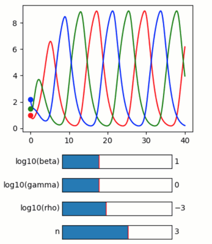

Simulating the genetic “repressilator”
--------------------------------------

**A demo of an quib-based ODE solver of the classical genetic
repressilator.**

-  **Features**

   -  Quib-linked widgets
   -  Running user defined functions using *quiby*
   -  Graphics quibs
   -  Graphics-driven assignments
   -  Inverse assignments (see the inversion of the ``log`` in the
      Slider value)

-  **Try me**

   -  Try dragging up and down the circle markers to set the initial
      conditions of protein concentrations.
   -  Try adjusting the sliders to set equation parameters.

**Credit**

Based on code by Justin Bois, Michael Elowitz (Caltech).

**References**

-  `Elowitz & Leibler, A synthetic oscillatory network of
   transcriptional regulators, Nature,
   2000 <https://doi.org/10.1038/35002125>`__
-  `Synchronous long-term oscillations in a synthetic gene circuit,
   Nature, 2016 <https://doi.org/10.1038/nature19841>`__

.. code:: python

    from pyquibbler import iquib, initialize_quibbler, quiby
    initialize_quibbler()
    import matplotlib.pyplot as plt
    from matplotlib.widgets import Slider
    import numpy as np
    import scipy.integrate
    %matplotlib tk

.. code:: python

    # Set key parameters:
    beta = iquib(10.)
    gamma = iquib(1.)
    rho = iquib(0.001)
    n = iquib(3)  # cooperativity 

.. code:: python

    # time
    t_max = iquib(40.)
    num_points = iquib(1000)  # Number of points to use in plots
    t = np.linspace(0, t_max, num_points)

.. code:: python

    # Initial condiations (3 x mRNA, 3 x Proteins)
    initial_m_x = iquib(np.array([0., 0., 0., 1., 1.5, 2.2]))

.. code:: python

    # Solver for the mRNA and Protein concentrations
    def repressilator_rhs(mx, t, beta, gamma, rho, n):
        """
        Returns 6-array of (dm_1/dt, dm_2/dt, dm_3/dt, dx_1/dt, dx_2/dt, dx_3/dt)
        """
        m_1, m_2, m_3, x_1, x_2, x_3 = mx
        return np.array(
            [
                beta * (rho + 1 / (1 + x_3 ** n)) - m_1,
                beta * (rho + 1 / (1 + x_1 ** n)) - m_2,
                beta * (rho + 1 / (1 + x_2 ** n)) - m_3,
                gamma * (m_1 - x_1),
                gamma * (m_2 - x_2),
                gamma * (m_3 - x_3),
            ]
        )
    
    
    @quiby
    def _solve_repressilator(beta, gamma, rho, n, t, x_init):
        x = scipy.integrate.odeint(repressilator_rhs, x_init, t, 
                                   args=(beta, gamma, rho, n))
        return x.transpose()

.. code:: python

    # Run ODE and plot
    m1, m2, m3, x1, x2, x3 = _solve_repressilator(beta, gamma, rho, n, t, initial_m_x)
    
    plt.figure(figsize=(4, 3))
    plt.plot(t, x1, 'r', t, x2, 'g', t, x3, 'b');
    
    # Plot initial conditions:
    plt.plot(0, initial_m_x[3], 'ro')
    plt.plot(0, initial_m_x[4], 'go')
    plt.plot(0, initial_m_x[5], 'bo');

.. code:: python

    # Add sliders for parameters
    fig = plt.figure(figsize=(4, 2))
    axs = fig.add_gridspec(4, hspace=0.7, left=0.3, right=0.8).subplots()
    Slider(ax=axs[0], valmin= 0, valmax=3, valinit=np.log10(beta), label='log10(beta)')
    Slider(ax=axs[1], valmin=-1, valmax=2, valinit=np.log10(gamma), label='log10(gamma)')
    Slider(ax=axs[2], valmin=-5, valmax=0, valinit=np.log10(rho), label='log10(rho)')
    Slider(ax=axs[3], valmin= 0, valmax=5, valinit=n, label='n');

